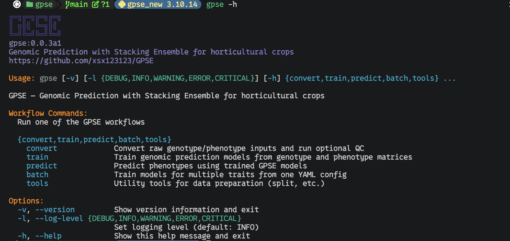

<p align="center">
  
</p>

<h1 align="center">GPSE (Genomic Prediction with Stacking Ensemble)</h1>

<p align="center">
  
  
  
</p>

<p align="center"><strong>Genomic Prediction with Stacking Ensemble for horticultural crops.</strong></p>

<p align="center">
  English | <a href="docs/readme_cn.md">简体中文</a>
</p>

GPSE is a comprehensive, machine-learning-based pipeline for genomic selection and prediction. It provides end-to-end functionalities from raw genomic data (VCF/PLINK) preprocessing to hyperparameter optimization, model evaluation, TOPSIS ranking, and Stacking Ensemble prediction.

## 🌟 Key Features

* **Complete Data Pipeline**: Seamlessly convert VCF files to PLINK binary formats, extract specific SNPs, convert to numerical matrices, and accurately match genotypes with phenotypes.
* **Broad Algorithm Support**: Supports 14+ robust machine learning algorithms including Random Forest, XGBoost, LightGBM, CatBoost, SVR, MLP, ElasticNet, and more.
* **Dual Task Modes**: Native support for both **Regression** (continuous traits) and **Classification** (categorical/discrete traits).
* **Automated Hyperparameter Tuning**: Integrated with Optuna for efficient, automated, multi-threaded parameter optimization.
* **Robust Evaluation**: Performs multiple repeats of K-Fold cross-validation to ensure model stability and reproducibility.
* **Model Ranking & Selection**: Built-in **TOPSIS** (Technique for Order of Preference by Similarity to Ideal Solution) evaluation utilizing Entropy Weight Method for multi-criteria model ranking.
* **Stacking Ensemble**: Automatically ensembles the Top-N performing models to maximize prediction accuracy.

## 🛠️ Installation

### Prerequisites

* Python >= 3.10
* [PLINK 1.9](https://www.cog-genomics.org/plink/) (Required for genomic data format conversion and SNP extraction)

### Install via Poetry

This project uses Poetry for dependency management:

```bash
# Clone the repository
git clone https://github.com/xsx123123/GPSE.git
cd gpse

# Install dependencies using Poetry
poetry install
```

### Install via pip

```bash
pip install .
```

## 🚀 Usage

GPSE uses a subcommand architecture: `gpse {convert,train,predict}`.

### Command-Line Preview



### 1. Data Conversion & QC (`gpse convert`)

`gpse convert` handles all genotype/phenotype preprocessing: format conversion, QC filtering, LD pruning, and sample matching. The output is training-ready numerical matrices.

#### Pipeline Overview

```
Input                        Processing                     Output
─────                        ──────────                     ──────
                             Validate trait names            (abort on invalid names)
samples.vcf            →  VCF → PLINK BED              →  {prefix}_{trait}_genotype.{csv|parquet|feather}
phenotype.txt/.csv     →  PED/MAP → numeric (0/1/2)    →  {prefix}_{trait}_phenotype.{ext}
                            SNP filtering                   {prefix}_{trait}_phenotype_info.json
                            Sample ID matching                 (auto-detected task type & n_classes)
                            Phenotype type detection        {prefix}_{trait}_scaler.json
                            Column name cleaning               (only with --standardize-phenotype)
                            Phenotype-only Z-score (optional)  (does not standardize genotype)
```

Genotype encoding: `00→0` (homozygous ref), `01/10→1` (heterozygous), `11→2` (homozygous alt), missing→`3`.

> **💡 `--direct` is now optional**
>
> When `--pheno` is provided, GPSE automatically converts the full PLINK binary
> dataset to a numeric matrix (the behaviour previously triggered by `--direct`).
> You only need to pass `--direct` explicitly when converting a genotype file
> **without** a phenotype file (e.g. preprocessing genotype data ahead of time).
>
> If you want to filter SNPs instead, use `--extract` or `--snp-dir`.

#### 1.1 VCF + Phenotype → Training Data

```bash
gpse convert \
    --vcf samples.vcf \
    --pheno phenotype.txt \
    --out-prefix data/train
```

Output files:
- `data/train_{trait}_genotype.parquet` — numeric matrix (rows=samples, columns=SNPs, values=0/1/2). Default format is **Parquet**; use `--out-format csv` or `--out-format feather` to switch. `feather` requires `pyarrow`.
- `data/train_{trait}_phenotype.csv` — cleaned, sample-matched phenotype (ID + trait value)
- `data/train_{trait}_phenotype_info.json` — auto-detected task type (`regression`/`classification`), `n_classes`, sample count, and class distribution (when applicable)

#### 1.2 VCF + Phenotype with Extra Chromosomes (Horticultural Crops)

Many horticultural crops (e.g., watermelon, cucumber) use non-standard chromosome names or scaffold IDs. Use `--allow-extra-chr` to pass this flag to PLINK:

```bash
gpse convert \
    --vcf samples.vcf.gz \
    --pheno phenotype.csv \
    --out-prefix data/train \
    -t 10 \
    --allow-extra-chr
```

#### 1.3 With Phenotype Standardization

```bash
gpse convert \
    --vcf samples.vcf \
    --pheno phenotype.txt \
    --standardize-phenotype \
    --out-prefix data/train
```

> **Note:** `--standardize-phenotype` performs a **z-score standardization on the phenotype/trait values only**. It does **not** standardize the genotype matrix. Genotype data is kept in its original 0/1/2 additive encoding.
>
> The standardized phenotype column is computed as:
> ```
> y_scaled = (y - mean) / std
> ```
> where `mean` and `std` are calculated from the matched phenotype column.

Additional output: `data/train_phenotype_scaler.json` (mean/std for inverse transform during prediction).

#### 1.4 Extract Specific SNPs

```bash
# From PLINK binary input
gpse convert \
    --bfile plink_data \
    --extract snp_list.txt \
    --pheno phenotype.txt \
    --out-prefix data/train

# Batch extraction from a directory of SNP list files
gpse convert \
    --bfile plink_data \
    --snp-dir snp_lists/ \
    --out-prefix data/train
```

#### 1.5 Use Existing Matrix (Skip Matrix Generation)

```bash
gpse convert \
    --matrix-file existing_genotype.csv \
    --pheno phenotype.txt \
    --out-prefix data/matched
```

#### 1.6 QC Filtering + LD Pruning + Imputation

Genotype data often contains missing calls, low-quality SNPs, and redundant markers due to linkage disequilibrium (LD). `gpse convert --run-qc` performs three main tasks.

**Pipeline flow when `--run-qc --impute` is enabled:**

```
┌─────────────────────────────────────────────────────────────────────────────┐
│                              gpse convert pipeline                           │
├─────────────────────────────────────────────────────────────────────────────┤
│  输入 VCF / BED / PED                                                        │
│       │                                                                      │
│       ▼                                                                      │
│  ┌─────────────────────────────────────┐                                    │
│  │ Step 0: 格式统一化                   │  ← format_converter()              │
│  │  VCF → BED (raw_prefix)              │                                    │
│  └─────────────────────────────────────┘                                    │
│       │                                                                      │
│       ▼ (如果 --run-qc)                                                     │
│  ┌─────────────────────────────────────┐                                    │
│  │ Step 1: Imputation (可选)            │  ← impute_genotype_beagle()        │
│  │  BED → VCF → Beagle → VCF.gz → BED   │   (需 --impute + beagle_jar_path)  │
│  │  输出: {out}_qc_filled.bed           │                                    │
│  └─────────────────────────────────────┘                                    │
│       │                                                                      │
│       ▼                                                                      │
│  ┌─────────────────────────────────────┐                                    │
│  │ Step 2: QC 过滤                      │  ← PLINK --geno --mind --maf       │
│  │  按缺失率、MAF 过滤                  │   (参数: snpmaxmiss, samplemaxmiss,│
│  │  输出: {out}_qc.bed                  │          maf_max)                   │
│  └─────────────────────────────────────┘                                    │
│       │                                                                      │
│       ▼                                                                      │
│  ┌─────────────────────────────────────┐                                    │
│  │ Step 3: LD Pruning                   │  ← PLINK --indep-pairwise          │
│  │  去除高度连锁的 SNP                  │   (参数: r2_cutoff)                 │
│  │  输出: {out}_pruned.bed              │                                    │
│  └─────────────────────────────────────┘                                    │
│       │                                                                      │
│       ▼                                                                      │
│  ┌─────────────────────────────────────┐                                    │
│  │ Step 4: 转数值矩阵                   │  ← PLINK --recode compound-genotypes│
│  │  BED → PED → .geno (0/1/2)          │    → recode_to_numeric()            │
│  │  最终输出 Parquet/CSV                │                                    │
│  └─────────────────────────────────────┘                                    │
│       │                                                                      │
│       ▼                                                                      │
│  与 Phenotype 文件做样本匹配，输出最终文件集                                  │
└─────────────────────────────────────────────────────────────────────────────┘
```

**Execution order summary:** Format normalisation → Imputation (fills missing) → QC filtering (drops low-quality) → LD pruning (removes correlated SNPs) → Numeric matrix conversion → Phenotype matching.

**Detail of each stage:**

1. **Imputation (optional)** — fills missing genotypes with Beagle **before** strict filtering.
   - `--impute` triggers Beagle imputation using the JAR specified in `gpse.yaml` or via `--beagle-jar-path`.
   - *Pre-filtering:* Variants completely lacking REF/ALT allele definitions in the raw data are automatically excluded before imputation, as they are incompatible with Beagle.
   - **Recommended for high-missingness data**: By filling gaps first, you avoid losing samples or SNPs that would otherwise exceed the filtering thresholds.

2. **QC Filtering** — removes variants and samples that still fail quality standards.
   - `--snpmaxmiss` (`--geno`): SNPs with missing rate > threshold are removed (default `0.1`).
   - `--samplemaxmiss` (`--mind`): Samples with missing rate > threshold are removed (default `0.1`).
   - `--maf`: SNPs with minor allele frequency below threshold are removed (default `0.05`).
   - *Note: If all samples are removed (PLINK error), try relaxing these thresholds (e.g., to 0.5).*

3. **LD Pruning** — removes highly correlated SNPs to reduce redundancy.
   - `--r2-cutoff`: SNP pairs with squared correlation (R²) above this threshold within a sliding window are pruned (default `0.2`).

**Basic QC + LD pruning (no imputation):**

```bash
gpse convert \
    --run-qc \
    --input-prefix plink_data \
    --out-prefix data/qc_data \
    --snpmaxmiss 0.1 \
    --samplemaxmiss 0.1 \
    --maf 0.05 \
    --r2-cutoff 0.2
```
 
**QC + Beagle imputation + LD pruning:**

```bash
gpse convert \
    --run-qc \
    --input-prefix plink_data \
    --out-prefix data/qc_data \
    --snpmaxmiss 0.1 \
    --samplemaxmiss 0.1 \
    --maf 0.05 \
    --r2-cutoff 0.2 \
    --impute \
    --beagle-jar-path /path/to/beagle.jar
```

> **Note:** `--run-qc` is a standalone step. It does **not** require `--vcf` or `--pheno`. The input must be a PLINK binary prefix (`--input-prefix`).

**Outputs:**

| File | Description |
| --- | --- |
| `data/qc_data_raw.bed/bim/fam` | PLINK binary after initial format conversion (if input was VCF/PLINK text). |
| `data/qc_data_qc.bed/bim/fam` | After QC filtering (missing rate + MAF). |
| `data/qc_data_qc_filled.bed/bim/fam` | After Beagle imputation (only with `--impute`). |
| `data/qc_data_qc_filled.prune.in` | List of SNPs retained after LD pruning. |
| `data/qc_data_pruned.bed/bim/fam` | **Final LD-pruned PLINK binary**, ready for matrix conversion. |
| `data/qc_data_qc.log` | PLINK QC log file. |

#### 1.7 Recode PED/MAP to Numeric

```bash
gpse convert --recode-prefix plink_data
# Output: plink_data.geno
```

#### 1.8 Check External Dependencies

```bash
gpse convert --check-deps
```

#### 1.9 Rename Phenotype Trait

```bash
gpse convert \
    --vcf samples.vcf \
    --pheno phenotype.txt \
    --trait-name Fruit_Weight \
    --out-prefix data/train
```

### 2. Model Training (`gpse train`)

`gpse train` supports two modes: training from pre-processed matrices, or a one-stop pipeline that internally reuses `gpse convert` for preprocessing and then proceeds directly to model training.

**Architecture overview (`--enable_preprocess`):**

```
User runs: gpse train --enable_preprocess --vcf_file samples.vcf --raw_pheno_file pheno.txt ...

         │
         ▼
┌─────────────────────────────────────────────────────────────────────────┐
│  gpse/train/cli.py   main()                                             │
│  ─────────────────────────────────────────────────────────────────────  │
│                                                                         │
│  Stage 1: Argument validation (--enable_preprocess? --preprocess_only?) │
│       │                                                                 │
│       ▼                                                                 │
│  Stage 2: Preprocessing (if enable_preprocess)                          │
│       │  ┌──────────────────────────────────────────────────┐          │
│       │  │ GenomicDataProcessor (from gpse.convert)         │          │
│       │  │  • process_genomic_data(vcf=..., pheno=...)      │          │
│       │  │  • VCF → BED → PED → numeric matrix             │          │
│       │  │  • phenotype matching, standardization, type    │          │
│       │  │    detection (regression vs classification)     │          │
│       │  │  • Output: *_genotype.parquet, *_phenotype.csv  │          │
│       │  └──────────────────────────────────────────────────┘          │
│       │                                                                 │
│       ▼                                                                 │
│  Stage 3: Auto-detect task_type (from *_phenotype_info.json)            │
│       │                                                                 │
│       ▼                                                                 │
│  Stage 4: Training                                                      │
│       │  ┌──────────────────────────────────────────────────┐          │
│       │  │ GenomicPredictorV2 (gpse.train)                  │          │
│       │  │  • load_data(geno_file, pheno_file)              │          │
│       │  │  • prepare_cv_folds()                            │          │
│       │  │  • run_model_multiple_repeats()  ← Optuna HPO   │          │
│       │  │  • TOPSIS ranking                                │          │
│       │  │  • Stacking ensemble (optional)                  │          │
│       │  └──────────────────────────────────────────────────┘          │
│                                                                         │
└─────────────────────────────────────────────────────────────────────────┘
```

> **Design note:** `--enable_preprocess` does **not** shell-out to `gpse convert`. Instead, `gpse train` directly `import`s and instantiates `GenomicDataProcessor` inside the same Python process, runs the full convert pipeline, infers output file paths automatically, and then passes those paths to `GenomicPredictorV2` for training.

#### 2.1 Train with Pre-processed Data

```bash
gpse train \
    --geno_file data/train_genotype.csv \
    --pheno_file data/train_phenotype.csv \
    --target_trait Fruit_Weight \
    --n_splits 5 \
    --n_repeats 10 \
    --trials 50 \
    --use_stacking \
    --top_n_models 5 \
    --n_jobs 2 \
    --max_workers 4 \
    --results_dir output_results/
```

> **💡 `--task_type` and `--n_classes` are now optional**
>
> When `gpse convert` has generated a `{prefix}_{trait}_phenotype_info.json`
> file, `gpse train` reads it automatically and sets `--task_type` and
> `--n_classes` for you. You only need to pass them explicitly when you want
> to override the auto-detected values or when no info file is present.

#### 2.2 One-Stop: Preprocessing + Training

```bash
gpse train \
    --enable_preprocess \
    --preprocess_prefix data/train \
    --vcf_file samples.vcf \
    --raw_pheno_file phenotype.txt \
    --target_trait Fruit_Weight \
    --n_splits 5 \
    --n_repeats 10 \
    --trials 50 \
    --use_stacking \
    --results_dir output_results/
```

#### 2.3 Preprocessing Only (No Training)

```bash
gpse train \
    --preprocess_only \
    --preprocess_prefix data/train \
    --vcf_file samples.vcf \
    --raw_pheno_file phenotype.txt \
    --target_trait Fruit_Weight
```

#### 2.4 Classification Task

```bash
gpse train \
    --geno_file genotype.csv \
    --pheno_file phenotype.csv \
    --target_trait Disease_Resistance \
    --n_splits 5 \
    --n_repeats 10 \
    --trials 50 \
    --results_dir classification_results/
```

> When a `phenotype_info.json` file is available, `--task_type classification`
> and `--n_classes 3` are inferred automatically. Explicit values override the
> auto-detection and trigger a warning if they conflict.

### 3. Analyze Phenotypes

Quickly analyze phenotype data to determine the appropriate task type (Regression vs Classification).

```bash
python -m gpse.tools.analyze_phenotypes
```

### 4. Show Help

```bash
gpse --help
gpse --version
gpse convert --help
gpse train --help
```

## 📥 Input and Output Formats

GPSE currently defines concrete I/O for `gpse convert` and `gpse train`.
`gpse predict` is present as a command stub, but prediction is not implemented yet.

### `gpse convert` Inputs

`gpse convert` prepares genotype and phenotype files for model training.

| Input type | Argument | Format requirement |
| --- | --- | --- |
| VCF | `--vcf samples.vcf` | Standard VCF file. GPSE uses PLINK to convert it to binary PLINK files. |
| PLINK binary | `--bfile prefix` | Requires `prefix.bed`, `prefix.bim`, and `prefix.fam`. |
| PLINK text | `--ped-file file.ped --map-file file.map` | Standard PLINK PED/MAP files. |
| Existing matrix | `--matrix-file genotype.csv` | CSV genotype matrix with sample IDs in the first column. |
| SNP list | `--extract snp_list.txt` | One SNP ID per line, passed to PLINK `--extract`. |
| SNP list directory | `--snp-dir snp_lists/` | Directory containing `.txt` SNP-list files. |
| Phenotype | `--pheno phenotype.txt` | Tab- or comma-separated; first column = sample ID, second column = trait value. |
| Full conversion | `--direct` | Optional. Auto-enabled when `--pheno` is provided. Forces full bfile → matrix conversion even without a phenotype file. |
| Output format | `--out-format {csv,parquet,feather}` | Genotype matrix output format. Default `parquet`; `feather` requires `pyarrow`. |
| Threads | `-t, --threads N` | Parallel threads for batch trait processing (default: 10). |
| Extra chromosomes | `--allow-extra-chr` | Pass `--allow-extra-chr` to PLINK for non-standard chromosome names (e.g. scaffold). |
| Trait rename | `--trait-name NAME` | Rename the target trait column in the output phenotype file. |

Phenotype input is passed with `--pheno`. The file should have a header row,
sample IDs in the first column, and the target trait in the second column. GPSE
tries tab-separated input first and falls back to comma-separated input. Only
the first two columns are retained by the converter. Missing phenotype values
(`NaN` and string `NA`) are removed. Use `--trait-name` to rename the target
trait column.

> **⚠️ Trait Name Restrictions**
>
> Trait (phenotype column) names are validated **before any conversion work
> begins**. Invalid names will cause the pipeline to abort immediately.
>
> Trait names must **not** contain:
>
> - Spaces (` `), tabs, or newlines
> - Percent sign (`%`)
> - Colons (`:`) or slashes (`/`, `\`)
> - Brackets (`[`, `]`, `{`, `}`)
> - Pipes (`|`)
> - Double quotes (`"`)
> - Commas (`,`)
>
> Use underscores (`_`) or hyphens (`-`) instead. For example, rename
> `fruit weight` to `fruit_weight` and `yield%` to `yield_pct`.

> **⚠️ VCF / Phenotype Sample ID Matching**
>
> Before starting the long-running VCF → PLINK → matrix conversion, GPSE
> performs a **defensive sample-overlap check** using `cyvcf2`.
>
> - VCF sample IDs are read directly from the VCF header.
> - Phenotype sample IDs are read from the first column of the phenotype file.
> - The pipeline aborts immediately if the number of shared samples is smaller
>   than the smaller of the two sets (i.e. not every sample in the smaller file
>   has a counterpart in the other).
>
> When the check fails, the log shows:
> - Total samples in VCF and phenotype
> - Number of shared samples
> - Representative examples from **both** files
> - Samples that exist **only in VCF**
> - Samples that exist **only in phenotype**
>
> This makes it easy to spot naming mismatches (e.g. `Ames_12781` in VCF vs
> `Chipper` in phenotype) and fix the input data before wasting time on
> conversion.

### `gpse convert` Outputs

When only a genotype matrix is generated, GPSE writes:

```text
{out_prefix}.{csv|parquet|feather}
```

The default output format is **Parquet** (`--out-format parquet`). You can switch to CSV (`--out-format csv`) or Feather (`--out-format feather`, requires `pyarrow`).

The genotype matrix structure (CSV view) is:

```csv
ID,SNP1,SNP2,SNP3
sample1,0,1,2
sample2,1,3,0
```

Genotype encoding:

| Compound genotype | Encoded value |
| --- | --- |
| `00` | `0` |
| `01` or `10` | `1` |
| `11` | `2` |
| Missing or unknown | `3` |

When phenotype/genotype matching is enabled, GPSE writes the recommended
training inputs (one set per trait):

```text
{out_prefix}_{trait}_genotype.{csv|parquet|feather}
{out_prefix}_{trait}_phenotype.{csv|parquet|feather}
{out_prefix}_{trait}_phenotype_info.json
```

The matched phenotype file has this structure:

```csv
ID,TraitName
sample1,12.3
sample2,9.8
```

The `phenotype_info.json` file contains auto-detection metadata:

```json
{
  "trait": "Fruit_Weight",
  "task_type": "regression",
  "n_classes": null,
  "reason": "continuous numeric values",
  "n_samples": 500,
  "mean": 12.34,
  "std": 3.56
}
```

GPSE automatically detects whether each trait is better treated as **regression**
(continuous) or **classification** (discrete) by inspecting the phenotype values.
Binary and integer-encoded traits with ≤20 classes are classified as
`classification`; all other numeric traits are `regression`. This metadata is
consumed by `gpse train` so you no longer need to manually pass `--task_type`
and `--n_classes` in most cases.

If `--standardize-phenotype` is enabled, GPSE also writes:

```text
{out_prefix}_{trait}_scaler.json
```

QC mode (`--run-qc`) writes PLINK-format prefixes:

```text
{out_prefix}_raw.bed/.bim/.fam
{out_prefix}_qc.bed/.bim/.fam
{out_prefix}_qc_filled.bed/.bim/.fam
{out_prefix}_qc_filled.prune.in
{out_prefix}_pruned.bed/.bim/.fam
{out_prefix}_qc.log
```

Recode mode (`--recode-prefix prefix`) writes:

```text
prefix.geno
```

### `gpse train` Inputs

`gpse train` consumes CSV files, usually the matched outputs from `gpse convert`.

| Argument | Requirement |
| --- | --- |
| `--geno_file` | CSV genotype matrix with an `ID` column. If `ID` is absent, GPSE tries `--cv_id_column`. |
| `--pheno_file` | CSV phenotype table with the same ID column as the genotype file. |
| `--target_trait` | Target trait column name in the phenotype table. |
| `--task_type` | `regression` or `classification`. **Optional** — auto-inferred from `{prefix}_{trait}_phenotype_info.json` when omitted. Defaults to `regression` when no info file is found. |
| `--n_classes` | Required for `classification` when auto-detection fails or is unavailable. Must be at least 2. |

Recommended training input:

```bash
gpse train \
    --geno_file data/train_genotype.csv \
    --pheno_file data/train_phenotype.csv \
    --target_trait Fruit_Weight
```

During training, GPSE keeps only samples shared by genotype and phenotype IDs,
sorts them into a consistent order, and uses all non-ID genotype columns as
features. Feature names are normalized internally to `feature_0`, `feature_1`,
and so on.

Classification labels can be strings or non-continuous numeric labels. GPSE
encodes them to continuous integer classes and saves the encoder to:

```text
{results_dir}/label_encoder.pkl
```

If `--cv_file` is omitted, GPSE creates:

```text
{results_dir}/cv_folds/{target_trait}_cv_{n_repeats}x{n_splits}.csv
```

The CV file contains sample IDs as the index and one fold-assignment column per
repeat:

```csv
ID,TraitName,cv0,cv1
sample1,12.3,0,3
sample2,9.8,1,4
```

Fold values range from `0` to `n_splits - 1`.

### `gpse train` Outputs

The default result directory is `optimization_results_v2/`.

Main outputs:

```text
{results_dir}/model_comparison.csv
{results_dir}/cv_folds/{target_trait}_cv_{n_repeats}x{n_splits}.csv
{results_dir}/{model_name}/summary_results.json
{results_dir}/{model_name}/repeat_{i}/repeat_results.json
{results_dir}/{model_name}/repeat_{i}/all_predictions.json
```

When `--save_models` is enabled:

```text
{results_dir}/{model_name}/repeat_{i}/fold_{j}_model.pkl
```

Representative model output:

```text
{results_dir}/{model_name}/representative_model/model.pkl
{results_dir}/{model_name}/representative_model/info.json
```

Regression phenotype standardization output:

```text
{results_dir}/phenotype_scaler.json
```

Stacking output:

```text
{results_dir}/ensemble_stacking/stacking_ensemble_model.pkl
{results_dir}/ensemble_stacking/stacking_results.pkl
```

TOPSIS model-ranking output:

```text
{results_dir}/model_comparison_topsis.csv
{results_dir}/model_comparison_topsis_simple.csv
```

### `gpse predict`

`gpse predict` currently accepts `--model`, `--geno-file`, and `--out`, but the
prediction workflow is not implemented yet. Prediction input and output formats
are therefore not finalized.

## 📁 Source Layout

The package is organized around the three workflow commands: `convert`, `train`,
and `predict`. Runtime-specific code lives in those command packages; shared
support code lives in `config`, `models`, `tasks`, `tools`, and `utils`.

### `gpse/`

| File | Scope |
| --- | --- |
| `__init__.py` | Package metadata, currently exposes `__version__`. |
| `cli.py` | Thin top-level command router for `gpse {convert,train,predict}`. It defines shared CLI flags, routes subcommands, and delegates workflow logic to the relevant package. |

### `gpse/config/`

Configuration constants and packaged YAML defaults.

| File | Scope |
| --- | --- |
| `__init__.py` | Public exports for config dataclasses and constants. |
| `constants.py` | Dataclasses and immutable model/training constants, including filenames, directory names, precision settings, and thread environment variable names. |
| `_topsis_config.py` | Loads TOPSIS task configuration, validates criteria/weights, logs runtime settings, and saves representative models. It is consumed by the training predictor. |
| `default.yaml` | Default application/logging configuration. |
| `software.yaml` | Package metadata and external tool definitions used by conversion/QC dependency checks. |
| `topsis.yaml` | Task-specific TOPSIS criteria, directions, and weights for regression/classification model ranking. |

### `gpse/convert/`

Implementation for `gpse convert`: genotype/phenotype conversion, QC, LD pruning,
and external tool execution.

| File | Scope |
| --- | --- |
| `__init__.py` | Public convert package export for `GenomicDataProcessor`. |
| `cli.py` | CLI parser and dispatcher for conversion modes such as full conversion, QC, recoding, and dependency checks. |
| `external.py` | External-tool discovery, configured path resolution, version checks, and command execution helpers. |
| `genotype_matrix.py` | Pure functions for genotype format conversion: VCF→PLINK BED, BED→PED/MAP, PED/MAP→numeric CSV matrix, and batch SNP directory processing. |
| `phenotype.py` | Pure functions for phenotype file conversion, genotype-phenotype sample matching, z-score standardization, scaler parameter persistence, and automatic phenotype type detection (regression vs classification). |
| `validators.py` | Data validation utilities: trait name validation, column-name sanitization (special character detection/cleaning), and matrix loading with summary statistics. |
| `processor.py` | Thin orchestrator (`GenomicDataProcessor`) that coordinates genotype conversion, phenotype matching, and data validation by delegating to the specialised sub-modules above. |
| `qc.py` | PLINK/Beagle QC utilities: format conversion, genotype filtering, imputation, LD pruning, and PED/MAP numeric recoding. |

#### Convert API Reference (Function-Level)

The tables below describe every public function / method in `gpse.convert`.  Internal helpers (e.g. `_run_command`, `_config_context`) are omitted.

##### `gpse.convert.qc`

| Function | Signature (key args) | Description |
|---|---|---|
| `format_converter` | `(user_params, input_prefix, output_prefix)` | Detect input format (VCF / PED+MAP / BED) and normalise to PLINK binary (BED/BIM/FAM). Returns the PLINK input flag (`--bfile`). |
| `filter_genotype` | `(user_params, input_prefix, output_prefix, input_flag='--bfile')` | Filter samples/SNPs by user-supplied ID lists (`--extract`, `--exclude`, `--keep`, `--remove`) and recode to compound genotypes (`01`) with missing coded as `3`. |
| `impute_genotype_beagle` | `(user_params, input_prefix, output_prefix)` | Run Beagle imputation end-to-end: **BED → VCF → Beagle → VCF.gz → BED**. Pre-filters variants with missing alleles (`0` in BIM) because Beagle requires valid REF/ALT. Uses `--const-fid` when converting the imputed VCF back to BED to safely handle sample IDs containing underscores. |
| `analyze_and_prune` | `(user_params, input_prefix, output_prefix, run_imputation=False)` | **Main QC orchestrator.** Executes, in order: (0) `format_converter`, (1) `impute_genotype_beagle` (if `run_imputation=True`), (2) QC filtering (`--geno`, `--mind`, `--maf`), (3) LD pruning (`--indep-pairwise`). Returns `(qc_prefix, pruned_prefix)`. |
| `recode_to_numeric` | `(fileprefix)` | Convert PLINK PED/MAP compound genotypes to additive numeric coding: `00→0`, `01/10→1`, `11→2`. Writes a `.geno` CSV file with header `ID,SNP1,SNP2,...`. |

##### `gpse.convert.genotype_matrix`

| Function | Signature (key args) | Description |
|---|---|---|
| `vcf_to_plink` | `(vcf_file, out_prefix, plink_path='plink', allow_extra_chr=False)` | Convert VCF to PLINK binary format (BED/BIM/FAM). Skips if output already exists. Uses `--double-id` so the full VCF sample name becomes the IID. |
| `extract_snps` | `(bfile, extract_file, out_prefix, ...)` | Extract selected SNPs from a PLINK binary dataset to PED/MAP. Compound-genotype recoding with missing=`3`. |
| `convert_bfile_to_ped` | `(bfile, out_prefix, ...)` | Convert the **full** PLINK binary dataset to PED/MAP (no SNP filtering). Compound-genotype recoding with missing=`3`. |
| `convert_to_matrix` | `(fileprefix, out_file=None, out_format='parquet')` | Read PED/MAP, apply the genotype encoding map (`00→0`, `01→1`, `10→1`, `11→2`, missing→`3`), and write a numeric matrix. Output formats: `csv`, `parquet`, `feather`. Falls back to CSV if `pyarrow` is missing. |
| `process_snp_dir` | `(bfile, snp_dir, out_dir, ...)` | Batch-process every `.txt` SNP list file in `snp_dir`: extract → PED/MAP → numeric matrix. Writes one output file per list. |

##### `gpse.convert.phenotype`

| Function | Signature (key args) | Description |
|---|---|---|
| `convert_phenotype` | `(pheno_file, out_file=None, trait_name=None, trait_col=None)` | Read a tab- or comma-separated phenotype file, drop rows with missing values (`NaN` / `NA`), optionally rename the trait column, and return a two-column DataFrame (`ID`, trait). |
| `match_genotype_phenotype` | `(pheno_df, geno_file, out_prefix, out_format='csv')` | Intersect genotype and phenotype samples by ID, sort to a shared order, and write matched `{prefix}_phenotype.{ext}` and `{prefix}_genotype.{ext}`. Raises `ValueError` if no overlap. |
| `standardize_phenotype` | `(pheno_df, trait_col)` | Apply z-score standardization to the trait column. Returns `(standardised_df, scaler_params)`. |
| `detect_phenotype_type` | `(series, max_classes=20, min_samples_per_class=5)` | Auto-detect whether a trait should be treated as `regression` or `classification` based on value distribution (≤2 unique values → classification; string labels → classification; integer with ≤20 classes and ≥5 samples/class → classification; otherwise → regression). |
| `save_phenotype_info` | `(info, info_file)` | Persist phenotype metadata (trait name, task type, `n_classes`, sample count, mean/std) to JSON. |
| `save_scaler_params` | `(scaler_params, scaler_file)` | Save z-score standardization parameters (`mean`, `std`) to JSON for inverse transformation during prediction. |

##### `gpse.convert.validators`

| Function | Signature | Description |
|---|---|---|
| `validate_trait_names` | `(trait_names)` | Pre-flight check: raises `ValueError` if any trait name contains invalid characters (spaces, `%`, `:`, `/`, `\`, `|`, brackets, quotes, commas) or is empty. |
| `check_special_chars` | `(column_names)` | Detect characters in feature names that are unsupported by LightGBM (`:`, `|`, `[`, `]`, `{`, `}`, `"`, `\`, `,`, ` `). |
| `clean_column_names` | `(column_names)` | Replace unsupported characters with underscores so feature names are safe for all ML frameworks. |
| `process_file` | `(file_path, output_path)` | Sanitize column names in a CSV file and rewrite it. |
| `load_matrix` | `(matrix_file)` | Load a genotype matrix (CSV/Parquet/Feather) and log row/column counts and sample ID examples. |

##### `gpse.convert.processor` — `GenomicDataProcessor`

`GenomicDataProcessor` is the thin orchestrator used by `gpse convert`.  Most methods are thin wrappers that delegate to the pure functions above.

| Method | Delegates to | Description |
|---|---|---|
| `process_genomic_data(**kwargs)` | — | **Main entry point.** Coordinates the entire convert pipeline: format conversion → optional QC/imputation → matrix generation → phenotype matching/standardization → per-trait output writing. |
| `vcf_to_plink(vcf_file, out_prefix)` | `genotype_matrix.vcf_to_plink` | Convert VCF → PLINK BED. |
| `extract_snps(bfile, extract_file, out_prefix)` | `genotype_matrix.extract_snps` | Extract SNP subset → PED/MAP. |
| `convert_bfile_to_ped(bfile, out_prefix)` | `genotype_matrix.convert_bfile_to_ped` | Full BED → PED/MAP. |
| `convert_to_matrix(fileprefix, out_file, out_format)` | `genotype_matrix.convert_to_matrix` | PED/MAP → numeric matrix. |
| `process_snp_dir(bfile, snp_dir, out_dir)` | `genotype_matrix.process_snp_dir` | Batch SNP extraction. |
| `convert_phenotype(pheno_file, ...)` | `phenotype.convert_phenotype` | Read and clean phenotype. |
| `match_genotype_phenotype(pheno_df, geno_file, out_prefix)` | `phenotype.match_genotype_phenotype` | Intersect and reorder genotype/phenotype samples. |
| `standardize_phenotype(pheno_df, trait_col)` | `phenotype.standardize_phenotype` | Z-score standardize a trait. |
| `check_special_chars(column_names)` | `validators.check_special_chars` | Detect unsupported chars. |
| `clean_column_names(column_names)` | `validators.clean_column_names` | Sanitize column names. |
| `validate_trait_names(trait_names)` | `validators.validate_trait_names` | Pre-flight trait name validation. |

##### `gpse.convert.workflow`

| Function | Description |
|---|---|
| `run_convert_workflow(args, mode)` | Top-level dispatcher. Routes to `_run_pipeline`, `_run_qc`, `_run_recode`, or `_run_deps` based on CLI arguments. |
| `validate_convert_mode(parser, args)` | Determine which convert sub-mode to run (`pipeline`, `qc`, `recode`, `deps`) and validate required arguments. |

##### `gpse.convert.external`

| Function | Description |
|---|---|
| `run_command(cmd_list, log_file)` | Execute an external command without a shell. Compresses PLINK progress-spam logs and prints friendly error hints for common PLINK/Beagle failures. |
| `resolve_configured_tool(name, ...)` | Resolve an executable path from (1) explicit CLI override, (2) YAML config, (3) `$PATH`. |
| `ensure_existing_file(file_path, name)` | Validate that `file_path` exists; raise `FileNotFoundError` with a descriptive message if not. |
| `check_configured_external_tools(tools, ...)` | Check that required externals (PLINK, Java) are installed and meet minimum version requirements. |
| `get_convert_config(config_path, ...)` | Load and merge convert-specific configuration from packaged YAML and optional project/user overrides. |

### `gpse/train/`

Implementation for `gpse train`: model training, repeated CV, optimization,
model ranking, and stacking ensemble training.

| File | Scope |
| --- | --- |
| `__init__.py` | Lazy exports for `GenomicPredictorV2`, `StackingEnsemble`, and `TOPSISEvaluator`. |
| `cli.py` | CLI parser and dispatcher for `gpse train`, including training arguments, preprocessing options, validation, and training workflow launch. |
| `predictor.py` | Main training orchestrator class. It initializes task-specific optimizers, logging, directories, and binds the training submodule functions as methods. |
| `_data_io.py` | Training data loading, genotype/phenotype alignment, phenotype standardization, and inverse standardization. |
| `_model_tools.py` | Unified model creation, default-parameter lookup, parameter filtering, and default metric fallbacks for regression/classification. |
| `_fold_training.py` | Single-fold model training, prediction, metric calculation, fold logging, and fold-level metric averaging. |
| `_ensemble.py` | Fold-ensemble prediction logic and ensemble metric calculation. |
| `_optimization.py` | Optuna-based hyperparameter optimization over CV folds. |
| `_repeat_training.py` | Repeat-level orchestration, parallel repeat execution, summary statistics, representative repeat selection, and repeat result saving. |
| `_cv_manager.py` | CV fold file creation/loading and fold generation from predefined CV assignments. |
| `_pipeline.py` | Top-level `run_all_models` workflow. Runs selected models, creates comparison tables, performs TOPSIS selection, and optionally trains stacking ensembles. |
| `stacking.py` | Optional stacking ensemble stage. Loads trained base models, creates meta-features, trains the meta-model, evaluates, and saves ensemble artifacts. |
| `topsis.py` | TOPSIS evaluator and optional CLI. Ranks trained models from comparison CSV outputs using configured criteria and weights. |

### `gpse/predict/`

Implementation placeholder for `gpse predict`.

| File | Scope |
| --- | --- |
| `__init__.py` | Prediction package marker. |
| `__main__.py` | Enables `python -m gpse.predict`. |
| `cli.py` | CLI stub for future prediction workflows. Parses model/genotype/output arguments and currently reports that prediction is not implemented yet. |

### `gpse/models/`

Model registries and optimizer/search-space definitions. These modules define
how models are constructed and how Optuna proposes parameters; they do not run
the full training pipeline by themselves.

| File | Scope |
| --- | --- |
| `__init__.py` | Lazy exports for regression and classification optimizers. |
| `regression_model_optimizer.py` | Regression model registry, Optuna search spaces, parameter filtering, model factories, and default parameters. |
| `classification_model_optimizer.py` | Classification model registry, Optuna search spaces, parameter filtering, model factories, and default parameters. |
| `model_optimizers.py` | Backward-compatible regression optimizer import shim. New code should use `regression_model_optimizer.py`. |
| `classification_models.py` | Backward-compatible classification optimizer import shim. New code should use `classification_model_optimizer.py`. |

### `gpse/tasks/`

Task-specific runtime helpers that are shared by training components.

| File | Scope |
| --- | --- |
| `__init__.py` | Lazy export for `GenomicClassifier`. |
| `classification.py` | Classification-specific runtime support: label encoding/decoding, probability-to-label conversion, classification metrics, result summaries, and delegation to `ClassificationModelOptimizer`. |

### `gpse/tools/`

Standalone helper scripts that are useful outside the main workflow commands.

| File | Scope |
| --- | --- |
| `__init__.py` | Tools package marker. |
| `analyze_phenotypes.py` | Standalone phenotype analysis helper for inspecting trait distributions and deciding whether traits are better treated as regression or classification targets. |

### `gpse/utils/`

Shared utilities used across workflow packages. This package should contain
generic support code only; train/convert/predict-specific business logic should
live in the corresponding workflow package.

| File | Scope |
| --- | --- |
| `__init__.py` | Lazy exports for logging and shared genomic utility functions. |
| `configuration.py` | YAML configuration loading and merge helpers for packaged defaults plus optional project/user overrides. |
| `dependency_checker.py` | Generic external dependency detection and version-check helpers used by conversion tooling. |
| `genomic_utils.py` | Shared training helpers: metric calculations, CV file helpers, result-table generation, seed generation, directory creation, fold utilities, and TOPSIS wrapper dispatch. |
| `log_utils.py` | Loguru/Rich logger initialization, subprocess logging setup, and subprocess log collection. |
| `logo.py` | Rich-based logo and welcome panel rendering. |
| `print_utils.py` | Reusable Rich table/panel/column printing helpers. |
| `version.py` | Version, dependency, system, and external-tool reporting helpers. |

## 📦 Core Dependencies

* `scikit-learn`
* `xgboost`
* `lightgbm`
* `catboost`
* `optuna`
* `pandas` & `numpy`
* `rich` & `loguru` (for beautiful CLI output and logging)

## 📝 Recent Updates

* **Automatic Phenotype Type Detection** (`2026-06-10`)
  * Added `detect_phenotype_type()` in `gpse/convert/phenotype.py` — automatically classifies each trait as `regression` or `classification` based on value distribution.
    * Binary traits (≤2 unique values) → `classification`
    * String labels → `classification`
    * Integer-encoded traits with ≤20 classes and ≥5 samples per class → `classification`
    * Continuous numeric values → `regression`
  * `gpse convert` now writes `{prefix}_{trait}_phenotype_info.json` alongside genotype/phenotype outputs.
  * `gpse train` automatically reads `phenotype_info.json` to infer `--task_type` and `--n_classes`, eliminating the need for manual specification in most workflows.
  * Explicit `--task_type` / `--n_classes` values are still respected; a warning is emitted when they conflict with the auto-detected type.

* **Convert Module Refactor & Trait Name Validation** (`2026-06-08`)
  * Split the monolithic `processor.py` into focused sub-modules under `gpse/convert/`:
    * `genotype_matrix.py` — pure functions for VCF→PLINK→PED→numeric CSV matrix conversion
    * `phenotype.py` — pure functions for phenotype conversion, sample matching, and z-score standardization
    * `validators.py` — trait name validation, column-name sanitization, and matrix loading
  * `processor.py` is now a thin orchestrator that delegates to the above modules.
  * Added **early trait name validation** — trait names containing spaces, `%`, `:`, `/`, brackets, pipes, quotes, commas, or whitespace characters are rejected before any conversion work begins.
  * Improved PLINK stdout compression: `\r`-based progress bars (e.g. `0%1%2%...99%done.`) are now correctly parsed and suppressed from logs.
  * Fixed `gpse convert` creating an empty `gpse_convert.log` file in the current directory when run without `--out-prefix`.

* **Defensive Sample Matching & Clean Error Reporting** (`2026-06-09`)
  * Added **`cyvcf2`-based VCF/phenotype sample overlap validation** in `gpse convert`. The pipeline aborts immediately (before any long-running format conversion) when sample IDs between the VCF and phenotype file do not match sufficiently. The error message lists examples from both sides as well as IDs that exist only in one file, making mismatches easy to diagnose.
  * **ValueError business errors no longer print Python tracebacks** to the terminal. Both trait-name validation failures and sample-overlap failures now produce clean, human-readable error logs and exit with code `1`. Unexpected runtime exceptions still print full tracebacks for debugging.

* **Thread Control & Startup Performance** (`2026-06-03`)
  * Fixed BLAS/MKL thread pools ignoring `--n_jobs` by setting all 6 environment variables (`OMP_NUM_THREADS`, `MKL_NUM_THREADS`, `OPENBLAS_NUM_THREADS`, `NUMEXPR_NUM_THREADS`, `VECLIB_MAXIMUM_THREADS`, `BLIS_NUM_THREADS`) **before** numpy/scipy import.
  * Added `threadpoolctl.threadpool_limits()` as a runtime safety net around all `model.fit()` calls.
  * Switched `__init__.py` files in `train/`, `models/`, `tasks/`, and `utils/` to **lazy imports** (`__getattr__`) so `gpse --help` no longer loads the entire ML stack.
  * Renamed CLI args for clarity: `--threads` → `--n_jobs`, `--parallel_jobs` → `--max_workers`.
  * Added `--n_jobs` to `histgradientboost_reg` and `knn_reg` (previously missing thread control).
  * Fixed easter egg (`gpse 42`) duplicate face and unrendered rich markup.

* **Import System Unification** (`2026-06-03`)
  * Removed all `sys.path` hacks from `cli.py` and the training predictor.
  * Unified all imports to absolute package paths (`from gpse.xxx import ...`).
  * Populated `__init__.py` files with proper exports for `config/`, `convert/`, `train/`, `models/`, `tasks/`, `utils/`, and `tools/`.

* **Modular Refactor of `GenomicPredictorV2`** (`2026-06-03`)
  * Split the monolithic `GenomicPredictorV2` class into focused training modules under `gpse/train/`:
    * `predictor.py` – main `GenomicPredictorV2` training orchestrator
    * `_data_io.py` – genotype / phenotype loading & standardization
    * `_model_tools.py` – model creation, default parameters & metric fallbacks
    * `_fold_training.py` – single CV fold training, logging & averaging
    * `_ensemble.py` – fold-ensemble prediction & metrics
    * `_optimization.py` – Optuna hyper-parameter optimization
    * `_repeat_training.py` – repeat-level training orchestration & parallel execution
    * `_cv_manager.py` – CV fold preparation & file generation
    * `_pipeline.py` – top-level `run_all_models` pipeline (including TOPSIS + Stacking)
    * `stacking.py` – optional stacking ensemble training
    * `topsis.py` – TOPSIS model ranking
  * Moved TOPSIS runtime configuration to `gpse/config/_topsis_config.py` and YAML defaults to `gpse/config/topsis.yaml`.
  * All Chinese comments, docstrings, and log messages translated to **English**.
  * Moved `ModelConfig`, `ClassificationModelConfig`, `NumpyEncoder` into `config/constants.py`.

## 📄 License

This project is licensed under the MIT License - see the `LICENSE` file for details.

## 👥 Authors

* XIAOLIU <1468835852@qq.com>
* JZHANG <zhangjian199567@outlook.com>
