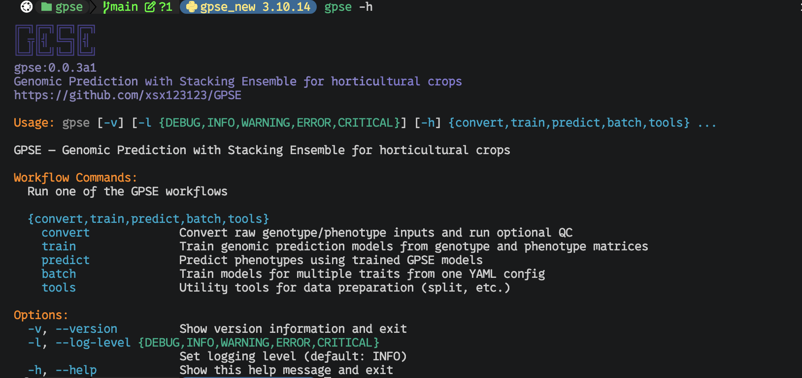

<p align="center">
  
</p>

<h1 align="center">GPSE（Genomic Prediction with Stacking Ensemble）</h1>

<p align="center">
  <a href="https://pypi.org/project/gpse/"></a>
  
  
  
</p>

<p align="center"><strong>用于园艺作物的基因组预测与 Stacking Ensemble 框架。</strong></p>

<p align="center">
  English: <a href="../README.md">README.md</a> | 简体中文
</p>

GPSE 是一个面向基因组选择与预测的机器学习流水线，覆盖从原始基因组数据（VCF/PLINK）预处理，到超参数优化、模型评估、TOPSIS 排名和 Stacking Ensemble 预测的完整流程。


## 🌟 核心特性

* **完整数据流水线**：支持 VCF 到 PLINK 二进制格式转换、SNP 提取、数值矩阵生成，以及基因型与表型的精确匹配。
* **可移植的 SNP 标识**：使用 canonical `chr<chrom>_<chromStart>_<chromEnd>` SNP ID（零基、半开区间），并持久化有序特征清单（feature manifest），保证训练好的模型可以安全地跨用户复用。
* **广泛算法支持**：支持 14+ 种机器学习算法，包括 Random Forest、XGBoost、LightGBM、CatBoost、SVR、MLP、ElasticNet 等。
* **双任务模式**：原生支持 **回归**（连续性状）与 **分类**（离散性状）。
* **自动超参数调优**：集成 Optuna，支持高效的多线程参数优化。
* **稳健评估**：通过多次重复 K 折交叉验证提升稳定性；CV 折分配使用固定种子 `42`，保证折划分可复现。
* **模型排序与筛选**：内置 **TOPSIS**（Technique for Order of Preference by Similarity to Ideal Solution）并结合熵权法进行多指标排名。
* **Stacking Ensemble**：自动集成 Top-N 表现最佳的模型以提升预测精度。
* **面向 AI Agent 的 MCP Server**：内置 [MCP](https://modelcontextprotocol.io) 服务器（`gpse-mcp` / `gpse mcp`），将完整的 convert → train → predict 工作流以 MCP 工具形式暴露，并支持后台任务管理（status / log / stop）以跟踪长时间训练——详见 [§6](#6-mcp-服务器gpse-mcp)。

## 📖 文档

- [Wiki 首页](wiki/README.md) — 完整文档索引
- [概览](wiki/01-overview.md) — 功能、架构与依赖
- [`gpse convert`](wiki/02-cli-convert.md) — 数据转换、QC 与重编码
- [`gpse train`](wiki/03-cli-train.md) — 训练、超参优化、重复交叉验证与 Stacking
- [`gpse predict`](wiki/04-cli-predict.md) — 特征对齐与表型预测
- [配置说明](wiki/05-configuration.md) — `gpse.yaml` 与 TOPSIS 配置
- [API 参考](wiki/06-api-reference.md) — 公开的 Python 类与函数
- [Agent Skill: gpse-mcp](../skills/gpse-mcp/SKILL.md) — 让 AI Agent 驱动 GPSE MCP 服务器
- [English README](../README.md) — 英文说明

## 🛠️ 安装

### 前置要求

* Python >= 3.10
* [PLINK 1.9](https://www.cog-genomics.org/plink/)（用于基因组格式转换与 SNP 提取）

### 使用 pip 安装（推荐）

```bash
pip install gpse
```

### 从源码安装

```bash
git clone https://github.com/xsx123123/GPSE.git
cd gpse

# 使用 Poetry 安装
poetry install

# 或使用 pip 安装
pip install .
```

## 🚀 使用方法

GPSE 使用子命令结构：`gpse {convert,train,predict,batch,tools}`。

### 命令行示意



### 1. 数据转换与 QC（`gpse convert`）

`gpse convert` 负责所有基因型/表型预处理：格式转换、QC 过滤、LD pruning 和样本匹配，输出可直接用于训练的数值矩阵。

#### 流程概览

```text
Input                        Processing                     Output
─────                        ──────────                     ──────
                             Validate trait names            (非法名称时中止)
samples.vcf            →  VCF → PLINK BED              →  {prefix}_{trait}_genotype.{csv|parquet|feather}
phenotype.txt/.csv     →  PED/MAP → numeric (0/1/2)    →  {prefix}_{trait}_phenotype.{ext}
                            SNP filtering                   {prefix}_{trait}_phenotype_info.json
                            Sample ID matching                 (自动检测的 task_type 与 n_classes)
                            Phenotype type detection        {prefix}_{trait}_scaler.json
                            Column name cleaning               (仅在 --standardize-phenotype 时)
                            Phenotype Z-score (optional)       (不标准化基因型矩阵)
```

基因型编码：`00→0`（纯合参考），`01/10→1`（杂合），`11→2`（纯合替代），缺失→`3`。

> **💡 `--direct` 现已变为可选**
>
> 当提供 `--pheno` 时，GPSE 会自动将完整 PLINK 二进制数据集转换为数值矩阵（即之前需要显式传入 `--direct` 的行为）。
> 仅在**没有**表型文件时（例如提前预处理基因型数据）才需要显式传入 `--direct`。
>
> 如需过滤 SNP，请使用 `--extract` 或 `--snp-dir`。

#### 1.1 VCF + 表型 → 训练数据

```bash
gpse convert \
    --vcf samples.vcf \
    --pheno phenotype.txt \
    --out-prefix data/train
```

输出文件：

* `data/train_{trait}_genotype.parquet` — 数值矩阵（行=样本，列=SNP，值为 0/1/2）。默认格式为 **Parquet**；可通过 `--out-format csv` 或 `--out-format feather` 切换，`feather` 需要安装 `pyarrow`。
* `data/train_{trait}_genotype.features.json` — 与矩阵一同生成的有序 SNP 特征清单。
* `data/train_{trait}_phenotype.csv` — 清洗并匹配后的表型文件（ID + 性状值）
* `data/train_{trait}_phenotype_info.json` — 自动检测的任务类型（`regression`/`classification`）、类别数、样本量和类别分布（如适用）

SNP 列名统一为 canonical `chr<chrom>_<chromStart>_<chromEnd>` 格式，采用零基、半开（half-open）坐标。例如 VCF 的 `chr1:100`（REF 长度为 1）会转换为 `chr1_99_100`。如果旧流程需要保留 VCF 的 `ID` 列，可在 `gpse convert`（或训练预处理）中使用 `--preserve-vcf-snp-ids`，并在 `gpse predict` 读取 VCF 时再次使用该参数；该模式会写入 feature manifest，并在转换和建模日志中提示。

#### 1.2 VCF + 表型（非标准染色体，园艺作物常用）

许多园艺作物（如西瓜、黄瓜）使用非标准染色体名或 scaffold ID。使用 `--allow-extra-chr` 将该参数传递给 PLINK：

```bash
gpse convert \
    --vcf samples.vcf.gz \
    --pheno phenotype.csv \
    --out-prefix data/train \
    -t 10 \
    --allow-extra-chr
```

#### 1.3 表型标准化

```bash
gpse convert \
    --vcf samples.vcf \
    --pheno phenotype.txt \
    --standardize-phenotype \
    --out-prefix data/train
```

> **注意：** `--standardize-phenotype` **只对表型/性状值**进行 z-score 标准化，**不会**标准化基因型矩阵。基因型数据保持原始的 0/1/2 加性编码。
>
> 标准化后的表型列计算方式为：
> ```
> y_scaled = (y - mean) / std
> ```
> 其中 `mean` 和 `std` 由匹配后的表型列计算得到。

额外输出：`data/train_phenotype_scaler.json`（均值/标准差，用于预测阶段逆标准化）

#### 1.4 提取指定 SNP

```bash
# 从 PLINK 二进制输入
gpse convert \
    --bfile plink_data \
    --extract snp_list.txt \
    --pheno phenotype.txt \
    --out-prefix data/train

# 从 SNP 列表目录批量提取
gpse convert \
    --bfile plink_data \
    --snp-dir snp_lists/ \
    --out-prefix data/train
```

#### 1.5 使用已有矩阵（跳过矩阵生成）

```bash
gpse convert \
    --matrix-file existing_genotype.csv \
    --pheno phenotype.txt \
    --out-prefix data/matched
```

#### 1.6 QC 过滤 + LD 修剪 + 基因型填充

基因型数据通常包含缺失位点、低质量 SNP，以及由于连锁不平衡（LD）导致的冗余标记。`gpse convert --run-qc` 执行以下主要任务。

**启用 `--run-qc --impute` 时的流程：**

```text
┌─────────────────────────────────────────────────────────────────────────────┐
│                              gpse convert pipeline                           │
├─────────────────────────────────────────────────────────────────────────────┤
│  输入 VCF / BED / PED                                                        │
│       │                                                                      │
│       ▼                                                                      │
│  ┌─────────────────────────────────────┐                                    │
│  │ Step 0: 格式统一化                   │  ← format_converter()              │
│  │  VCF → BED (raw_prefix)              │                                    │
│  └─────────────────────────────────────┘                                    │
│       │                                                                      │
│       ▼ (如果 --run-qc)                                                     │
│  ┌─────────────────────────────────────┐                                    │
│  │ Step 1: Imputation (可选)            │  ← impute_genotype_beagle()        │
│  │  BED → VCF → Beagle → VCF.gz → BED   │   (需 --impute + beagle_jar_path)  │
│  │  输出: {out}_qc_filled.bed           │                                    │
│  └─────────────────────────────────────┘                                    │
│       │                                                                      │
│       ▼                                                                      │
│  ┌─────────────────────────────────────┐                                    │
│  │ Step 2: QC 过滤                      │  ← PLINK --geno --mind --maf       │
│  │  按缺失率、MAF 过滤                  │   (参数: snpmaxmiss, samplemaxmiss,│
│  │  输出: {out}_qc.bed                  │          maf_max)                   │
│  └─────────────────────────────────────┘                                    │
│       │                                                                      │
│       ▼                                                                      │
│  ┌─────────────────────────────────────┐                                    │
│  │ Step 3: LD Pruning                   │  ← PLINK --indep-pairwise          │
│  │  去除高度连锁的 SNP                  │   (参数: r2_cutoff)                 │
│  │  输出: {out}_pruned.bed              │                                    │
│  └─────────────────────────────────────┘                                    │
│       │                                                                      │
│       ▼                                                                      │
│  ┌─────────────────────────────────────┐                                    │
│  │ Step 4: 转数值矩阵                   │  ← PLINK --recode compound-genotypes│
│  │  BED → PED → .geno (0/1/2)          │    → recode_to_numeric()            │
│  │  最终输出 Parquet/CSV                │                                    │
│  └─────────────────────────────────────┘                                    │
│       │                                                                      │
│       ▼                                                                      │
│  与 Phenotype 文件做样本匹配，输出最终文件集                                  │
└─────────────────────────────────────────────────────────────────────────────┘
```

**执行顺序总结：** 格式统一化 → 基因型填充（填补缺失）→ QC 过滤（剔除低质量）→ LD 修剪（去除相关 SNP）→ 数值矩阵转换 → 表型匹配。

**各阶段详情：**

1. **基因型填充（可选）** — 在严格过滤**之前**使用 Beagle 填补缺失基因型。
   - `--impute` 触发 Beagle 填充，使用的 JAR 包路径在 `gpse.yaml` 中配置，或通过 `--beagle-jar-path` 指定。
   - *预过滤：* 原始数据中完全缺少 REF/ALT 等位基因定义的变异会在填充前自动剔除，因为它们与 Beagle 不兼容。
   - **推荐用于高缺失率数据**：先填补空缺，可以避免样本或 SNP 因超过过滤阈值而丢失。

2. **QC 过滤** — 移除仍不满足质量标准的变异和样本。
   - `--snpmaxmiss`（对应 PLINK `--geno`）：缺失率超过阈值的 SNP 会被移除（默认 `0.1`，即保留检出率 ≥90% 的 SNP）。
   - `--samplemaxmiss`（对应 PLINK `--mind`）：缺失率超过阈值的样本会被移除（默认 `0.1`）。
   - `--maf`： minor allele frequency（MAF）低于阈值的 SNP 会被移除（默认 `0.05`）。稀有变异通常噪音较大，对基因组选择预测力贡献有限。
   - *注意：如果所有样本都被移除（PLINK 报错），请尝试放宽这些阈值（例如调到 0.5）。*

3. **LD 修剪** — 去除高度连锁的 SNP，降低冗余和共线性。
   - `--r2-cutoff`：在滑动窗口内，R² 超过该阈值的 SNP 对会被修剪（默认 `0.2`）。
   - 最终得到一组相对独立的 SNP，更适合机器学习模型。

**基础 QC + LD 修剪（无填充）：**

```bash
gpse convert \
    --run-qc \
    --input-prefix plink_data \
    --out-prefix data/qc_data \
    --snpmaxmiss 0.1 \
    --samplemaxmiss 0.1 \
    --maf 0.05 \
    --r2-cutoff 0.2
```

**QC + Beagle 填充 + LD 修剪：**

```bash
gpse convert \
    --run-qc \
    --input-prefix plink_data \
    --out-prefix data/qc_data \
    --snpmaxmiss 0.1 \
    --samplemaxmiss 0.1 \
    --maf 0.05 \
    --r2-cutoff 0.2 \
    --impute \
    --beagle-jar-path /path/to/beagle.jar
```

> **注意：** `--run-qc` 是独立步骤，**不需要** `--vcf` 或 `--pheno`。输入必须是 PLINK 二进制前缀（`--input-prefix`）。

**输出文件：**

| 文件 | 说明 |
| --- | --- |
| `data/qc_data_raw.bed/.bim/.fam` | 初始格式转换后的 PLINK 二进制（若输入为 VCF/PLINK 文本）。 |
| `data/qc_data_qc.bed/.bim/.fam` | QC 过滤后（缺失率 + MAF）。 |
| `data/qc_data_qc_filled.bed/.bim/.fam` | Beagle 填充后（仅当使用 `--impute`）。 |
| `data/qc_data_qc_filled.prune.in` | LD 修剪后保留的 SNP 列表。 |
| `data/qc_data_pruned.bed/.bim/.fam` | **最终 LD 修剪后的 PLINK 二进制**，可直接进入矩阵转换。 |
| `data/qc_data_qc.log` | PLINK QC 日志。 |

#### 1.7 PED/MAP 重编码为数值矩阵

```bash
gpse convert --recode-prefix plink_data
# 输出：plink_data.geno
```

#### 1.8 检查外部依赖

```bash
gpse convert --check-deps
```

#### 1.9 重命名表型列

```bash
gpse convert \
    --vcf samples.vcf \
    --pheno phenotype.txt \
    --trait-name Fruit_Weight \
    --out-prefix data/train
```

### 2. 模型训练（`gpse train`）

`gpse train` 支持两种模式：基于预处理好的矩阵直接训练，或通过 `--enable_preprocess` 在同一进程内复用 `gpse convert` 完成预处理后再训练。

**架构概览（`--enable_preprocess`）：**

```text
User runs: gpse train --enable_preprocess --vcf_file samples.vcf --raw_pheno_file pheno.txt ...

         │
         ▼
┌─────────────────────────────────────────────────────────────────────────┐
│  gpse/train/cli.py   main()                                             │
│  ─────────────────────────────────────────────────────────────────────  │
│                                                                         │
│  Stage 1: Argument validation (--enable_preprocess? --preprocess_only?) │
│       │                                                                 │
│       ▼                                                                 │
│  Stage 2: Preprocessing (if enable_preprocess)                          │
│       │  ┌──────────────────────────────────────────────────┐          │
│       │  │ GenomicDataProcessor (from gpse.convert)         │          │
│       │  │  • process_genomic_data(vcf=..., pheno=...)      │          │
│       │  │  • VCF → BED → PED → numeric matrix             │          │
│       │  │  • phenotype matching, standardization, type    │          │
│       │  │    detection (regression vs classification)     │          │
│       │  │  • Output: *_genotype.parquet, *_phenotype.csv  │          │
│       │  └──────────────────────────────────────────────────┘          │
│       │                                                                 │
│       ▼                                                                 │
│  Stage 3: Auto-detect task_type (from *_phenotype_info.json)            │
│       │                                                                 │
│       ▼                                                                 │
│  Stage 4: Training                                                      │
│       │  ┌──────────────────────────────────────────────────┐          │
│       │  │ GenomicPredictorV2 (gpse.train)                  │          │
│       │  │  • load_data(geno_file, pheno_file)              │          │
│       │  │  • prepare_cv_folds()                            │          │
│       │  │  • run_model_multiple_repeats()  ← Optuna HPO   │          │
│       │  │  • TOPSIS ranking                                │          │
│       │  │  • Stacking ensemble (optional)                  │          │
│       │  └──────────────────────────────────────────────────┘          │
│                                                                         │
└─────────────────────────────────────────────────────────────────────────┘
```

> **设计说明：** `--enable_preprocess` **不会** shell 调用 `gpse convert`。`gpse train` 直接在同一个 Python 进程内 import 并实例化 `GenomicDataProcessor`，运行完整的 convert 流程，自动推断输出文件路径，再将这些路径交给 `GenomicPredictorV2` 进行训练。

#### 2.1 使用预处理后的数据训练

训练会保留真实的基因型特征名（SNP ID），并写出 `<results_dir>/feature_manifest.json`。该清单记录了已保存模型实际使用的 SNP 顺序，是预测阶段安全对齐 VCF 输入的必要文件。CV 折分配使用固定种子 `seed=42` 重新生成，因此删除缓存的 CV 文件不会改变同一输入数据的折划分。

```bash
gpse train \
    --geno_file data/train_genotype.csv \
    --pheno_file data/train_phenotype.csv \
    --target_trait Fruit_Weight \
    --train_folds 5 \
    --n_repeats 10 \
    --trials 50 \
    --use_stacking \
    --top_n_models 5 \
    --n_jobs 1 \
    --max_workers 4 \
    --repeat_workers 1 \
    --results_dir output_results/
```

> **💡 总核数快捷参数：`--threads`**
>
> 如果只想表达"用大约 N 个核"，可以直接传 `--threads N`，GPSE 会自动推导
> `--max_workers` 和 `--repeat_workers`（并保持 `--n_jobs` 为 1 以避免线程超额订阅）：
>
> ```bash
> gpse train \
>     --geno_file data/train_genotype.csv \
>     --pheno_file data/train_phenotype.csv \
>     --target_trait Fruit_Weight \
>     --n_repeats 7 \
>     --threads 100 \
>     --results_dir output_results/
> ```
>
> 以 14 个回归模型为例，上述命令会解析为 `--max_workers 14 --repeat_workers 7`，
> 约 98 个并发训练单元。若 `--n_repeats` 为 1，有效并行度上限为模型数（14）；
> 需要更高并行时可增大 `--n_repeats` 或显式设置 `--n_jobs`。

> **💡 `--task_type` 和 `--n_classes` 现已变为可选**
>
> 当 `gpse convert` 已生成 `{prefix}_{trait}_phenotype_info.json` 文件时，
> `gpse train` 会自动读取并设置 `--task_type` 和 `--n_classes`。
> 仅在需要覆盖自动检测结果，或没有 info 文件时，才需显式传入。

> **💡 自定义 TOPSIS 排名指标：`--topsis_config`**
>
> GPSE 使用 TOPSIS 对模型排名，指标和权重均可配置。默认情况下，回归使用
> `Test Pearson (0.8) + Test Pearson std (0.2)`，分类使用
> `Test Accuracy (0.8) + Test Accuracy std (0.2)`。内置配置
> （`gpse/config/topsis.yaml`）列出了每种任务类型全部 11 个可用指标；
> `weight: 0` 的指标仅作参考展示。
>
> 自定义排名（例如同时考虑 Spearman 或训练时间）：
>
> ```bash
> gpse train \
>     --geno_file data/train_genotype.csv \
>     --pheno_file data/train_phenotype.csv \
>     --target_trait Fruit_Weight \
>     --task_type regression \
>     --topsis_config my_topsis.yaml \
>     --results_dir output_results/
> ```
>
> 完整 schema 和所有可用指标见 [配置说明 → TOPSIS](wiki/05-configuration.md#topsis-configuration-topsisyaml)。

> **💡 自定义模型注册表：`--model_config`**
>
> GPSE 内置 15 个回归 + 6 个分类模型，定义在 `gpse/config/models.yaml` 中。
> 可以用自定义 YAML 文件新增或覆盖现有模型——简单模型无需改动代码：
>
> ```bash
> gpse train \
>     --geno_file data/train_genotype.csv \
>     --pheno_file data/train_phenotype.csv \
>     --target_trait Fruit_Weight \
>     --task_type regression \
>     --model_config my_models.yaml \
>     --models bagging_reg \
>     --results_dir output_results/
> ```
>
> 完整 schema 和新增模型示例见 [配置说明 → Model Registry](wiki/05-configuration.md#model-registry-modelsyaml)。

#### 2.2 一键式：预处理 + 训练

```bash
gpse train \
    --enable_preprocess \
    --preprocess_prefix data/train \
    --vcf_file samples.vcf \
    --raw_pheno_file phenotype.txt \
    --target_trait Fruit_Weight \
    --train_folds 5 \
    --n_repeats 10 \
    --trials 50 \
    --use_stacking \
    --results_dir output_results/
```

#### 2.3 仅预处理（不训练）

```bash
gpse train \
    --preprocess_only \
    --preprocess_prefix data/train \
    --vcf_file samples.vcf \
    --raw_pheno_file phenotype.txt \
    --target_trait Fruit_Weight
```

#### 2.4 分类任务

```bash
gpse train \
    --geno_file genotype.csv \
    --pheno_file phenotype.csv \
    --target_trait Disease_Resistance \
    --train_folds 5 \
    --n_repeats 10 \
    --trials 50 \
    --results_dir classification_results/
```

> 当存在 `phenotype_info.json` 文件时，`--task_type classification` 和
> `--n_classes 3` 会自动推断。显式传入的值会覆盖自动检测结果，
> 若与检测结果冲突则会发出警告。

#### 2.5 批量多性状训练（`gpse batch`）

通过一份 YAML 配置一次性为多个性状构建模型。每个性状都会独立执行完整的
`gpse train` 流程并写入各自的输出目录；单个性状失败不会中断后续性状，
批次结束后会打印每个性状的成功/失败汇总，且各性状的汇总表会合并到
`<results_root>/merged/`。

```bash
gpse batch --config batch_config.yaml
# 只预览每个性状实际生成的命令，不真正运行：
gpse batch --config batch_config.yaml --dry_run
```

YAML 分为两段。`defaults` 接受任意 `gpse train` 参数（参数名与命令行选项
完全一致），另有 batch 专用的 `results_root`；`traits` 列表中每项必填
`name`（自动作为 `--target_trait`），并可覆盖任意参数——包括任务类型，
因此回归和分类性状可以混在同一个批次中：

```yaml
defaults:
  geno_file: maize_geno.csv
  pheno_file: maize_pheno.csv        # 多性状表型表，name 即列名
  task_type: regression
  use_default_params: true
  use_stacking: true
  n_repeats: 2
  threads: 60
  results_root: results/             # 每个性状输出到 results/<name>/

traits:
  - name: FT                         # 全部继承 defaults
    cv_file: cv_folds/FT_cv_50x5.csv
  - name: FW
    models: [rf_reg, xgboost_reg, gblup_reg]   # 该性状只跑这几个模型
  - name: color
    task_type: classification        # 按性状指定任务类型
    n_classes: 3
    results_dir: results_color/      # 覆盖 results_root
  - name: DTF
    enabled: false                   # 暂时跳过，但保留在配置中
```

可直接修改的模板见 `batch/batch_config.example.yaml`。配置中出现非
`gpse train` 的参数名会直接报错；Ctrl+C 会终止整个批次。

### 3. 表型分析

快速分析表型数据，判断更适合回归还是分类。

```bash
python -m gpse.tools.analyze_phenotypes
```

### 4. 拆分训练/测试集（`gpse tools split`）

将已匹配的基因型/表型样本拆分为训练集和保留测试集；测试集之后可用
`gpse predict` 进行评估：

```bash
gpse tools split \
    --geno data/train_genotype.csv \
    --pheno data/train_phenotype.csv \
    --out-prefix data/split \
    --test-ratio 0.2 \
    --seed 42
```

输出 `data/split_train_geno`、`data/split_train_pheno`、
`data/split_test_geno` 和 `data/split_test_pheno`。分类性状可使用
`--stratify COLUMN` 进行分层拆分。

### 5. 查看帮助

```bash
gpse --help
gpse --version
gpse convert --help
gpse train --help
gpse batch --help
gpse tools --help
```

### 6. MCP Server（`gpse mcp`）

GPSE 内置 [MCP](https://modelcontextprotocol.io)（Model Context Protocol）服务器，
让 AI Agent 通过 MCP 工具驱动完整的分析工作流（convert → train → predict）。
`pip install` 之后，以 stdio 方式启动，两种方式等价：

```bash
gpse-mcp        # console script
gpse mcp        # 等价的 CLI 子命令
```

MCP 客户端配置示例：

```json
{
  "mcpServers": {
    "gpse": {
      "command": "gpse-mcp"
    }
  }
}
```

暴露的工具：`gpse_version`、`gpse_help`、`gpse_convert`、`gpse_train`、
`gpse_predict`、`gpse_batch`、`gpse_tools`，以及后台任务管理
（`gpse_job_list` / `gpse_job_status` / `gpse_job_log` / `gpse_job_stop`）。
任务日志位于 `~/.gpse/mcp_jobs/`（可通过 `GPSE_MCP_JOBS_DIR` 环境变量覆盖）。

**工作方式。** 每次 MCP 工具调用都以子进程方式运行
（`python -m gpse.cli ...`，列表形式——不经过 shell，参数不会受到 shell 注入影响）。
短命令（`convert`、`predict`、`tools`）同步执行，默认 300 秒超时，
返回捕获的 stdout/stderr（尾部截断至 8000 字符）。长时间运行的命令
（`train`、`batch`）默认启动**后台任务**并立即返回 8 位 `job_id`；
用 `gpse_job_status` 轮询状态，用 `gpse_job_log` 读取进度，用
`gpse_job_stop` 终止整个进程组。传 `wait=True` 可改为同步执行（仅适合快速运行）。
相对路径基于 MCP 服务器的工作目录解析，建议使用绝对路径。

**典型 Agent 工作流。** 一次对话式分析大致如下：

1. `gpse_version` — 确认服务器可达。
2. `gpse_help("convert")` — 查询确切的 CLI 参数；未作为工具参数暴露的
   flag 可通过 `extra_args` 传入，如 `["--run-qc", "--maf", "0.05"]`。
3. `gpse_convert(vcf=..., pheno=..., out_prefix=...)` — 生成可训练矩阵
   （`{prefix}_{trait}_genotype.parquet`、`_phenotype.csv`、`_phenotype_info.json`）。
4. `gpse_train(task_type="regression", geno_file=..., pheno_file=...,
   target_trait=...)` — 返回 `job_id`；用 `gpse_job_status` /
   `gpse_job_log` 跟踪直至完成。
5. `gpse_predict(model=<results 目录或 .pkl>, geno_file=..., out=...)` —
   基于 SNP ID 对齐预测新样本。

多性状运行时，编写 YAML 配置（见上文 `gpse batch`），先调用
`gpse_batch(config=..., dry_run=True, wait=True)` 预览生成的命令，
再以后台方式启动。

**内置 Agent Skill（`skills/gpse-mcp/`）。** 仓库附带一个现成的 agent skill
（[skills/gpse-mcp/SKILL.md](../skills/gpse-mcp/SKILL.md)），指导 AI 编程 Agent
（Kimi Code、Claude Code 等）驱动该 MCP 服务器：工具清单、convert → train →
predict 工作流、后台任务处理，以及修改 `gpse/mcp/server.py` 时需要遵守的约束。
激活方式：将其复制或软链到 agent 的项目级 skills 目录（或直接让 agent 指向该文件）：

```bash
# Kimi Code / 通用 agent
mkdir -p .agents/skills && ln -s ../../skills/gpse-mcp .agents/skills/gpse-mcp

# Claude Code
mkdir -p .claude/skills && ln -s ../../skills/gpse-mcp .claude/skills/gpse-mcp
```

## 📥 输入与输出格式

当前 GPSE 对 `gpse convert`、`gpse train` 和 `gpse predict` 定义了完整 I/O 约束。

### `gpse convert` 输入

`gpse convert` 用于准备可训练的基因型和表型文件。

| 输入类型 | 参数 | 格式要求 |
| --- | --- | --- |
| VCF | `--vcf samples.vcf` | 标准 VCF 文件，GPSE 会调用 PLINK 转成二进制 PLINK 文件。 |
| PLINK binary | `--bfile prefix` | 需要同时存在 `prefix.bed`、`prefix.bim`、`prefix.fam`。 |
| PLINK text | `--ped-file file.ped --map-file file.map` | 标准 PED/MAP 文件。 |
| 已有矩阵 | `--matrix-file genotype.csv` | 第一列为样本 ID 的 CSV 基因型矩阵。 |
| SNP 列表 | `--extract snp_list.txt` | 每行一个 SNP ID，传给 PLINK `--extract`。 |
| SNP 列表目录 | `--snp-dir snp_lists/` | 目录下包含多个 `.txt` SNP 列表文件。 |
| 表型 | `--pheno phenotype.txt` | Tab 或逗号分隔；第一列为样本 ID，第二列为性状值。 |
| 完整转换 | `--direct` | 可选。提供 `--pheno` 时自动启用；无表型文件时强制执行 bfile → 矩阵的完整转换。 |
| 输出格式 | `--out-format {csv,parquet,feather}` | 基因型矩阵输出格式。默认 `parquet`；`feather` 需要 `pyarrow`。 |
| 线程数 | `-t, --threads N` | 批量性状处理的并行线程数（默认：10）。 |
| 非标准染色体 | `--allow-extra-chr` | 将 `--allow-extra-chr` 传给 PLINK，支持 scaffold 等非标准染色体名。 |
| 性状重命名 | `--trait-name NAME` | 重命名输出表型文件中的目标性状列。 |

表型文件通过 `--pheno` 传入。文件应包含表头，第一列为样本 ID，第二列为目标性状。GPSE 会先尝试按 tab 读取，失败后再按逗号读取。转换时只保留前两列。缺失值（`NaN` 和字符串 `NA`）会被删除。可通过 `--trait-name` 重命名目标性状列。

> **⚠️ 性状名限制**
>
> 性状（表型列）名会在**任何转换工作开始之前**进行校验。非法名称会导致流水线立即中止。
>
> 性状名**不能**包含：
>
> - 空格（` `）、制表符或换行符
> - 百分号（`%`）
> - 冒号（`:`）或斜杠（`/`、`\`）
> - 括号（`[`、`]`、`{`、`}`）
> - 竖线（`|`）
> - 双引号（`"`）
> - 逗号（`,`）
>
> 请改用下划线（`_`）或连字符（`-`）。例如将 `fruit weight` 改为 `fruit_weight`，将 `yield%` 改为 `yield_pct`。

> **⚠️ VCF / 表型样本 ID 匹配**
>
> 在开始耗时的 VCF → PLINK → 矩阵转换之前，GPSE 会基于 `cyvcf2` 执行一次**防御性样本重叠检查**。
>
> - VCF 样本 ID 直接从 VCF 头部读取。
> - 表型样本 ID 从表型文件第一列读取。
> - 如果共有样本数小于两个集合中较小的一个（即较小文件中的样本并非都在另一文件中有对应），流水线会立即中止。
>
> 检查失败时，日志会显示：
> - VCF 和表型文件各自的样本总数
> - 共有样本数
> - **两个文件**各自的代表性示例
> - **仅存在于 VCF** 中的样本
> - **仅存在于表型**中的样本
>
> 这样可以快速发现命名不一致（例如 VCF 中的 `Ames_12781` 与表型中的 `Chipper`），在浪费时间转换之前修正输入数据。

### `gpse convert` 输出

仅生成基因型矩阵时，输出：

```text
{out_prefix}.{csv|parquet|feather}
```

默认输出格式为 **Parquet**（`--out-format parquet`），可通过 `--out-format csv` 或 `--out-format feather` 切换（`feather` 需要安装 `pyarrow`）。

格式示例（CSV 视图）：

```csv
ID,chr1_99_100,chr2_199_200,chr3_300_301
sample1,0,1,2
sample2,1,3,0
```

SNP 列名统一为 `chr<chrom>_<chromStart>_<chromEnd>`，采用零基、半开坐标。例如 VCF 的 `chr1:100`（REF 长度为 1）会转换为 `chr1_99_100`。矩阵旁会写入 `<matrix>.features.json`，记录有序 SNP 清单。

基因型编码：

| 复合基因型 | 编码值 |
| --- | --- |
| `00` | `0` |
| `01` 或 `10` | `1` |
| `11` | `2` |
| 缺失或未知 | `3` |

启用表型/基因型匹配后，输出推荐训练文件（每个性状一组）：

```text
{out_prefix}_{trait}_genotype.{csv|parquet|feather}
{out_prefix}_{trait}_phenotype.{csv|parquet|feather}
{out_prefix}_{trait}_phenotype_info.json
```

匹配后的表型文件示例：

```csv
ID,TraitName
sample1,12.3
sample2,9.8
```

`phenotype_info.json` 文件包含自动检测的元数据：

```json
{
  "trait": "Fruit_Weight",
  "task_type": "regression",
  "n_classes": null,
  "reason": "continuous numeric values",
  "n_samples": 500,
  "mean": 12.34,
  "std": 3.56
}
```

GPSE 会根据表型值的分布自动判断每个性状更适合作为**回归**（连续值）还是**分类**（离散值）处理：
二元性状和整数编码且类别数 ≤20 的性状会被判定为 `classification`；其余数值性状为 `regression`。
该元数据会被 `gpse train` 读取，大多数情况下不再需要手动传入 `--task_type` 和 `--n_classes`。

启用 `--standardize-phenotype` 时，还会输出：

```text
{out_prefix}_{trait}_scaler.json
```

QC 模式（`--run-qc`）会输出 PLINK 前缀文件：

```text
{out_prefix}_raw.bed/.bim/.fam
{out_prefix}_qc.bed/.bim/.fam
{out_prefix}_qc_filled.bed/.bim/.fam
{out_prefix}_qc_filled.prune.in
{out_prefix}_pruned.bed/.bim/.fam
{out_prefix}_qc.log
```

Recode 模式（`--recode-prefix prefix`）输出：

```text
prefix.geno
```

### `gpse train` 输入

`gpse train` 消费的是 CSV 文件，通常直接来自 `gpse convert` 的输出。

| 参数 | 要求 |
| --- | --- |
| `--geno_file` | 需要包含 `ID` 列的 CSV 基因型矩阵；如果没有 `ID`，会尝试 `--cv_id_column`。 |
| `--pheno_file` | 与基因型文件共享同一 ID 列的 CSV 表型表。 |
| `--target_trait` | 表型表中的目标性状列名。 |
| `--task_type` | `regression` 或 `classification`。**可选** — 当存在 `{prefix}_{trait}_phenotype_info.json` 时自动推断；未找到 info 文件时默认 `regression`。 |
| `--n_classes` | 仅在自动检测失败或不可用时为分类任务必填，必须至少为 2。 |

推荐训练输入：

```bash
gpse train \
    --geno_file data/train_genotype.csv \
    --pheno_file data/train_phenotype.csv \
    --target_trait Fruit_Weight
```

训练时，GPSE 只保留 genotype 和 phenotype 中共同存在的样本 ID，并按统一顺序排序；所有非 ID 的 genotype 列都会作为特征，并**保留真实 SNP 名称**（不再重命名为 `feature_0`、`feature_1`）。训练时实际使用的有序特征清单会保存到 `{results_dir}/feature_manifest.json`，`gpse predict` 依据它将新的 VCF 或矩阵数据对齐到已训练模型。

分类标签可以是字符串，也可以是不连续数值。GPSE 会将其编码为连续整数类，并保存编码器：

```text
{results_dir}/label_encoder.pkl
```

如果未提供 `--cv_file`，GPSE 会自动生成：

```text
{results_dir}/cv_folds/{target_trait}_cv_{n_repeats}x{train_folds}.csv
```

CV 文件包含样本 ID 作为索引，以及每个 repeat 对应的折分配列：

```csv
ID,TraitName,cv0,cv1
sample1,12.3,0,3
sample2,9.8,1,4
```

折编号范围为 `0` 到 `train_folds - 1`。

### `gpse train` 输出

默认结果目录为 `optimization_results_v2/`。

主要输出：

```text
{results_dir}/model_comparison.csv
{results_dir}/feature_manifest.json
{results_dir}/cv_folds/{target_trait}_cv_{n_repeats}x{train_folds}.csv
{results_dir}/{model_name}/summary_results.json
{results_dir}/{model_name}/repeat_{i}/repeat_results.json
{results_dir}/{model_name}/repeat_{i}/all_predictions.json
```

启用 `--save_models` 时：

```text
{results_dir}/{model_name}/repeat_{i}/fold_{j}_model.pkl
```

`feature_manifest.json` 保存训练时实际使用的 SNP 有序清单；`predict` 会依据它对输入 VCF 进行对齐。

代表性模型输出：

```text
{results_dir}/{model_name}/representative_model/model.pkl
{results_dir}/{model_name}/representative_model/info.json
```

回归任务标准化输出：

```text
{results_dir}/phenotype_scaler.json
```

Stacking 输出：

```text
{results_dir}/ensemble_stacking/stacking_ensemble_model.pkl
{results_dir}/ensemble_stacking/stacking_results.pkl
```

TOPSIS 排名输出：

```text
{results_dir}/model_comparison_topsis.csv
{results_dir}/model_comparison_topsis_simple.csv
```

### `gpse predict`

`gpse predict` 已实现：接受训练结果目录（或其中的代表性模型），加上新的 VCF 或已转换的基因型矩阵，完成特征对齐后输出预测结果：

```bash
gpse predict \
    --model results/ \
    --vcf-file new_samples.vcf.gz \
    --out predictions.csv
```

预测前会将 VCF 的 `CHROM/POS/REF` 转换为同样的 canonical SNP ID（`chr<chrom>_<chromStart>_<chromEnd>`，零基、半开区间），并严格按 `<results_dir>/feature_manifest.json` 的训练顺序排列。输入缺少的模型 SNP 默认使用 GPSE 缺失基因型编码 `3`（可通过 `--missing-value` 覆盖），同时在终端告警，并将 matched/missing/extra SNP 数、特征覆盖率和完整清单写入 `predictions.alignment.json`。低覆盖率默认只告警；可传入 `--min-feature-coverage 0.8`（或其他 0–1 阈值）直接拒绝不可靠输入。

## 📁 源码结构

项目按五个工作流命令组织：`convert`、`train`、`predict`、`batch` 和 `tools`。命令相关代码放在对应子包中，共享支撑代码放在 `config`、`models`、`tasks`、`tools` 和 `utils` 中。

### `gpse/`

| 文件 | 作用 |
| --- | --- |
| `__init__.py` | 包元数据，当前导出 `__version__`。 |
| `cli.py` | 顶层命令路由器，负责 `gpse {convert,train,predict,batch,tools}` 的子命令路由、共享 CLI 参数，并将工作流逻辑委派给对应子包。 |

### `gpse/config/`

配置常量与打包的 YAML 默认值。

| 文件 | 作用 |
| --- | --- |
| `__init__.py` | 配置数据类和常量的公共导出。 |
| `constants.py` | 数据类与不可变常量，包括文件名、目录名、精度设置和线程环境变量名。 |
| `_topsis_config.py` | 读取 TOPSIS 任务配置、验证 criteria/weights、记录运行环境，并保存代表性模型。由训练预测器消费。 |
| `_model_registry.py` | YAML 驱动的模型注册引擎：加载 `models.yaml`，延迟解析 import 路径，注入线程参数，将内联搜索空间 DSL 编译为 Optuna 可调用对象。 |
| `default.yaml` | 默认应用/日志配置。 |
| `software.yaml` | 软件元数据与外部工具定义，用于转换/QC 依赖检查。 |
| `topsis.yaml` | 用于回归/分类模型排序的 TOPSIS 指标、方向和权重。 |
| `models.yaml` | 模型注册表：15 个回归 + 6 个分类模型定义（import 路径、线程策略、默认参数、Optuna 搜索空间）。 |

### `gpse/convert/`

`gpse convert` 的实现：基因型/表型转换、QC、LD pruning 和外部工具执行。

| 文件 | 作用 |
| --- | --- |
| `__init__.py` | 导出 `GenomicDataProcessor`。 |
| `cli.py` | 转换模式 CLI 解析器与分发器，包含 QC、重编码和依赖检查。 |
| `external.py` | 外部工具发现、路径解析、版本检查和命令执行辅助函数。 |
| `genotype_matrix.py` | 基因型格式转换纯函数：VCF→PLINK BED、BED→PED/MAP、PED/MAP→数值 CSV 矩阵，以及批量 SNP 目录处理。 |
| `phenotype.py` | 表型处理纯函数：表型文件转换、基因型-表型样本匹配、Z-score 标准化、标准化参数持久化，以及自动表型类型检测（回归/分类）。 |
| `validators.py` | 数据校验工具：性状名验证、列名清洗（特殊字符检测/替换）、矩阵加载与摘要统计。 |
| `processor.py` | 薄编排层（`GenomicDataProcessor`），协调上述子模块完成基因型转换、表型匹配和数据校验。 |
| `qc.py` | PLINK/Beagle QC 工具：格式转换、基因型过滤、imputation、LD pruning 和 PED/MAP 数值重编码。 |

#### Convert API 参考（函数级）

下表描述 `gpse.convert` 中的所有公开函数/方法。内部辅助函数（如
`_run_command`、`_config_context`）省略。

##### `gpse.convert.qc`

| 函数 | 签名（关键参数） | 描述 |
|---|---|---|
| `format_converter` | `(user_params, input_prefix, output_prefix)` | 检测输入格式（VCF / PED+MAP / BED）并统一为 PLINK 二进制（BED/BIM/FAM）。返回 PLINK 输入 flag（`--bfile`）。 |
| `filter_genotype` | `(user_params, input_prefix, output_prefix, input_flag='--bfile')` | 按用户提供的 ID 列表过滤样本/SNP（`--extract`、`--exclude`、`--keep`、`--remove`），并重编码为复合基因型（`01`），缺失编码为 `3`。 |
| `impute_genotype_beagle` | `(user_params, input_prefix, output_prefix)` | 端到端执行 Beagle 填充：**BED → VCF → Beagle → VCF.gz → BED**。预过滤缺失等位基因（BIM 中为 `0`）的变异，因为 Beagle 要求有效的 REF/ALT。将填充后的 VCF 转回 BED 时使用 `--const-fid`，以安全处理包含下划线的样本 ID。 |
| `analyze_and_prune` | `(user_params, input_prefix, output_prefix, run_imputation=False)` | **主 QC 编排器。** 依次执行：(0) `format_converter`，(1) `impute_genotype_beagle`（当 `run_imputation=True`），(2) QC 过滤（`--geno`、`--mind`、`--maf`），(3) LD 修剪（`--indep-pairwise`）。返回 `(qc_prefix, pruned_prefix)`。 |
| `recode_to_numeric` | `(fileprefix)` | 将 PLINK PED/MAP 复合基因型转换为加性数值编码：`00→0`、`01/10→1`、`11→2`。写出表头为 `ID,SNP1,SNP2,...` 的 `.geno` CSV 文件。 |

##### `gpse.convert.genotype_matrix`

| 函数 | 签名（关键参数） | 描述 |
|---|---|---|
| `vcf_to_plink` | `(vcf_file, out_prefix, plink_path='plink', allow_extra_chr=False)` | 将 VCF 转为 PLINK 二进制格式（BED/BIM/FAM）。输出已存在时跳过。使用 `--double-id`，使完整 VCF 样本名成为 IID。 |
| `extract_snps` | `(bfile, extract_file, out_prefix, ...)` | 从 PLINK 二进制数据集中提取指定 SNP 到 PED/MAP。复合基因型重编码，缺失=`3`。 |
| `convert_bfile_to_ped` | `(bfile, out_prefix, ...)` | 将**完整** PLINK 二进制数据集转为 PED/MAP（不过滤 SNP）。复合基因型重编码，缺失=`3`。 |
| `convert_to_matrix` | `(fileprefix, out_file=None, out_format='parquet')` | 读取 PED/MAP，应用基因型编码映射（`00→0`、`01→1`、`10→1`、`11→2`、缺失→`3`），写出数值矩阵。输出格式：`csv`、`parquet`、`feather`。缺少 `pyarrow` 时回退 CSV。 |
| `process_snp_dir` | `(bfile, snp_dir, out_dir, ...)` | 批量处理 `snp_dir` 中的每个 `.txt` SNP 列表文件：extract → PED/MAP → 数值矩阵。每个列表写一个输出文件。 |

##### `gpse.convert.phenotype`

| 函数 | 签名（关键参数） | 描述 |
|---|---|---|
| `convert_phenotype` | `(pheno_file, out_file=None, trait_name=None, trait_col=None)` | 读取 tab 或逗号分隔的表型文件，删除缺失行（`NaN` / `NA`），可选重命名性状列，返回两列 DataFrame（`ID`、trait）。 |
| `match_genotype_phenotype` | `(pheno_df, geno_file, out_prefix, out_format='csv')` | 按 ID 取基因型与表型样本交集，按共享顺序排序，写出匹配的 `{prefix}_phenotype.{ext}` 和 `{prefix}_genotype.{ext}`。无交集时抛出 `ValueError`。 |
| `standardize_phenotype` | `(pheno_df, trait_col)` | 对性状列做 z-score 标准化。返回 `(标准化后 DataFrame, scaler 参数)`。 |
| `detect_phenotype_type` | `(series, max_classes=20, min_samples_per_class=5)` | 根据值分布自动判断性状应作为 `regression` 还是 `classification`（唯一值 ≤2 → classification；字符串标签 → classification；整数编码且类别数 ≤20、每类样本 ≥5 → classification；否则 → regression）。 |
| `save_phenotype_info` | `(info, info_file)` | 持久化表型元数据（性状名、任务类型、`n_classes`、样本量、mean/std）到 JSON。 |
| `save_scaler_params` | `(scaler_params, scaler_file)` | 将 z-score 标准化参数（`mean`、`std`）保存为 JSON，供预测阶段逆变换。 |

##### `gpse.convert.validators`

| 函数 | 签名 | 描述 |
|---|---|---|
| `validate_trait_names` | `(trait_names)` | 前置校验：任一性状名包含非法字符（空格、`%`、`:`、`/`、`\`、`|`、括号、引号、逗号）或为空时抛出 `ValueError`。 |
| `check_special_chars` | `(column_names)` | 检测特征名中 LightGBM 不支持的字符（`:`、`|`、`[`、`]`、`{`、`}`、`"`、`\`、`,`、空格）。 |
| `clean_column_names` | `(column_names)` | 将不支持的字符替换为下划线，使特征名对所有 ML 框架安全。 |
| `process_file` | `(file_path, output_path)` | 清洗 CSV 文件中的列名并重写。 |
| `load_matrix` | `(matrix_file)` | 加载基因型矩阵（CSV/Parquet/Feather），记录行/列数和样本 ID 示例。 |

##### `gpse.convert.processor` — `GenomicDataProcessor`

`GenomicDataProcessor` 是 `gpse convert` 使用的薄编排器。多数方法是对上述纯函数的薄封装。

| 方法 | 委派给 | 描述 |
|---|---|---|
| `process_genomic_data(**kwargs)` | — | **主入口。** 协调整个 convert 流程：格式转换 → 可选 QC/填充 → 矩阵生成 → 表型匹配/标准化 → 按性状写出输出。 |
| `vcf_to_plink(vcf_file, out_prefix)` | `genotype_matrix.vcf_to_plink` | VCF → PLINK BED。 |
| `extract_snps(bfile, extract_file, out_prefix)` | `genotype_matrix.extract_snps` | 提取 SNP 子集 → PED/MAP。 |
| `convert_bfile_to_ped(bfile, out_prefix)` | `genotype_matrix.convert_bfile_to_ped` | 完整 BED → PED/MAP。 |
| `convert_to_matrix(fileprefix, out_file, out_format)` | `genotype_matrix.convert_to_matrix` | PED/MAP → 数值矩阵。 |
| `process_snp_dir(bfile, snp_dir, out_dir)` | `genotype_matrix.process_snp_dir` | 批量 SNP 提取。 |
| `convert_phenotype(pheno_file, ...)` | `phenotype.convert_phenotype` | 读取并清洗表型。 |
| `match_genotype_phenotype(pheno_df, geno_file, out_prefix)` | `phenotype.match_genotype_phenotype` | 取交集并重排基因型/表型样本。 |
| `standardize_phenotype(pheno_df, trait_col)` | `phenotype.standardize_phenotype` | 对性状做 z-score 标准化。 |
| `check_special_chars(column_names)` | `validators.check_special_chars` | 检测不支持的字符。 |
| `clean_column_names(column_names)` | `validators.clean_column_names` | 清洗列名。 |
| `validate_trait_names(trait_names)` | `validators.validate_trait_names` | 性状名前置校验。 |

##### `gpse.convert.workflow`

| 函数 | 描述 |
|---|---|
| `run_convert_workflow(args, mode)` | 顶层分发器。根据 CLI 参数路由到 `_run_pipeline`、`_run_qc`、`_run_recode` 或 `_run_deps`。 |
| `validate_convert_mode(parser, args)` | 判断要运行的 convert 子模式（`pipeline`、`qc`、`recode`、`deps`）并校验必需参数。 |

##### `gpse.convert.external`

| 函数 | 描述 |
|---|---|
| `run_command(cmd_list, log_file)` | 不经过 shell 执行外部命令。压缩 PLINK 进度刷屏日志，并为常见 PLINK/Beagle 失败输出友好的错误提示。 |
| `resolve_configured_tool(name, ...)` | 依次从 (1) 显式 CLI 覆盖、(2) YAML 配置、(3) `$PATH` 解析可执行文件路径。 |
| `ensure_existing_file(file_path, name)` | 校验 `file_path` 存在；不存在时抛出带描述信息的 `FileNotFoundError`。 |
| `check_configured_external_tools(tools, ...)` | 检查必需的外部依赖（PLINK、Java）已安装且满足最低版本要求。 |
| `get_convert_config(config_path, ...)` | 从打包 YAML 和可选的项目/用户覆盖中加载并合并 convert 配置。 |

### `gpse/train/`

`gpse train` 的实现：模型训练、重复 CV、优化、模型排名和 Stacking Ensemble。

| 文件 | 作用 |
| --- | --- |
| `__init__.py` | 对 `GenomicPredictorV2`、`StackingEnsemble` 和 `TOPSISEvaluator` 的懒加载导出。 |
| `cli.py` | `gpse train` 的 CLI 解析器与分发器，包括训练参数、预处理参数、校验和训练流程启动。 |
| `predictor.py` | 训练总控类，负责初始化任务优化器、日志、目录，并绑定训练子模块方法。 |
| `_data_io.py` | 训练数据加载、基因型/表型对齐、表型标准化和逆标准化。 |
| `_model_tools.py` | 模型创建、默认参数查找、参数过滤，以及回归/分类默认指标回退。 |
| `_fold_training.py` | 单折训练、预测、指标计算、折级日志和折级指标平均。 |
| `_ensemble.py` | fold 集成预测逻辑和集成指标计算。 |
| `_optimization.py` | 基于 Optuna 的交叉验证超参数优化。 |
| `_repeat_training.py` | repeat 级编排、并行 repeat 执行、统计汇总、代表性 repeat 选择和结果保存。 |
| `_cv_manager.py` | CV fold 文件的创建/加载，以及基于预定义 CV 分配生成 folds。 |
| `_pipeline.py` | 顶层 `run_all_models` 流程：运行选定模型、生成比较表、执行 TOPSIS，并可选训练 stacking。 |
| `stacking.py` | 可选的 stacking stage：加载基础模型、生成 meta-features、训练 meta-model、评估并保存产物。 |
| `topsis.py` | TOPSIS evaluator 和可选 CLI，用于根据配置好的指标和权重对模型排名。 |

### `gpse/predict/`

`gpse predict` 的实现：面向 VCF/矩阵输入的预测流程，按已训练的特征清单进行 canonical SNP ID 对齐。

| 文件 | 作用 |
| --- | --- |
| `__init__.py` | 导出预测与特征对齐辅助函数。 |
| `__main__.py` | 支持 `python -m gpse.predict`。 |
| `core.py` | 加载 VCF/矩阵基因型，canonical 化 SNP ID，按 `feature_manifest.json` 对齐并写出对齐报告。 |
| `cli.py` | 预测 CLI：VCF/矩阵输入、模型特征对齐、缺失 SNP 报告与预测 CSV 输出。 |

### `gpse/batch/`

`gpse batch` 的实现：YAML 批量配置加载，按性状顺序执行 `gpse train`。

| 文件 | 作用 |
| --- | --- |
| `__init__.py` | Batch 包标记。 |
| `cli.py` | `gpse batch` 的 CLI 解析器（`--config`、`--dry_run`）。 |
| `runner.py` | 加载 YAML 批量配置，将 `defaults` 与性状级覆盖合并并翻译成 `gpse train` 参数（含布尔和列表参数），逐性状执行训练并打印最终汇总。 |
| `merge.py` | 将各性状的汇总表（`model_comparison*.csv` 和 holdout 汇总）合并到 `<results_root>/merged/`，并添加前置 `Trait` 列。 |

### `gpse/models/`

模型注册表和优化器/搜索空间定义。这里定义模型如何构建、Optuna 如何采样参数，但不直接运行完整训练流水线。

| 文件 | 作用 |
| --- | --- |
| `__init__.py` | 回归和分类优化器的懒加载导出。 |
| `regression_model_optimizer.py` | 回归模型注册、Optuna 搜索空间、参数过滤、模型工厂和默认参数。 |
| `classification_model_optimizer.py` | 分类模型注册、Optuna 搜索空间、参数过滤、模型工厂和默认参数。 |
| `model_optimizers.py` | 兼容旧代码的回归优化器导入 shim。新代码建议直接使用 `regression_model_optimizer.py`。 |
| `classification_models.py` | 兼容旧代码的分类优化器导入 shim。新代码建议直接使用 `classification_model_optimizer.py`。 |

### `gpse/tasks/`

训练阶段共享的任务级运行辅助代码。

| 文件 | 作用 |
| --- | --- |
| `__init__.py` | `GenomicClassifier` 的懒加载导出。 |
| `classification.py` | 分类任务运行支持：标签编码/解码、概率转标签、分类指标、结果汇总，以及对 `ClassificationModelOptimizer` 的委派。 |

### `gpse/tools/`

独立于主工作流的工具脚本。

| 文件 | 作用 |
| --- | --- |
| `__init__.py` | tools 包标记。 |
| `cli.py` | `gpse tools` 的 CLI 解析器与分发器。 |
| `analyze_phenotypes.py` | 用于检查表型分布、辅助判断任务类型的独立分析脚本。 |
| `split.py` | `gpse tools split` 的实现：将匹配的基因型/表型样本拆分为训练/测试集（支持分类性状的分层拆分）。 |

### `gpse/utils/`

跨工作流共享的通用工具代码。这里应只放通用支撑代码，train/convert/predict 特有业务逻辑应放到对应子包。

| 文件 | 作用 |
| --- | --- |
| `__init__.py` | 日志和通用基因组工具的懒加载导出。 |
| `configuration.py` | YAML 配置加载与合并辅助，支持打包默认值和可选的项目/用户覆盖。 |
| `dependency_checker.py` | 通用外部依赖检测与版本检查工具。 |
| `genomic_utils.py` | 通用训练辅助：指标计算、CV 文件辅助、结果表生成、随机种子生成、目录创建、fold 工具和 TOPSIS 封装。 |
| `log_utils.py` | Loguru/Rich 日志初始化、子进程日志设置和日志收集。 |
| `logo.py` | 基于 Rich 的 logo 与欢迎面板渲染。 |
| `print_utils.py` | 可复用的 Rich 表格/面板/列输出工具。 |
| `version.py` | 版本、依赖、系统环境和外部工具信息输出。 |

## 📦 主要依赖

* `scikit-learn`
* `xgboost`
* `lightgbm`
* `catboost`
* `optuna`
* `pandas` & `numpy`
* `rich` & `loguru`（用于美观的 CLI 输出和日志）

## 📝 最近更新

* **0.0.3a1：批量训练、数据拆分与验证套件**（`2026-07-21`）
  * 新增 `gpse batch` 子命令：YAML 驱动的多性状批量训练。`defaults` 接受任意 `gpse train` 参数，每个性状可单独覆盖；`--dry_run` 可预览生成的分性状命令；运行后各性状汇总表合并到 `<results_root>/merged/`。
  * 新增 `gpse tools split` 子命令：将匹配的基因型/表型样本拆分为训练/测试子集（分类性状可选分层拆分），供后续 `gpse predict` 评估。
  * 修复 `kernelridge_reg` 的 scipy-OpenBLAS 段错误（改走安全求解路径）。
  * 新增 `tests/validation/` 多物种验证套件：覆盖 6 个田间作物、3 个葫芦科物种和 1 个生菜 MAGIC 群体的批量配置与运行脚本，每个均跑全部 15 个回归模型。

* **日志重构、并行度调优与批量中断处理**（`2026-07-20`）
  * 新增 `docs/wiki/` Wiki 文档框架——软件概览、各子命令指南（`convert` / `train` / `predict`）、配置参考和完整 Python API 参考。
  * 训练日志改为带 模型/repeat/fold 标签的紧凑单行格式（`xgboost_reg R1 F3 | Train r=... | Val r=... | Test r=... | 5.4s`）；折级日志降为 DEBUG（可用 `-l DEBUG` 查看），并行运行不再交错成噪音。repeat 平均值也是单行摘要。
  * `derive_parallelism_from_threads` 在模型级和 repeat 级分配后，将剩余的 `--threads` 预算回收进 `n_jobs`（例如 `--threads 80`、15 个模型 × 2 repeats 现在用满 60 核而非 30）。
  * `batch/batch_genomic_prediction.py` 在 Ctrl+C 时停止剩余批量队列（返回码 130），不再将中断当作普通任务失败。
  * 消除两类警告：Markdown 报告中 pandas `fillna` 降型的 `FutureWarning`；输入数组为常量时跳过 Pearson/Spearman 以消除 scipy `ConstantInputWarning`（指标回退为 0.0）。
  * 超大/发散的 MSE 值以科学计数法显示（`4.415e+27`），不再打印超长数字串。

* **自动表型类型检测**（`2026-06-10`）
  * 在 `gpse/convert/phenotype.py` 中新增 `detect_phenotype_type()` — 根据值分布自动将性状分类为 `regression` 或 `classification`：
    * 二元性状（唯一值 ≤2）→ `classification`
    * 字符串标签 → `classification`
    * 整数编码且类别数 ≤20、每类样本 ≥5 → `classification`
    * 连续数值 → `regression`
  * `gpse convert` 现在会在输出基因型/表型文件的同时，生成 `{prefix}_{trait}_phenotype_info.json`。
  * `gpse train` 自动读取 `phenotype_info.json` 来推断 `--task_type` 和 `--n_classes`，大多数场景下不再需要手动指定。
  * 显式传入的 `--task_type` / `--n_classes` 仍会被尊重；若与自动检测结果冲突，将发出警告。

* **Convert 模块重构与性状名校验**（`2026-06-08`）
  * 将单体的 `processor.py` 拆分为 `gpse/convert/` 下的多个聚焦子模块：
    * `genotype_matrix.py` — VCF→PLINK→PED→数值 CSV 矩阵转换纯函数
    * `phenotype.py` — 表型转换、样本匹配和 z-score 标准化纯函数
    * `validators.py` — 性状名校验、列名清洗和矩阵加载
  * `processor.py` 现在是委派给上述模块的薄编排层。
  * 新增**性状名前置校验**——包含空格、`%`、`:`、`/`、括号、竖线、引号、逗号或空白字符的性状名会在任何转换工作开始前被拒绝。
  * 改进 PLINK stdout 压缩：基于 `\r` 的进度条（如 `0%1%2%...99%done.`）现在能被正确解析并从日志中抑制。
  * 修复 `gpse convert` 在未传 `--out-prefix` 时在当前目录创建空 `gpse_convert.log` 文件的问题。

* **防御性样本匹配与干净的错误报告**（`2026-06-09`）
  * 在 `gpse convert` 中新增基于 **`cyvcf2` 的 VCF/表型样本重叠校验**。当 VCF 与表型文件的样本 ID 匹配不足时，流水线会在任何耗时的格式转换之前立即中止。错误信息会列出两侧示例以及仅存在于单侧的 ID，便于诊断命名不一致。
  * **ValueError 业务错误不再向终端打印 Python traceback**。性状名校验失败和样本重叠失败现在都会产生干净、可读的错误日志并以退出码 `1` 退出。未预期的运行时异常仍会打印完整 traceback 以便调试。

* **线程控制与启动性能**（`2026-06-03`）
  * 在导入 numpy/scipy 之前设置 6 个环境变量，修复 BLAS/MKL 线程池忽略 `--n_jobs` 的问题。
  * 在所有 `model.fit()` 调用周围增加 `threadpoolctl.threadpool_limits()` 作为运行时安全网。
  * 将 `train/`、`models/`、`tasks/` 和 `utils/` 下的 `__init__.py` 改为懒加载，以避免 `gpse --help` 载入整个 ML 栈。
  * 重命名 CLI 参数：`--threads` → `--n_jobs`，`--parallel_jobs` → `--max_workers`。
  * 为 `histgradientboost_reg` 和 `knn_reg` 补充 `--n_jobs`。
  * 修复 `gpse 42` 彩蛋的重复面板和 Rich 标记未渲染问题。

* **导入系统统一**（`2026-06-03`）
  * 移除了 `cli.py` 和训练预测器中的所有 `sys.path` hack。
  * 统一为绝对包路径导入（`from gpse.xxx import ...`）。
  * 为 `config/`、`convert/`、`train/`、`models/`、`tasks/`、`utils/` 和 `tools/` 配置了正确的 `__init__.py` 导出。

* **`GenomicPredictorV2` 模块化重构**（`2026-06-03`）
  * 将单体的 `GenomicPredictorV2` 拆分为 `gpse/train/` 下的多个聚焦模块。
  * 将 TOPSIS 运行时配置迁移到 `gpse/config/_topsis_config.py`，YAML 默认值迁移到 `gpse/config/topsis.yaml`。
  * 将所有中文注释、docstring 和日志翻译为英文。
  * 将 `ModelConfig`、`ClassificationModelConfig`、`NumpyEncoder` 移至 `config/constants.py`。

## 🗺️ Roadmap

### GPSE v1 — 标准化流水线（当前）

GPSE v1 提供标准化、可复现的基因组预测流水线：
**QC → 表型处理 → 建模 → 评估 → 报告**。定位为领域工具 + 基准测试套件，
针对基因组选择（GS）/ 基因组预测（GP）中长期存在的两个痛点：
分析流程不一致、结果难以复现。

* 配置驱动、模块化的架构，每个步骤都有显式的输入/输出契约——该设计已为
  Agent 层预留扩展点。
* 从设计上强制无泄漏评估：保留集在训练循环之外一次性拆分
  （`split_manifest.json`、`train_ids.txt`、`test_ids.txt`），表型 scaler
  只在训练折内拟合，特征选择是折局部的，所有模型/repeat/ensemble 选择决策
  均使用**仅训练 CV** 指标。保留集指标仅用于报告。
* 完整审计链：每 repeat、每折的结果（`cv_train_only.csv`、
  `all_predictions.json`）、Optuna 最优参数、TOPSIS 选择和
  `run_summary.json` 全部持久化，保证可复现。
* 在多个公开数据集（小麦、玉米及其他公开基因型 + 表型 panel）上做基准测试，
  验证工作流。

### GPSE v2 — Agent 驱动的自适应建模（规划中）

V2 通过 *Evaluator–Optimizer* 循环，将标准化流水线升级为**领域感知、
自适应的建模框架**。V1 回答"如何标准化工作流"，V2 回答"如何让工作流
适配每个数据集"。

**Evaluator–Optimizer 循环**

* **Builder Agent** — 以声明式 spec 提出建模方案（模型类型、超参数、
  QC 策略、表型变换）。
* **Reviewer Agent** — 以领域感知的方式推理交叉验证指标和诊断信息
  （学习曲线、过拟合差距、特征重要性、折间稳定性），并给出具体的改进建议。
* 目标信号始终来自**真实的交叉验证结果**；Agent 负责解释和决策——
  它们从不取代真实评估。

**领域感知**

* 群体结构校正和结构感知的 CV 策略，包括基于家系/群体的折划分。
* 偏态表型的变换选择（log / Box-Cox / Yeo-Johnson）。
* 识别并针对基因组特有问题（如 G×E）提供建议。

**从构造上无泄漏**

* 所有数据驱动的决策（QC 阈值、表型变换、特征选择）都**只在训练折内**做出。
* 保留测试集在迭代开始前预留，绝不参与循环；仅用于一次最终评估。

**终止、日志、可复现性**

* 达到最大迭代次数，或连续 N 次迭代无改进（以仅训练 CV 打分）后停止。
* 每次迭代记录其方案、Agent 反馈和观测指标；最终锁定的流水线可导出，
  一键重跑，完全可复现。

**为什么现在可行。** V1 的基础已经就绪：MCP 服务器（`gpse mcp`）通过
后台任务管理将完整的 convert → train → predict 工作流暴露给 AI Agent，
无泄漏的保留集机制和每折审计产物已经产出 Reviewer Agent 需要的每个目标信号，
YAML 驱动的模型注册表使建模方案可机器书写。V2 的主要新工作是上层编排：
plan-spec 执行器、诊断聚合器（学习曲线、重要性、过拟合分析）和 Agent 循环本身。

**里程碑**

1. **v2.0 — 基础：** plan-spec schema + 执行器；诊断与可视化子命令；
   锁定流水线导出。
2. **v2.1 — Agent 循环：** Builder/Reviewer Agent、终止条件、完整迭代日志。
3. **v2.2 — 领域深度：** 表型变换选择、家系感知 CV、G×E 处理。

> 定位：V1 是*工具 + 基准*论文（"标准化工作流"）；V2 是*方法学*论文
> （"自适应、领域感知的工作流"）。两者叙事刻意区分。

## 🗂️ TODO

convert 阶段的性能跟进事项（在 0.0.5 的内存交接、向量化编码和分性状基因型
去重落地之后）：

* **直接读取 PLINK BED，跳过 PED 文本往返。** 当前 VCF 路径为
  VCF → BED → PED（文本，数 GB）→ 矩阵。用 numpy 直接读取二进制 `.bed`
  （每基因型 2 bit）可移除 PED 中间文件和逐行 Python 解析——这是剩余最大的
  I/O 优化点。需要仔细验证 BED 2-bit 等位基因码与当前 PLINK
  `--recode compound-genotypes 01` 语义一致，保证 0/1/2 加性编码不变，
  并对相同输入做并排单元测试。
* **加速数值 VCF 解析。** `vcf_numeric_to_matrix` 目前仍逐行 Python 解析 VCF；
  对大 VCF 切换到 `cyvcf2`（已是可选依赖）或分块/向量化解析。
* **匹配紧随时跳过中间全矩阵写出。** 当表型匹配紧跟转换之后运行时，
  完整的 `{prefix}.{ext}` 矩阵会被写出，但下游只消费分性状子集。一旦
  resume / `--matrix-file` 复用路径与其解耦，可将全矩阵写出改为可选（opt-in flag）。
* **写出数值 dtype 而非字符串。** 基因型矩阵目前以字符串（`'0'/'1'/'2'/'3'`）
  存储；`int8`/`float32` 可缩小 parquet 文件并加快训练侧加载。因为这会改变
  输出契约，先验证 `gpse train` / `gpse predict` 的读取端。
* **评估 PLINK2 支持。** PLINK2 转换命令是多线程的，在大规模队列上明显快于
  PLINK 1.9；将其作为 VCF/BED 步骤的替代后端加入。

## 📄 许可证

本项目采用 MIT License，详见 `LICENSE` 文件。

## 👥 作者

* XIAOLIU <1468835852@qq.com>
* JZHANG <zhangjian199567@outlook.com>
