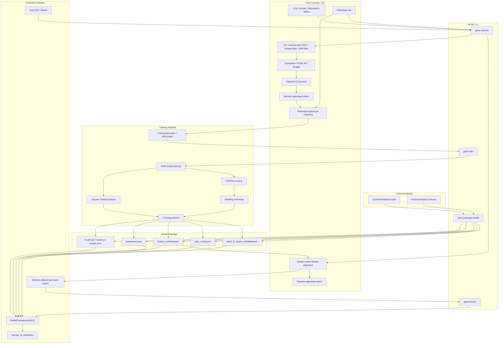

# GPSE 重构计划 v2

> 合并自 `todo_cc.md` + `docs/gpse核心逻辑梳理.md` + Claude 分析  
> 生成日期: 2026-06-08
> 基于代码版本: main@8039a30 之后
> 更新说明: 新增第十四节 MCP & Skills 集成计划

---

## 一、当前代码现状

### 1.1 已完成的重构（近期 commits）

| Commit | 内容 | 状态 |
|--------|------|------|
| `737abae` | 拆分 `GenomicPredictorV2` 为 8 个 `_*.py` 子模块 | ✅ |
| `df15dbb` | 重组包结构，统一日志到单文件 | ✅ |
| `2bcac02` | 整合 utilities，合并 config，固定依赖版本 | ✅ |
| `4948a3e` | 统一绝对导入，填充 `__init__.py` 导出 | ✅ |
| `abb3e76` | 线程控制（环境变量 + threadpool_limits） | ✅ |
| `121c4bf` | lazy imports 避免加载重依赖 | ✅ |
| `30aaafb` | CLI 彩蛋修复 | ✅ |

**结论：前置模块化已干净，现在是执行 YAML 外置化的最佳时机。**

### 1.2 当前目录结构（已更新）

```
gpse/
├── __init__.py
├── cli.py                          # CLI 根路由 → convert / train / predict
├── config/
│   ├── __init__.py
│   ├── constants.py                # ModelConfig, ClassificationModelConfig, ModelConstants
│   ├── _topsis_config.py           # TOPSIS 配置 + 代表性模型保存
│   ├── default.yaml                # 软件元信息
│   └── software.yaml               # 外部工具依赖
├── convert/                        # ✅ 数据转换 / QC 子命令 (gpse convert)
│   ├── __init__.py
│   ├── cli.py
│   ├── workflow.py
│   ├── processor.py                # GenomicDataProcessor
│   ├── qc.py                       # PLINK QC / recode / LD pruning
│   └── external.py                 # 外部工具调用封装
├── models/
│   ├── __init__.py
│   ├── model_optimizers.py         # Backward-compatible shim → RegressionModelOptimizer
│   ├── regression_model_optimizer.py  # RegressionModelOptimizer — 14 reg 模型
│   └── classification_models.py    # ClassificationModelOptimizer — 6 clf 模型
├── predict/                        # ⚠️ predict 子命令壳 (仅 stub)
│   ├── __init__.py
│   ├── __main__.py
│   └── cli.py
├── tasks/
│   ├── __init__.py
│   └── classification.py           # GenomicClassifier
├── train/                          # ✅ 训练子命令 (gpse train)
│   ├── __init__.py
│   ├── cli.py
│   ├── workflow.py
│   ├── predictor.py                # GenomicPredictorV2
│   ├── _pipeline.py                # run_all_models() 顶层循环
│   ├── _repeat_training.py         # 多重复训练，ProcessPoolExecutor 并行
│   ├── _fold_training.py           # 单 fold 训练: 缩放 → fit → predict → metrics
│   ├── _optimization.py            # Optuna 超参数优化（CV 内循环）
│   ├── _ensemble.py                # Fold 集成预测
│   ├── _data_io.py                 # 数据加载/标准化/反标准化
│   ├── _model_tools.py             # 模型创建/默认参数路由（reg vs clf）
│   ├── _cv_manager.py              # CV fold 文件生成与加载
│   ├── stacking.py                 # StackingEnsemble — 元学习器集成 ★
│   └── topsis.py                   # TOPSISEvaluator — 多准则排名 ★
├── tools/
│   ├── __init__.py
│   └── analyze_phenotypes.py
└── utils/
    ├── __init__.py
    ├── cli_display.py
    ├── configuration.py
    ├── dependency_checker.py
    ├── genomic_utils.py            # 通用工具
    ├── log_utils.py
    ├── logo.py
    ├── paralle.py
    ├── print_utils.py
    └── version.py
```

### 1.3 模型清单（实际代码统计）

**`RegressionModelOptimizer`** (`regression_model_optimizer.py`):

| 类型 | 注册到 configs | param 函数 | create_model 分支 | 默认参数 |
|------|:-:|:-:|:-:|:-:|
| **回归 14 个** | ✅ | ✅ | ✅ | ✅ |
| elasticnet_reg, gbdt_reg, svr_reg, mlp_reg, knn_reg | ✅ | ✅ | ✅ | ✅ |
| rf_reg, xgboost_reg, adaboost_reg, lightgbm_reg | ✅ | ✅ | ✅ | ✅ |
| catboost_reg, kernelridge_reg, histgradientboost_reg | ✅ | ✅ | ✅ | ✅ |
| sgd_reg, lasso_reg | ✅ | ✅ | ✅ | ✅ |
| **分类** | — | — | — | — |
| ~~15 个 clf 函数~~ | **已清理** | **已清理** | **已清理** | **已清理** |

**`ClassificationModelOptimizer`** (`classification_models.py`):

| 类型 | 注册到 configs | param 函数 | create_model 分支 | 默认参数 |
|------|:-:|:-:|:-:|:-:|
| **分类 6 个** | ✅ | ✅ | ✅ | ✅ |
| rf_clf, xgboost_clf, lightgbm_clf | ✅ | ✅ | ✅ | ✅ |
| catboost_clf, svm_clf, mlp_clf | ✅ | ✅ | ✅ | ✅ |

### 1.4 当前框架能力评估（vs. 端到端预测描述）

> 描述：框架涵盖基因组数据预处理、模型训练与优化、多维度综合评估、表型预测模块，能够支持包括二分类、多分类和连续分布在内的多种农艺/经济性状预测需求，实现从原始数据到最终预测的端到端流程。

| 能力维度 | 状态 | 说明 |
|---|---|---|
| **基因组数据预处理** | ✅ 已满足 | `gpse/convert/` 支持 VCF / PLINK BED·BIM·FAM / PED·MAP / 数值矩阵输入，输出训练用矩阵；含 QC（`--geno`、`--mind`、`--maf`）、LD 剪枝（`--indep-pairwise`）、可选 Beagle 插补、表型匹配与标准化、任务类型自动检测。 |
| **模型训练与优化** | ✅ 已满足 | `gpse/train/` + `gpse/models/` 提供 14 个回归模型和 6 个分类模型，基于 Optuna 进行超参数优化，采用重复 K 折交叉验证与早停机制。 |
| **多维度综合评估** | ✅ 已满足 | TOPSIS 多准则排序、Stacking 集成学习，以及回归/分类多指标评估（Pearson、R²、MSE、Accuracy、F1、AUC 等）。 |
| **二分类 / 多分类 / 连续分布** | ✅ 已满足 | `detect_phenotype_type()` 自动识别任务类型；回归、二分类、多分类均有对应模型与评估指标。 |
| **表型预测（inference）** | ❌ **未满足** | `gpse/predict/cli.py` 仅为占位实现，执行时报错 `predict is not implemented yet`；无 saved-model 加载、无 `feature_schema.json` 对齐、无法对新基因型数据输出预测。 |
| **端到端：原始数据 → 最终预测** | ⚠️ **部分满足** | 已实现“原始数据 → 训练/评估/排序后的模型 + 结果表格 + `.pkl` 模型文件”，但尚未打通最后“对新数据做表型预测”的环节。 |

**结论**：若文章表述为“覆盖预处理、训练、优化与多准则评估，支持二分类/多分类/连续性状”，当前代码可支撑；若表述为“实现从原始数据到最终预测结果的端到端流程”，需补充 `gpse predict` 模块或明确标注该模块为占位/待实现。

---

## 二、发现的问题

### ✅ ~~P0: 分类模型代码严重重复~~ **【已完成 by codex】**

**状态**：`model_optimizers.py` 中所有 clf 死代码（15 个 `_clf_params` 函数 + clf 分支）已清理。文件变为向后兼容的 shim，实际逻辑移至 `regression_model_optimizer.py`。

| 模型 | ~~`ModelOptimizer`~~ `RegressionModelOptimizer` | `ClassificationModelOptimizer` | 状态 |
|------|:-:|:-:|:-:|
| rf_clf | ❌ 已移除 | ✅ | **清理完成** |
| xgboost_clf | ❌ 已移除 | ✅ | **清理完成** |
| lightgbm_clf | ❌ 已移除 | ✅ | **清理完成** |
| catboost_clf | ❌ 已移除 | ✅ | **清理完成** |
| svm_clf / svc_clf | ❌ 已移除 | ✅ | **清理完成** |
| mlp_clf | ❌ 已移除 | ✅ | **清理完成** |

- 15 个 `_clf_params` 死函数已删除
- `create_model()` / `get_default_params()` 中的 clf elif 分支已删除
- 职责边界已清晰：`regression_model_optimizer.py` = 纯回归，`classification_models.py` = 纯分类

### 🟡 P1: `create_model()` 的 if/elif 链不可扩展

当前每加一个模型需要改 **4 处代码**：
1. `_init_model_configs()` — 注册
2. `_xxx_params(trial)` — Optuna 搜索空间
3. `create_model()` — if/elif 实例化分支
4. `get_default_params()` — if/elif 默认参数

### 🟡 P2: Stacking 模型加载路径脆弱

`load_and_select_models()` 搜索 6 级路径 + 遍历 repeat_1~50：
```
1. {model_name}_{suffix}/representative_model/model.pkl
2. {model_name}_{suffix}/model.pkl
3. {model_name}/representative_model/model.pkl
4. {model_name}/model.pkl
5. {model_name}_{suffix}/repeat_{1~50}/model.pkl
6. {model_name}/repeat_{1~50}/model.pkl
```

**问题**：容易找不到模型、路径约定脆弱、与 pipeline 耦合深。

### 🟡 P3: `test/` 目录为空 — 无回归测试

没有任何测试文件，重构后无法自动化验证正确性。

### 🟡 P4: Optuna 搜索空间的动态约束

部分搜索空间有自适应逻辑，不能简单用 YAML 表达：
- **深树约束**: max_depth 越大 → n_estimators 上限越低
- **XGBoost booster 条件分支**: gbtree/dart 才有树参数
- **MLP 动态层数**: n_layers 决定 hidden_layer_sizes 维度
- **LightGBM 二分类/多分类**: n_classes 影响 objective

### 🟡 P5: 线程参数名差异

不同库使用不同参数名：
| 库 | 参数名 |
|----|--------|
| sklearn | `n_jobs` |
| XGBoost | `n_jobs` + `nthread` |
| LightGBM | `n_jobs` |
| CatBoost | `thread_count` |
| SGD | 无（不支持并行） |

### 🟢 P6: CLI 职责已拆分为 `convert` / `train` / `predict`

**状态**：CLI 架构拆分已完成，`gpse/cli.py` 作为根路由，将命令分发到三个子模块。

| 子命令 | 状态 | 说明 |
|--------|------|------|
| `gpse convert` | ✅ **已实现** | `gpse/convert/cli.py` + `workflow.py` + `processor.py` |
| `gpse train` | ✅ **已实现** | `gpse/train/cli.py` + `workflow.py`，训练全流程可用 |
| `gpse predict` | ⚠️ **仅 stub** | `gpse/predict/cli.py` 存在，但执行时直接报错 `predict is not implemented yet` |

#### P6.0: `data_convert` 已新建 `gpse/convert/` 模块

**状态**：`gpse/convert/` 模块已创建，包含 `cli.py`、`workflow.py`、`processor.py`、`qc.py`、`external.py`。

当前存在两套相关逻辑，需逐步合并：

- `gpse/utils/genomic_data_pipeline.py`
  - VCF → PLINK
  - PLINK/PED/MAP → genotype matrix
  - 表型 TXT/CSV 转换
  - 基因型/表型样本 ID 匹配
  - 列名特殊字符清理
  - 表型标准化

- `scripts/qc.py` / `gpse/convert/qc.py`
  - 输入格式识别与转换：VCF / PED/MAP / BED/BIM/FAM → PLINK BED
  - PLINK 样本过滤：`--keep` / `--remove`
  - PLINK SNP 过滤：`--extract` / `--exclude`
  - SNP missing rate 过滤：`--geno`
  - sample missing rate 过滤：`--mind`
  - MAF 过滤：`--maf`
  - 缺失值处理：PLINK `--fill-missing-a2`
  - 可选 Beagle 插补
  - LD pruning：`--indep-pairwise`
  - compound genotype → numeric additive coding (`0/1/2`)

后续应统一为 `gpse convert`，并支持两种模式：

1. **train 模式**
   - 输入：VCF/PLINK/PED/MAP + phenotype
   - 输出：训练用 genotype matrix、训练用 phenotype CSV、QC report、feature schema 初稿

2. **predict 模式**
   - 输入：新 VCF/PLINK/PED/MAP 或已有 genotype matrix + 已训练模型的 `feature_schema.json`
   - 输出：已按模型 schema 对齐的 genotype matrix、feature 对齐报告

predict 模式下必须注意：
- 不能重新自由选择 SNP 集合
- 不能重新做会改变 feature 空间的 LD pruning
- 应按模型中的 `feature_schema.json` 提取、排序和校验 feature
- 缺失 feature 按指定策略处理：`strict` / `impute_mean` / `impute_mode` / `missing_code`
- 额外 feature 默认丢弃并记录
- 如果能获得 REF/ALT 信息，需要检查 allele 方向；方向不一致时必须报错或执行显式翻转
- 输出矩阵必须与训练模型的 feature 数量、顺序、编码语义一致

#### P6.1: 已保存模型缺少 feature schema

**状态**：❌ **未实现**

当前模型保存点：
- fold 模型：`repeat_N/fold_M_model.pkl`，内容为 `(model, scaler)`
- representative 模型：`representative_model/model.pkl`，内容为 `(model, scaler)`

问题：模型文件没有记录训练时特征的完整描述。后续使用新数据预测时，即使模型能正常加载，也无法确认新数据是否和训练数据处在同一个 feature 空间。

至少需要保存：
- 原始 SNP ID 列表
- 清理后的 SNP/feature 名称
- feature 顺序
- feature 数量
- VCF / PLINK 编码规则
- REF / ALT 或等位基因方向信息
- 缺失值编码和缺失值处理策略
- 训练时 `StandardScaler` 对应的 feature schema
- 回归任务的 phenotype scaler 信息（如果启用标准化）
- 分类任务的 label encoder 信息
- 训练任务类型、模型名、GPSE 版本、训练时间、参数

建议新增文件：
```text
representative_model/
├── model.pkl
├── model_info.json
└── feature_schema.json
```

#### P6.2: predict 阶段必须做 feature 对齐

**状态**：❌ **未实现**

“相同 feature”不能只理解为列数相同。对 VCF 数据来说，必须同时满足：
- SNP ID 一致
- SNP 顺序一致
- REF / ALT 或等位基因编码方向一致
- genotype 编码规则一致（例如 0/1/2/3）
- 缺失值处理一致
- 列名清理规则一致

predict 流程应当：
1. 将新 VCF 转换为 genotype matrix
2. 读取训练时保存的 `feature_schema.json`
3. 按训练 schema 对新 matrix 进行列对齐
4. 额外 feature：丢弃或记录 warning
5. 缺失 feature：按策略处理
6. 使用训练时保存的 scaler transform
7. 加载模型预测
8. 输出 `sample_id, prediction`

#### P6.3: 真实数据中的缺失 feature 需要明确策略

**状态**：❌ **未实现**

新数据中可能缺少训练模型需要的 SNP。当前没有处理策略。

可选策略：

| 策略 | 行为 | 适用场景 |
|------|------|----------|
| `strict` | 缺任何训练 feature 就报错 | 默认推荐，保证预测可靠 |
| `impute_mean` | 用训练集 feature 均值填充 | 回归/连续编码，需保存训练均值 |
| `impute_mode` | 用训练集 feature 众数填充 | SNP 离散编码 |
| `missing_code` | 用固定缺失编码填充（如 3） | 需要训练时也使用同样编码 |

建议默认使用 `strict`，只有用户明确指定时才允许 imputation。

#### P6.4: predict-only 子命令建议参数

**状态**：❌ **未实现**

未来可以考虑：

```bash
gpse predict \
  --model_file results/rf_reg/representative_model/model.pkl \
  --feature_schema results/rf_reg/representative_model/feature_schema.json \
  --vcf_file new_samples.vcf \
  --preprocess_prefix predict/new_samples \
  --output predictions.csv \
  --missing_feature_strategy strict
```

或直接对已经转换好的矩阵预测：

```bash
gpse predict \
  --model_file results/rf_reg/representative_model/model.pkl \
  --feature_schema results/rf_reg/representative_model/feature_schema.json \
  --matrix_file new_samples_genotype.csv \
  --output predictions.csv
```

#### P6.5: ModelPackage / PredictorPackage 统一对象

**状态**：❌ **未实现**

后续可以抽象一个统一的 `ModelPackage` / `PredictorPackage` 对象，把“模型本体”和“输入输出契约”封装在一起。

核心目标不是把所有模型变成同一种模型，而是让所有模型都遵守同一个预测接口：

```python
package = ModelPackage.load("model_package/")
pred = package.predict(genotype_matrix)
```

内部模型可以是：
- GPSE 自己训练出的 sklearn / XGBoost / LightGBM / CatBoost 模型
- 外部用户训练好的 sklearn 模型
- PyTorch / TensorFlow 深度学习模型
- ONNX 模型
- 外部命令行模型（通过 wrapper 适配）

建议模型包结构：
```text
model_package/
├── model.pkl / model.pt / model.onnx / model.json
├── feature_schema.json
├── preprocess.json
├── task_config.json
└── label_or_target_metadata.json
```

建议对象职责：
```python
class ModelPackage:
    def load(path): ...
    def validate_features(X): ...
    def align_features(X): ...
    def preprocess(X): ...
    def predict(X): ...
    def postprocess(y_pred): ...
```

再抽象 backend 层：
```python
class BaseModelBackend:
    def load(model_path): ...
    def predict(X): ...
    def predict_proba(X): ...
```

不同模型对应不同 backend：
```text
SklearnBackend
XGBoostBackend
LightGBMBackend
CatBoostBackend
TorchBackend
TensorFlowBackend
OnnxBackend
ExternalCommandBackend
```

这样外部用户训练好的模型也可以转换成 GPSE package：

```bash
gpse package-model \
  --model_file external_model.pkl \
  --backend sklearn \
  --feature_schema feature_schema.json \
  --preprocess preprocess.json \
  --task_config task_config.json \
  --output my_model_package/
```

之后预测统一为：

```bash
gpse predict \
  --model_package my_model_package/ \
  --vcf_file new_samples.vcf \
  --output predictions.csv
```

关键输入契约仍然必须统一：
- feature 名称、顺序、数量
- SNP / allele 编码方向
- 缺失 feature 处理策略
- genotype 缺失值编码
- scaler / imputer / 标准化流程
- 输出类型：回归值、分类 label、分类概率
- 回归值是否需要 inverse transform

#### P6.6: 当前风险总结

- 当前训练得到的模型可以被 `joblib.load()` 加载并预测
- 但没有 schema 校验时，预测新数据存在静默错误风险
- 最危险情况：新数据列数刚好一致，但 SNP 顺序或等位基因方向不同，程序不会报错，预测结果却可能完全错误
- 因此在实现 `predict` 前，必须先补齐 feature schema 保存与对齐机制

#### P6.7: 目标架构 Mermaid 可视化



#### P6.8: 模型自动拉取机制（Remote Model Pull）

**状态**：💡 **待讨论 / 待规划**

随着 `gpse predict` 和 `ModelPackage` 落地，用户拿到软件后最自然的诉求是：不自己训练，直接下载并使用别人发布好的模型。因此需要考虑在 GPSE 内部内置一套**轻量的模型自动拉取逻辑**。

##### 2. 要不要做？

**建议做，理由：**

| 收益 | 说明 |
|------|------|
| 降低使用门槛 | 用户拿到软件后，不需要自己训练，直接 `gpse predict --model <model_id>` 就能跑。 |
| 便于复现论文/基准 | 可以发布"官方预训练模型"，别人下载即用。 |
| 支持模型共享 | 团队内部或社区可以共享模型资产。 |
| 商业化/服务化基础 | 未来如果要接模型市场或 API，拉取逻辑是第一步。 |

**但也要警惕风险：**

| 风险 | 说明 |
|------|------|
| 模型版本兼容 | sklearn / XGBoost / LightGBM / CatBoost 的版本差异会导致 pickle / joblib 加载失败。 |
| 安全性 | 加载远程 pickle / joblib 存在任意代码执行风险，必须校验签名或来源。 |
| 授权 / 隐私 | 基因组数据相关的模型可能涉及数据授权，不能默认公开拉取。 |
| 存储与网络 | 模型文件可能几百 MB，首次下载体验要考虑缓存、断点续传。 |

##### 实现路径建议（分阶段）

**阶段 1：先让 `gpse predict` 支持本地模型（阻塞项）**

```bash
gpse predict \
    --model path/to/model_package/ \
    --geno-file path/to/geno.csv \
    --out predictions.csv
```

**阶段 2：给 `--model` 增加 URI 语义，支持远程 URL 自动下载**

```bash
# 本地路径
gpse predict --model ./models/rice_g_yield/ ...

# 远程 URL（自动下载到本地缓存）
gpse predict --model https://example.com/gpse/models/rice_g_yield/v1/package.zip ...

# 简写形式（如果后续建设模型注册表）
gpse predict --model gpse://rice/g_yield:v1 ...
```

下载逻辑建议封装在 `gpse.predict.model_store` 中：

```python
def resolve_model(uri: str) -> Path:
    if uri.startswith("http://") or uri.startswith("https://"):
        return download_to_cache(uri)
    if uri.startswith("gpse://"):
        return resolve_from_registry(uri)
    return Path(uri)
```

**阶段 3：模型包附带元数据索引，加载前做兼容性校验**

建议每个可拉取的模型包附带 `model_info.json`：

```json
{
  "name": "rice_g_yield",
  "version": "1.0.0",
  "task_type": "regression",
  "gpse_version": "0.5.0",
  "python_version": "3.10",
  "dependencies": {
    "scikit-learn": "1.6.0",
    "xgboost": "2.1.0",
    "lightgbm": "4.5.0"
  },
  "model_file": "model.pkl",
  "scaler_file": "scaler.json",
  "signature_hash": "sha256:abc123..."
}
```

加载前至少完成：

1. GPSE 版本兼容检查（警告或报错）。
2. 关键依赖版本警告（小版本可能兼容，不强求）。
3. 文件哈希校验（防篡改）。

**阶段 4：可选的模型注册表 / 模型市场**

模型数量多了以后，可维护一个轻量 registry：

```bash
# 列出可用模型
gpse model list

# 显式拉取到本地
gpse model pull rice/g_yield@v1.2.0

# 预测时引用 registry 中的模型名
gpse predict --model rice/g_yield --vcf_file new.vcf --out pred.csv
```

##### 与当前工作的关系

- 该能力应作为 `gpse predict` 工作流的一部分实现，而不是独立的"下载器"。
- 落地顺序：`本地 predict` → `URL 自动下载` → `registry / model market`。
- 在实现远程拉取之前，必须先完成 P6.1（feature schema 保存）和 P6.5（ModelPackage 统一对象），否则拉下来的模型无法安全、正确地用于新数据预测。

#### P6.9: 训练结果可视化（Visualization）

**状态**：💡 **待规划 / 待实现**

当前 `gpse/train/` 中**几乎没有训练结果可视化代码**。`gpse/utils/genomic_utils.py:521` 的 `save_fold_predictions_and_plots()` 明确说明：

> "plotting functionality removed to accelerate training"

这是因为 GPSE 默认 `n_repeats=100`、`n_splits=5`，一个模型会产生 500 个 fold。如果在训练过程中每个 fold 都实时绘图，会严重拖慢训练速度并产生大量中间图片。

##### 设计原则

**不要恢复 per-fold 实时绘图，改为"训练后汇总可视化"**：

- 训练阶段只保存必要数据（`all_predictions`、`model_comparison.csv`、repeat metrics 等）。
- 训练结束后，通过独立命令统一生成汇总图表。
- 默认只生成 summary 级别的图；可选 `--per-repeat` / `--per-fold` 才生成详细图。

计划使用 **`plotnine`**（Python 版 ggplot2）作为绘图后端，语法声明式、易维护、与 tidyverse 风格一致。

##### 需要添加的依赖

```toml
# pyproject.toml
[tool.poetry.dependencies]
plotnine = "^0.14.0"
```

```yaml
# requirements.yaml
plotnine==0.14.0
```

> 注意：`requirements.yaml` 中已有 `matplotlib` 和 `plotly`，但 `pyproject.toml` 未显式声明 `matplotlib`。如果统一用 `plotnine`，建议把 `matplotlib` 作为 `plotnine` 的间接依赖处理，或在 `pyproject.toml` 中补全。

##### 推荐图表（按优先级）

| 优先级 | 图表 | 数据源 | 用途 |
|--------|------|--------|------|
| P0 | **观测值 vs 预测值散点图** | `all_predictions.json` / repeat 汇总 | 直观检查模型拟合效果 |
| P0 | **模型对比箱线图 / 小提琴图** | `model_comparison.csv` + repeat metrics | 比较多个模型的稳定性 |
| P1 | **TOPSIS 排名条形图** | `*_topsis_simple.csv` | 展示综合排名结果 |
| P1 | **Stacking 元学习器权重图** | `stacking_ensemble_model.pkl` 中 `meta_model.coef_` | 看各基模型贡献度 |
| P2 | **训练时间对比图** | `model_comparison.csv` | 识别慢模型，辅助资源规划 |
| P2 | **重复实验指标收敛图** | 各 repeat 的 test metrics | 判断结果是否稳定 |
| P2 | **特征重要性图（树模型）** | 基模型的 `feature_importances_` | 解释哪些 SNP/特征重要 |

##### 建议实现位置

新增独立子模块，避免污染训练核心逻辑：

```text
gpse/
├── visualize/
│   ├── __init__.py
│   ├── cli.py              # gpse visualize 子命令
│   ├── core.py             # 通用 plotnine 绘图函数
│   ├── plots.py            # 各类图表的具体实现
│   └── reports.py          # 生成完整 HTML / PDF 报告
```

CLI 用法示例：

```bash
# 生成训练结果可视化汇总
gpse visualize \
    --results-dir optimization_results/ \
    --output-dir optimization_results/visualization/

# 同时生成每个 repeat 的详细图
gpse visualize \
    --results-dir optimization_results/ \
    --output-dir optimization_results/visualization/ \
    --per-repeat
```

##### 最小可行方案（MVP）

第一步先实现 **两张最核心、最有价值的图**：

1. **所有模型的 Test Pearson / Test Accuracy 箱线图对比**
2. **最佳模型的观测值 vs 预测值散点图**（train / val / test 用不同颜色）

这个 MVP：

- 不改动训练流程
- 不拖慢训练速度
- 只依赖 `model_comparison.csv` 和 `all_predictions.json`
- 代码量小，可快速验证 `plotnine` 集成效果

##### 与当前工作的关系

- 可视化应作为**训练后处理步骤**，不要嵌入训练循环。
- 落地顺序：`MVP 两张图` → `完整图表库` → `HTML/PDF 报告`。
- 在实现可视化之前，需要确保训练流程稳定产出 `model_comparison.csv` 和 `all_predictions.json`。

---

## 三、端到端训练流程（当前实现）

```
CLI (cli.py)
  │
  ├── 1. [可选] 数据预处理 (GenomicDataProcessor via gpse convert)
  │      VCF → PLINK → 矩阵 → 表型匹配 → 清洗
  │
  ├── 2. GenomicPredictorV2.__init__()
  │      ├── 回归 → RegressionModelOptimizer
  │      └── 分类 → GenomicClassifier (内含 ClassificationModelOptimizer)
  │
  └── 3. run_all_models()                              [train/_pipeline.py]
         │
         ├── load_data()                               [train/_data_io.py]
         ├── prepare_cv_folds()                        [train/_cv_manager.py]
         │
         ├── For each model:
         │    └── run_model_multiple_repeats()         [train/_repeat_training.py]
         │         ├── 可选: ProcessPoolExecutor 并行
         │         └── For each repeat:
         │              ├── optimize_model_parameters() [train/_optimization.py]
         │              │    └── Optuna TPE + MedianPruner + 早停
         │              ├── create_model(best_params)   [train/_model_tools.py]
         │              ├── For each fold:
         │              │    └── _train_single_fold()   [train/_fold_training.py]
         │              │         ├── StandardScaler.fit_transform
         │              │         ├── model.fit (threadpool_limits)
         │              │         ├── predict + metrics
         │              │         └── 保存 (model, scaler) pickle
         │              └── _compute_ensemble_predictions() [train/_ensemble.py]
         │
         ├── create_comparison_table() → model_comparison.csv
         │
         ├── [可选] TOPSIS 排名                         [train/topsis.py]
         │    └── 按 Test Pearson/Accuracy 排序, 选 Top-N
         │
         └── [可选] StackingEnsemble                    [train/stacking.py]
              └── 用 Top-N 模型训练元学习器 (Ridge/LogisticRegression)
```

---

## 四、核心模块详解

### 4.1 ★ Stacking 集成 — `gpse/train/stacking.py`

**核心类**: `StackingEnsemble`

**初始化参数**:
- `base_models_dir`: 基础模型存储目录
- `top_n_models`: 选 Top-N 个基础模型 (默认5)
- `meta_model_type`: 元模型类型 (目前仅 `'ridge'`)
- `cv_folds`: 生成元特征的 CV 折数 (默认5)
- `task_type`: 回归 / 分类

**`fit()` 流程**:
```
fit(X_train, y_train, X_test, y_test, model_names)
  ├── Step 1: load_and_select_models(model_names)
  │    ├── 读 model_comparison.csv
  │    ├── 按指标排序选 Top-N
  │    └── 加载 .pkl（搜索 6 级路径 + repeat_1~50）
  │
  ├── Step 2: create_meta_features(X_train, y_train, X_test)
  │    ├── 训练集: KFold CV → clone(model) → fit → predict → 填入 meta_train
  │    ├── 测试集: model.fit(X_train 全量) → predict(X_test) → 填入 meta_test
  │    └── 特殊处理: (model, scaler) 元组 → 先 transform 再 predict
  │
  ├── Step 3: fit_meta_model(meta_train, y_train)
  │    ├── 回归: Pipeline([StandardScaler, Ridge(alpha=1.0)])
  │    └── 分类: Pipeline([StandardScaler, LogisticRegression(C=1.0, multi_class='ovr')])
  │
  ├── Step 4: 保存 stacking_ensemble_model.pkl
  └── Step 5: 评估 (train/test metrics, model_importances)
```

**存在的问题**:
1. 模型加载路径过于脆弱（6 级搜索 + 遍历 50 个 repeat）
2. 元特征生成中对 X_test 使用 `model.fit(X_train)` 原地训练，修改了基础模型状态
3. 元模型选择太少（只有 Ridge / LogisticRegression）
4. 没有交叉验证评估元模型
5. `clone()` 要求 sklearn-compatible，自定义模型需适配

### 4.2 ★ TOPSIS 排名 — `gpse/train/topsis.py`

**核心类**: `TOPSISEvaluator`

**算法步骤**:
```
evaluate(input_file, output_file, criteria, criteria_types, ...)
  ├── Step 1: 读 model_comparison.csv
  ├── Step 2: 过滤无效行（全0或NaN）
  ├── Step 3: 计算权重
  │    ├── 熵权法: E = -k * Σ(P·logP), w = (1-E) / Σ(1-E)
  │    └── 手动权重: 默认 "0.8,0.2"（精度80%, 稳定性20%）
  ├── Step 4: min 型指标正向化
  │    ├── reciprocal: 1/(x+ε)       ← 默认
  │    ├── neglog: -log(x+ε)         ← pipeline 使用
  │    └── minmax_inv: (max-x)/(max-min)
  ├── Step 5: TOPSIS 计算
  │    ├── 向量归一化 → 加权 → 理想解/负理想解 → 距离 → Score
  │    └── Score = D- / (D+ + D-)
  └── Step 6: 输出（完整版 + 精简版 CSV）
```

**默认配置**（`train/_topsis_config.py`）:
- 回归: `["Test Pearson", "Test Pearson (std)"]`, types `["max", "min"]`, weights `"0.8,0.2"`
- 分类: `["Test Accuracy", "Test Accuracy (std)"]`, types `["max", "min"]`, weights `"0.8,0.2"`

**存在的问题**:
1. 评价指标固定为 2 个（主指标 + 标准差），未纳入训练时间、模型复杂度
2. 权重硬编码 0.8:0.2
3. 与 pipeline 耦合：`call_topsis_evaluator()` 在 `genomic_utils.py` 中包装

### 4.3 方法绑定模式

```python
class GenomicPredictorV2:
    load_data = load_data                        # from _data_io
    create_model = create_model                  # from _model_tools
    optimize_model_parameters = optimize_model_parameters  # from _optimization
    _train_single_fold = _train_single_fold      # from _fold_training
    run_model_multiple_repeats = run_model_multiple_repeats  # from _repeat_training
    run_all_models = run_all_models              # from _pipeline
    # ... 共 ~15 个绑定方法
```

---

## 五、重构计划: 模型参数 YAML 外置化

### 5.1 目标

将每个模型的以下信息外置到 YAML：
- 模型类路径（如 `sklearn.ensemble.RandomForestRegressor`）
- Optuna 搜索空间（参数名、类型、范围、约束）
- 默认参数
- 线程参数映射（`n_jobs` / `nthread` / `thread_count`）
- 需要过滤的辅助参数

### 5.2 YAML 结构设计

```yaml
# gpse/config/models/rf_reg.yaml
model:
  name: rf_reg
  class: sklearn.ensemble.RandomForestRegressor
  task_type: regression
  thread_param: n_jobs

default_params:
  n_estimators: 100
  max_depth: null
  min_samples_split: 2
  min_samples_leaf: 1
  bootstrap: true

search_space:
  max_depth:
    type: int
    low: 2
    high: 32
  n_estimators:
    type: int
    low: 10
    high: 2000
    constraints:
      - when: {max_depth: {gte: 25}}
        then: {high: 500}
      - when: {max_depth: {gte: 15}}
        then: {high: 1000}
  min_samples_split:
    type: int
    low: 2
    high: 20
  min_samples_leaf:
    type: int
    low: 1
    high: 20
  bootstrap:
    type: categorical
    choices: [true, false]

filter_params: []
```

```yaml
# gpse/config/models/xgboost_reg.yaml
model:
  name: xgboost_reg
  class: xgboost.XGBRegressor
  task_type: regression
  thread_param: n_jobs
  thread_param_alias: nthread

default_params:
  n_estimators: 100
  max_depth: 3
  learning_rate: 0.1
  booster: gbtree
  verbosity: 0

search_space:
  booster:
    type: categorical
    choices: [gbtree, gblinear, dart]
  lambda:
    type: float
    low: 1.0e-8
    high: 10.0
    log: true
  alpha:
    type: float
    low: 1.0e-8
    high: 10.0
    log: true
  max_depth:
    type: int
    low: 1
    high: 14
    condition: "booster in [gbtree, dart]"
  n_estimators:
    type: int
    low: 20
    high: 400
    condition: "booster in [gbtree, dart]"
  # ...

filter_params: []
```

```yaml
# gpse/config/models/mlp_reg.yaml — 特殊: 动态层数用 Python hook
model:
  name: mlp_reg
  class: sklearn.neural_network.MLPRegressor
  task_type: regression
  custom_param_func: gpse.models.custom_params.mlp_reg_suggest  # Python hook

default_params:
  hidden_layer_sizes: [128, 64]
  activation: relu
  solver: adam
  alpha: 0.0001
  learning_rate: adaptive

filter_params:
  - n_layers
  - "n_units_l*"
```

### 5.3 约束表达式设计（安全方案）

**❌ 不要用 `eval()`**（有注入风险）

**✅ 方案 A: 简单 DSL**
```yaml
constraints:
  - when: {max_depth: {gte: 25}}
    then: {n_estimators: {high: 500}}
  - when: {max_depth: {gte: 15}}
    then: {n_estimators: {high: 1000}}
```
对应 Python 解析器:
```python
def check_condition(when: dict, current_params: dict) -> bool:
    for param, rule in when.items():
        val = current_params.get(param)
        if val is None:
            return False
        for op, threshold in rule.items():
            if op == 'gte' and not (val >= threshold): return False
            if op == 'lte' and not (val <= threshold): return False
            if op == 'in' and val not in threshold: return False
            if op == 'eq' and val != threshold: return False
    return True
```

**✅ 方案 B: Python hook（仅用于复杂模型）**
```yaml
# 只有 MLP, XGBoost 等复杂模型需要
model:
  custom_param_func: gpse.models.custom_params.xgboost_reg_suggest
```

**推荐**: 简单约束用 DSL（方案 A），复杂逻辑用 hook（方案 B）。

### 5.4 核心实现: ModelRegistry

```python
# gpse/models/model_registry.py — 新文件

class ModelRegistry:
    """从 YAML 文件加载模型配置, 替代硬编码的 RegressionModelOptimizer + ClassificationModelOptimizer"""
    
    def __init__(self, config_dirs: list[str], random_state: int, 
                 n_threads: int, n_classes: int = None):
        self.config_dirs = [Path(d) for d in config_dirs]
        self.random_state = random_state
        self.n_threads = n_threads
        self.n_classes = n_classes
        self._models = {}
        self._load_all_configs()
    
    def _load_all_configs(self):
        """扫描所有 config_dirs 下的 .yaml 文件, 后加载的覆盖先加载的"""
        for config_dir in self.config_dirs:
            for yaml_file in config_dir.glob("*.yaml"):
                config = yaml.safe_load(yaml_file.read_text())
                name = config['model']['name']
                self._models[name] = config
    
    def get_available_models(self, task_type: str = None) -> list:
        if task_type:
            return [n for n, c in self._models.items() 
                    if c['model']['task_type'] == task_type]
        return list(self._models.keys())
    
    def create_model(self, model_name: str, params: dict):
        """动态导入模型类并实例化"""
        config = self._models[model_name]
        cls = self._import_class(config['model']['class'])
        
        params = params.copy()
        # 注入线程参数
        thread_param = config['model'].get('thread_param')
        if thread_param:
            params[thread_param] = self.n_threads
        thread_alias = config['model'].get('thread_param_alias')
        if thread_alias:
            params[thread_alias] = self.n_threads
        
        return cls(**params)
    
    def suggest_params(self, model_name: str, trial) -> dict:
        """根据 YAML 定义的搜索空间建议参数"""
        config = self._models[model_name]
        # 如果有 custom_param_func, 直接调用 Python hook
        custom = config['model'].get('custom_param_func')
        if custom:
            return self._call_custom_param_func(custom, trial)
        # 否则从 YAML 解析
        return self._suggest_from_yaml(trial, config['search_space'])
    
    def get_default_params(self, model_name: str) -> dict:
        return self._models[model_name].get('default_params', {})
    
    def filter_params(self, model_name: str, params: dict) -> dict:
        """过滤辅助参数"""
        config = self._models[model_name]
        filter_list = config.get('filter_params', [])
        result = {k: v for k, v in params.items() if not k.startswith('_')}
        for rule in filter_list:
            if '*' in rule:  # 通配符
                pattern = rule.replace('*', '')
                result = {k: v for k, v in result.items() if not k.startswith(pattern)}
            else:
                result.pop(rule, None)
        return result
    
    @staticmethod
    def _import_class(class_path: str):
        module_path, class_name = class_path.rsplit('.', 1)
        module = importlib.import_module(module_path)
        return getattr(module, class_name)
```

---

## 六、重构计划: 模型调用通用化

### 6.1 目标

将模型创建从 if/elif 链改为**注册表模式**，支持：
- 内置模型（YAML 配置）
- 用户自定义模型（用户提供 YAML + 可选 Python hook）
- 第三方模型（通过 importlib 动态加载）

### 6.2 动态约束搜索空间解析器

```python
# gpse/models/search_space.py — 新文件

def check_condition(when: dict, current_params: dict) -> bool:
    """安全地评估约束条件 (不用 eval)"""
    for param, rule in when.items():
        val = current_params.get(param)
        if val is None:
            return False
        for op, threshold in rule.items():
            if op == 'gte' and not (val >= threshold): return False
            if op == 'lte' and not (val <= threshold): return False
            if op == 'gt'  and not (val >  threshold): return False
            if op == 'lt'  and not (val <  threshold): return False
            if op == 'eq'  and val != threshold:        return False
            if op == 'in'  and val not in threshold:     return False
    return True


def suggest_from_yaml(trial, search_space: dict, current_params: dict) -> dict:
    """根据 YAML 规格建议参数"""
    params = {}
    for param_name, spec in search_space.items():
        # 检查 condition 是否满足
        condition = spec.get('condition')
        if condition:
            # condition 格式: "booster in [gbtree, dart]"
            # 解析为 check_condition 格式
            if not _eval_simple_condition(condition, params):
                continue
        
        param_type = spec['type']
        
        if param_type == 'int':
            high = spec['high']
            # 处理动态约束
            for c in spec.get('constraints', []):
                if check_condition(c['when'], params):
                    high = c['then'].get('high', high)
                    break
            params[param_name] = trial.suggest_int(
                param_name, spec['low'], high,
                log=spec.get('log', False),
                step=spec.get('step', 1)
            )
        elif param_type == 'float':
            params[param_name] = trial.suggest_float(
                param_name, spec['low'], spec['high'],
                log=spec.get('log', False)
            )
        elif param_type == 'categorical':
            params[param_name] = trial.suggest_categorical(
                param_name, spec['choices']
            )
    
    return params
```

---

## 七、分阶段执行计划

### ~~Phase 0: 清理（预计 30min）~~ ✅ **已完成 by codex**

- [x] 删除 `ModelOptimizer` 中所有 `_xxx_clf_params` 函数（15个，约 280 行）
- [x] 删除 `ModelOptimizer.create_model()` 中的 clf elif 分支
- [x] 删除 `ModelOptimizer.get_default_params()` 中的 clf elif 分支
- [x] 新建 `regression_model_optimizer.py`，`ModelOptimizer` 改为 `RegressionModelOptimizer` 别名
- [x] `GenomicClassifier` 支持通过参数注入 `ClassificationModelOptimizer`
- [x] `GenomicPredictorV2` 消除 `ClassificationModelOptimizer` 重复创建
- [x] 统一 `random_seed` / `random_state` 参数命名
- [x] 验证删除后回归/分类任务初始化正常

### Phase 1: 基础架构（预计 2-3h）

**状态**: ❌ **未开始**

- [ ] 创建 `gpse/config/models/` 目录
- [ ] 创建 `gpse/models/model_registry.py` — ModelRegistry 类
- [ ] 创建 `gpse/models/search_space.py` — YAML 搜索空间解析器
- [ ] 编写第一个 YAML: `rf_reg.yaml`，端到端验证
  - 跑旧版 baseline: `gpse --models rf_reg --task regression ...`
  - 用新版 ModelRegistry 跑同一模型
  - 对比 Optuna 搜索空间 + 训练结果一致性

### Phase 2: 批量迁移（预计 3-4h）

**状态**: ❌ **未开始**

- [ ] 迁移全部 14 个回归模型到 YAML
- [ ] 迁移全部 6 个分类模型到 YAML
- [ ] 特殊处理:
  - MLP 动态层数 → `custom_param_func` hook
  - XGBoost booster 条件分支 → DSL condition
  - LightGBM 二分类/多分类 → YAML 中 n_classes 参数
  - NGBoost 基学习器 → `custom_param_func` hook
- [ ] 每迁移一个模型，对比 baseline 结果

### Phase 3: 整合清理（预计 2h）

**状态**: ❌ **未开始**

- [ ] 更新 `_model_tools.py` 路由 → 通过 ModelRegistry
- [ ] 更新 `predictor.py` 初始化 → 创建 ModelRegistry
- [ ] 更新 `_optimization.py` → suggest_params 调用 Registry
- [ ] 合并 `RegressionModelOptimizer` + `ClassificationModelOptimizer` → 统一为 ModelRegistry
- [ ] 删除旧的 if/elif 链
- [ ] 添加 CLI 参数 `--model_config_dir`（支持用户自定义模型目录）
- [ ] 更新 `cli.py` 中 `--models` 的 help 文本动态获取

### Phase 4: Stacking & TOPSIS 改进（预计 2-3h）

**状态**: ❌ **未开始**

- [ ] **Stacking: 修复模型加载** — 改为从 pipeline 直接传递模型实例
- [ ] **Stacking: 修复元特征生成** — 不对基础模型原地 fit
- [ ] Stacking: 支持更多元模型（ElasticNet, GBDT 等）
- [ ] TOPSIS: 权重配置外置到 YAML
- [ ] TOPSIS: 支持更多评价指标维度（训练时间、模型复杂度）

### Phase 5: 测试 & 文档（预计 1-2h）

**状态**: ❌ **未开始**

- [ ] 为 ModelRegistry 编写单元测试
- [ ] 为 search_space.py 编写单元测试（含约束条件测试）
- [ ] 端到端测试: 全模型跑一遍对比 baseline
- [ ] 更新 README（新增自定义模型说明）

---

## 八、修改文件清单

| 文件 | 操作 | 阶段 | 状态 |
|------|------|------|------|
| `gpse/config/models/*.yaml` | **新建** 20 个 YAML（14 reg + 6 clf） | Phase 2 | ❌ 未开始 |
| `gpse/models/model_registry.py` | **新建** ModelRegistry 类 | Phase 1 | ❌ 未开始 |
| `gpse/models/search_space.py` | **新建** YAML 搜索空间解析器 | Phase 1 | ❌ 未开始 |
| `gpse/models/custom_params.py` | **新建** MLP/NGBoost 等自定义 hook | Phase 2 | ❌ 未开始 |
| `gpse/models/regression_model_optimizer.py` | **已新建** — 回归模型优化器（原 `model_optimizers.py` 拆分） | codex | ✅ 已完成 |
| `gpse/models/model_optimizers.py` | **Phase 0 完成**: 已变为 shim; **Phase 3**: 替换为 ModelRegistry 委托 | 0, 3 | ✅ Phase 0 完成 |
| `gpse/models/classification_models.py` | **Phase 3**: 替换为 ModelRegistry 委托 | 3 | ❌ 未开始 |
| `gpse/train/_model_tools.py` | 路由改为通过 ModelRegistry | Phase 3 | ❌ 未开始 |
| `gpse/train/predictor.py` | 初始化时创建 ModelRegistry | Phase 3 | ❌ 未开始 |
| `gpse/train/_optimization.py` | suggest_params 调用改为 Registry | Phase 3 | ❌ 未开始 |
| `gpse/cli.py` | 添加 `--model_config_dir`; help 文本动态获取 | Phase 3 | ⚠️ 子命令路由已完成，参数未加 |
| `gpse/train/stacking.py` | 修复模型加载路径; 修复元特征 fit | Phase 4 | ❌ 未开始 |
| `gpse/train/topsis.py` | 权重/指标配置外置 | Phase 4 | ❌ 未开始 |
| `gpse/config/_topsis_config.py` | 适配新配置 | Phase 4 | ❌ 未开始 |
| `gpse/config/constants.py` | 可能需要扩展 ModelConfig | Phase 1 | ❌ 未开始 |
| `scripts/qc.py` | 合并 QC / imputation / LD pruning / recode 逻辑到正式 data_convert 流程 | P6 后续 | ❌ 未开始 |
| `gpse/utils/genomic_data_pipeline.py` | 升级为 data_convert 核心实现，区分 train-mode 与 predict-mode | P6 后续 | ❌ 未开始 |
| `gpse/model_package/` 或 `gpse/predict/model_package.py` | 新建 ModelPackage / PredictorPackage 抽象 | P6 后续 | ❌ 未开始 |
| `gpse/cli.py` | 拆分为 `convert` / `train` / `predict` / 可选 `package-model` 子命令 | P6 后续 | ✅ **已完成** |

---

## 九、关键代码位置索引

| 功能 | 文件 | 行号/方法 |
|------|------|----------|
| 回归模型配置注册 | `models/regression_model_optimizer.py` | `_init_model_configs()` |
| 回归搜索空间 | `models/regression_model_optimizer.py` | `_xxx_reg_params()` |
| ~~分类死代码~~ | ~~`models/model_optimizers.py`~~ | **已清理** |
| 参数过滤 | `models/regression_model_optimizer.py` | `filter_model_params()` |
| 回归模型创建 | `models/regression_model_optimizer.py` | `create_model()` |
| 回归默认参数 | `models/regression_model_optimizer.py` | `get_default_params()` |
| 分类配置注册 | `models/classification_models.py` | `_init_classification_model_configs()` |
| 分类搜索空间 | `models/classification_models.py` | `_xxx_clf_params()` |
| 分类模型创建 | `models/classification_models.py` | `create_classification_model()` |
| 分类默认参数 | `models/classification_models.py` | `get_classification_default_params()` |
| 模型路由 | `train/_model_tools.py` | `create_model()`, `get_default_params()` |
| Optuna 优化 | `train/_optimization.py` | `optimize_model_parameters()` |
| Stacking 集成 | `train/stacking.py` | `StackingEnsemble` class |
| TOPSIS 排名 | `train/topsis.py` | `TOPSISEvaluator.evaluate()` |
| Pipeline 编排 | `train/_pipeline.py` | `run_all_models()` |
| 常量配置 | `config/constants.py` | `ModelConstants` singleton |
| 线程控制 | `cli.py` L15-28; `_repeat_training.py` | 环境变量设置 |

---

## 十、风险与注意事项

1. **⚠️ 无回归测试**: `test/` 为空，重构前**必须先保存 baseline 结果**
   ```bash
   gpse --data your_data.csv --task regression --models all --n_repeats 3
   cp results/model_comparison.csv results/baseline_comparison.csv
   ```

2. **⚠️ YAML 参数空间翻译错误**: Optuna 搜索空间范围不一致会导致模型性能下降但不报错
   - **预防**: 每个模型迁移后对比 Optuna study 的搜索空间日志

3. **⚠️ eval() 注入风险**: 约束表达式不要用 `eval()`
   - **预防**: 使用 DSL（方案 A）或 Python hook（方案 B）

4. **⚠️ 线程参数差异**: `n_jobs` / `nthread` / `thread_count` 名称不统一
   - **预防**: YAML 中显式声明 `thread_param` + `thread_param_alias`

5. **⚠️ 分类特殊逻辑**: LightGBM 根据 `n_classes` 设置 `objective`，XGBoost 需要 `num_class`
   - **预防**: 在 YAML 中增加 `runtime_params` 字段，由 pipeline 注入

6. **⚠️ Stacking pickle 兼容性**: 模型类路径变化后旧 pickle 无法加载
   - **预防**: 重构完成后重新训练，或保留旧类路径作为 alias

7. **⚠️ 向后兼容**: `model_optimizers.py` 已保留为 shim，`ModelOptimizer` 是 `RegressionModelOptimizer` 的别名
   - **状态**: codex 已完成 shim，`from gpse.models.model_optimizers import ModelOptimizer` 仍可工作
   - **Phase 3**: 统一为 ModelRegistry 后再移除 shim

---

## 十一、耗时对比

| 阶段 | 纯人工 | 人机协作（推荐） | 实际状态 |
|------|--------|---------------|----------|
| Phase 0: 清理死代码 | 1h | **30min** | ✅ **已完成** |
| Phase 1: 基础架构 | 5-6h | **2-3h** | ❌ **未开始** |
| Phase 2: 批量迁移 | 8-10h | **3-4h** | ❌ **未开始** |
| Phase 3: 整合清理 | 3-4h | **2h** | ❌ **未开始** |
| Phase 4: Stacking & TOPSIS | 3-4h | **2-3h** | ❌ **未开始** |
| Phase 5: 测试 & 文档 | 3-4h | **1-2h** | ❌ **未开始** |
| **合计** | **23-30h（4-5天）** | **10-14h（2天）** | 1/6 完成 |

人机协作分工：
- AI → 生成 YAML、写 ModelRegistry、删除死代码、修改路由
- 人 → 跑 baseline、验证端到端、对比结果、提供实际数据

---

## 十二、基因型编码问题（待修复）

> 发现日期: 2026-06-04  
> 涉及文件: `convert/processor.py`, `convert/qc.py`, `scripts/qc.py`

### 背景：编码链路

```
VCF
 ↓  plink --vcf --make-bed
BED/BIM/FAM
 ↓  plink --recode compound-genotypes 01 --output-missing-genotype 3
PED/MAP   (每个基因型 = 2个字符)
 ↓  Python GENO_DICT 映射
CSV 矩阵  (每个值 = 单个数字)
```

PLINK `--recode compound-genotypes 01` 含义：
- `0` = A2 等位基因（通常 = REF / major）
- `1` = A1 等位基因（通常 = ALT / minor）
- `3` = 缺失等位基因（由 `--output-missing-genotype 3` 指定）

主编码 `00→0, 01→1, 10→1, 11→2` 是正确的，README 描述无需修改。

### ✅ BUG-1: `convert/qc.py` 的 `recode_to_numeric()` header 缺少 ID 列

**状态**: ✅ **已修复**

```python
# convert/qc.py (L97)
geno_file.write('ID,' + ','.join(snpid_list) + '\n')   # ✅ 已有 ID 列

# convert/processor.py (L222)
header = "ID," + ",".join(snpid_list)                   # ✅ 有 ID 列
```

### 🟡 BUG-2: `convert/qc.py` 和 `convert/processor.py` 缺失值编码不一致

**状态**: ❌ **未修复**

| 文件 | 缺失 fallback | 结果 |
|------|-------------|------|
| `convert/qc.py` → `recode_to_numeric()` | `code_map.get(g, 'NaN')` | 缺失 → `NaN` |
| `convert/processor.py` → `convert_to_matrix()` | `GENO_DICT.get(genotype, '3')` | 缺失 → `3` |
| `scripts/qc.py` → `recode_to_numeric()` | `code_map.get(g, 'NaN')` | 缺失 → `NaN` |

**影响**：如果用户混用 QC 路径和主转换路径，同一个缺失位点会被编码为不同值。

**修复**：统一为 `3`（与 PLINK `--output-missing-genotype 3` 一致）。

### 🟡 BUG-3: 部分缺失基因型 `03`/`30` 未处理

**状态**: ❌ **未修复**

PED 文件中可能出现 `33`（全缺失）、`03`（一个等位基因缺失）、`30`（另一个等位基因缺失）：

```python
GENO_DICT = {'00': '0', '01': '1', '10': '1', '11': '2'}
diploid = GENO_DICT.get(genotype, '3')
```

- `33` → `'3'` ✅ 正确
- `03` → `'3'` ⚠️ 静默丢弃已知等位基因信息
- `30` → `'3'` ⚠️ 同上

**影响**：通常 QC 阶段的 `--geno` 过滤会移除这些 SNP，但如果跳过 QC 直接转换可能遇到。风险较低。

**修复**：在 `GENO_DICT` 中显式添加 `{'03': '3', '30': '3', '33': '3'}`，或在注释中说明 fallback 行为。

### 修复优先级

| 优先级 | 问题 | 预计工作量 | 状态 |
|--------|------|-----------|------|
| **P0** | BUG-1: `recode_to_numeric()` 缺 ID 列 | 1 min | ✅ 已修复 |
| **P1** | BUG-2: 缺失值编码统一为 `3` | 5 min | ❌ 待修复 |
| **P2** | BUG-3: 显式声明 `03`/`30`/`33` | 5 min | ❌ 待修复 |

---

## 十三、用户文档与软件展示（投稿前必须完成）

> **优先级**: P1（投稿硬性要求）  
> **建议时间**: 正式投稿前 2-4 周完成  
> **负责**: 主作者

### 13.1 为什么必须

基因组选择 / 生物信息学软件投稿（*Bioinformatics*、*Briefings in Bioinformatics*、*Plant Biotechnology Journal*、*GigaScience* 等）时，评审人和编辑会明确要求：

1. **独立用户文档** — README 太长不够，需要分层导航的安装/教程/参考文档
2. **可复现示例** — 审稿人能在 15 分钟内跑通的最小数据集
3. **完整参数说明** — 每个 CLI 参数、配置文件字段、输出文件格式的详细解释
4. **FAQ / 故障排除** — 常见报错和解决方案

### 13.2 建议形式

| 方案 | 工具 | 成本 | 推荐度 |
|------|------|------|--------|
| GitHub Wiki | 原生 | 最低 | ⭐⭐ |
| **GitHub Pages + MkDocs** | `mkdocs-material` | 中等 | **⭐⭐⭐ 最推荐** |
| ReadTheDocs | Sphinx / MkDocs | 中等 | ⭐⭐⭐ |
| 独立网站 | VuePress / Docusaurus | 较高 | 投稿前不建议投入 |

### 13.3 内容清单（投稿前必须覆盖）

- [ ] **Home** — 一句话介绍 + 核心特性 + Citation 预占位
- [ ] **Installation** — Python ≥3.10、Poetry/pip、PLINK 1.9、Java（Beagle 可选）
- [ ] **Quick Start** — 最小示例：示例 VCF + 表型 → `gpse convert` → `gpse train` → 结果，15 分钟跑通
- [ ] **`gpse convert` 指南** — 格式转换、QC 过滤、Beagle Imputation、LD Pruning、输出文件说明
- [ ] **`gpse train` 指南** — 回归 vs 分类、Optuna 调参、模型选择、TOPSIS 排名、Stacking 集成
- [ ] **Configuration** — `gpse.yaml` 说明、外部工具路径配置
- [ ] **示例数据集** — 提供公开测试数据（建议放 `tests/data/` 或 GitHub Release）
- [ ] **FAQ / Troubleshooting** — 样本 ID 不匹配、PLINK 下划线报错、内存不足、线程爆炸
- [ ] **Changelog** — 版本历史与 breaking changes
- [ ] **Citation** — BibTeX 格式引用信息

### 13.4 与 README 的分工

| 内容 | README | Wiki / Docs |
|------|--------|-------------|
| 项目简介 | ✅ | 首页复用 |
| 安装命令 | ✅ | ✅ 详细版 |
| Quick Start | ✅ 精简 | ✅ 完整 + 截图 |
| 每个参数的详细说明 | ❌ | ✅ |
| 示例数据集下载 | 链接 | ✅ 完整教程 |
| FAQ | ❌ | ✅ |
| API Reference | ❌ | ✅ 可选 |

---

## 十四、MCP & Skills 集成

> **优先级**: P2（增强 AI 辅助能力，非核心功能阻塞项）
> **建议时间**: Phase 1~3 完成后启动
> **依赖**: `gpse predict` 基本可用 + `feature_schema.json` 保存机制

### 14.1 背景与动机

**MCP (Model Context Protocol)** 是 Anthropic 主导的开放标准，用于连接 AI 应用与外部系统（数据源、工具、工作流），相当于"AI 的 USB-C 接口"。

**Claude Code Skills** 是 Claude Code 的技能扩展机制，通过 `SKILL.md` 文件定义可复用的指令模板，用户通过 `/skill-name` 调用。

为 GPSE 添加 MCP & Skills 支持的价值：

| 收益 | 说明 |
|------|------|
| 降低使用门槛 | 用户在 Claude Code / Claude Desktop 中直接用自然语言调用 GPSE，无需记忆 CLI 参数 |
| AI 辅助分析 | AI 助手可根据数据特征推荐模型、调参策略、解读结果 |
| 工作流自动化 | AI 可编排完整的 convert → train → predict 流程 |
| 结果交互式探索 | AI 可读取训练结果、模型比较表、TOPSIS 排名并生成分析报告 |
| 促进复现 | Skills 可固化最佳实践工作流，一键复现 |

### 14.2 架构设计

#### 整体架构

```
┌─────────────────────────────────────────────────────┐
│  AI Host (Claude Code / Claude Desktop / VS Code)   │
│                                                     │
│  ┌──────────┐  ┌──────────────┐  ┌───────────────┐ │
│  │ MCP      │  │ Skill        │  │ .mcp.json     │ │
│  │ Client   │  │ Engine       │  │ Config        │ │
│  └────┬─────┘  └──────┬───────┘  └───────┬───────┘ │
│       │ stdio          │ SKILL.md         │         │
└───────┼────────────────┼──────────────────┼─────────┘
        │                │                  │
        ▼                ▼                  ▼
┌─────────────────────────────────────────────────────┐
│  GPSE MCP Server (gpse/mcp/server.py)               │
│                                                     │
│  ┌──────────┐  ┌──────────┐  ┌──────────────────┐  │
│  │ Tools    │  │ Resources│  │ Prompts          │  │
│  │ (动作)   │  │ (只读数据)│  │ (指令模板)       │  │
│  └──────────┘  └──────────┘  └──────────────────┘  │
│                                                     │
│  ┌──────────────────────────────────────────────┐   │
│  │ GPSE Core (gpse.convert / gpse.train / ...)  │   │
│  └──────────────────────────────────────────────┘   │
└─────────────────────────────────────────────────────┘
```

#### 两种集成策略

| 策略 | 说明 | 优点 | 缺点 |
|------|------|------|------|
| **A: 独立 MCP Server 封装 CLI** | MCP Server 通过 `subprocess.run()` 调用 `gpse` CLI | 不改动现有代码；解耦；易测试 | 进程启动开销；字符串解析结果 |
| **B: 嵌入式 MCP Server** | CLI 新增 `gpse mcp` 子命令，直接调用内部 Python 函数 | 无进程开销；类型安全；可返回结构化数据 | 与核心代码耦合；需处理异步/长任务 |

**推荐：策略 B（嵌入式）为主，策略 A 为降级方案**

理由：
- GPSE 核心函数已有清晰的 Python API（`GenomicDataProcessor`、`GenomicPredictorV2`）
- MCP Tool 返回结构化数据（JSON）比解析 CLI 文本输出更可靠
- 长时间训练任务通过异步机制处理

### 14.3 MCP Server 实现计划

#### 14.3.1 依赖与配置

```toml
# pyproject.toml 新增依赖
[tool.poetry.dependencies]
mcp = {version = "^1.2.0", optional = true}

[tool.poetry.extras]
mcp = ["mcp"]
```

MCP 作为可选依赖，不影响核心功能安装。

#### 14.3.2 目录结构

```
gpse/
├── mcp/                          # ★ 新增 MCP 子模块
│   ├── __init__.py
│   ├── server.py                 # FastMCP 服务器主入口
│   ├── tools/                    # MCP Tools（动作类）
│   │   ├── __init__.py
│   │   ├── convert_tools.py      # convert 相关 tools
│   │   ├── train_tools.py        # train 相关 tools
│   │   ├── predict_tools.py      # predict 相关 tools
│   │   └── query_tools.py        # 查询/结果 tools
│   ├── resources/                # MCP Resources（只读数据）
│   │   ├── __init__.py
│   │   └── data_resources.py     # 配置/模型/结果 resources
│   └── prompts/                  # MCP Prompts（指令模板）
│       ├── __init__.py
│       └── workflow_prompts.py   # 工作流引导 prompts
```

#### 14.3.3 MCP Tools 清单

| Tool 名称 | 功能 | 参数 | 返回 |
|-----------|------|------|------|
| `gpse_check_deps` | 检查外部依赖（PLINK/Beagle/Java） | 无 | 依赖状态 JSON |
| `gpse_convert` | 运行数据转换流水线 | input_file, output_prefix, format, qc_options... | 转换结果摘要 JSON |
| `gpse_train` | 运行模型训练 | geno_file, pheno_file, target_trait, models, task_type... | 训练任务 ID + 状态 |
| `gpse_predict` | 使用已训练模型预测 | model_package, geno_file, output... | 预测结果路径 |
| `gpse_list_models` | 列出可用模型 | task_type (可选) | 模型列表 JSON |
| `gpse_get_results` | 获取训练结果 | results_dir, model_name (可选) | model_comparison.csv 内容 JSON |
| `gpse_get_topsis` | 获取 TOPSIS 排名 | results_dir | TOPSIS 排名 JSON |
| `gpse_get_model_info` | 获取模型详细信息 | model_path | model_info.json 内容 JSON |
| `gpse_validate_data` | 验证输入数据格式 | geno_file, pheno_file | 验证结果 JSON |

#### 14.3.4 MCP Resources 清单

| Resource URI | 功能 | MIME 类型 |
|-------------|------|-----------|
| `gpse://config/defaults` | 默认配置 | application/json |
| `gpse://config/software` | 外部工具依赖配置 | application/json |
| `gpse://models/available` | 可用模型列表及描述 | application/json |
| `gpse://results/{results_dir}/comparison` | model_comparison.csv | text/csv |
| `gpse://results/{results_dir}/topsis` | TOPSIS 排名结果 | text/csv |
| `gpse://results/{results_dir}/predictions/{model}` | 模型预测结果 | application/json |

#### 14.3.5 MCP Prompts 清单

| Prompt 名称 | 功能 | 参数 |
|------------|------|------|
| `gpse_analyze_genomic_data` | 引导完成基因组数据分析全流程 | input_file, species, trait_name |
| `gpse_setup_training` | 辅助设置训练参数 | geno_file, pheno_file, task_type |
| `gpse_interpret_results` | 解读训练结果并给出建议 | results_dir |
| `gpse_compare_models` | 比较多个模型的训练结果 | results_dirs (逗号分隔) |

#### 14.3.6 核心代码骨架

```python
# gpse/mcp/server.py

import sys
import json
import logging
from pathlib import Path
from mcp.server.fastmcp import FastMCP

# 日志必须写到 stderr，不能写 stdout（会破坏 JSON-RPC 消息流）
logging.basicConfig(level=logging.INFO, stream=sys.stderr)

mcp = FastMCP(
    "gpse",
    version="0.0.1",
    description="GPSE — Genomic Prediction with Stacking Ensemble",
)


# ==================== Tools ====================

@mcp.tool()
async def gpse_check_deps() -> str:
    """Check external dependencies (PLINK, Beagle, Java) availability.

    Returns a JSON string with dependency names, paths, and status.
    """
    from gpse.utils.dependency_checker import check_dependencies
    result = check_dependencies()
    return json.dumps(result, indent=2)


@mcp.tool()
async def gpse_convert(
    input_file: str,
    output_prefix: str,
    input_format: str = "auto",
    run_qc: bool = True,
    maf_threshold: float = 0.05,
    missing_rate_threshold: float = 0.1,
    run_ld_pruning: bool = False,
    impute: bool = False,
) -> str:
    """Run the GPSE data conversion pipeline.

    Args:
        input_file: Path to input file (VCF/PLINK BED/PED-MAP)
        output_prefix: Output file prefix
        input_format: Input format (auto/vcf/plink/ped). Default: auto-detect
        run_qc: Whether to run quality control filtering. Default: True
        maf_threshold: Minor allele frequency filter threshold. Default: 0.05
        missing_rate_threshold: Missing rate filter threshold. Default: 0.1
        run_ld_pruning: Whether to run LD pruning. Default: False
        impute: Whether to run Beagle imputation. Default: False
    """
    from gpse.convert.processor import GenomicDataProcessor
    # ... 调用内部 API，返回结构化结果
    result = {"status": "success", "output_files": [...]}
    return json.dumps(result, indent=2)


@mcp.tool()
async def gpse_train(
    geno_file: str,
    pheno_file: str,
    target_trait: str,
    task_type: str = "regression",
    models: str = "all",
    n_repeats: int = 10,
    n_splits: int = 5,
    n_trials: int = 50,
    use_stacking: bool = False,
    use_topsis: bool = True,
) -> str:
    """Run the GPSE model training pipeline.

    Args:
        geno_file: Path to genotype matrix file (CSV/Parquet)
        pheno_file: Path to phenotype file (CSV)
        target_trait: Name of the target trait/column to predict
        task_type: Task type (regression/classification). Default: regression
        models: Models to train (comma-separated or 'all'). Default: all
        n_repeats: Number of training repeats. Default: 10
        n_splits: Number of CV splits. Default: 5
        n_trials: Number of Optuna trials per model. Default: 50
        use_stacking: Whether to run stacking ensemble after training. Default: False
        use_topsis: Whether to run TOPSIS ranking. Default: True
    """
    # 长时间任务 — 返回任务 ID，用户可后续查询
    # 实现方案：后台线程 / asyncio task
    result = {
        "status": "started",
        "job_id": "train_20260615_001",
        "results_dir": "...",
        "message": "Training started. Use gpse_get_results to check progress."
    }
    return json.dumps(result, indent=2)


@mcp.tool()
async def gpse_list_models(task_type: str | None = None) -> str:
    """List available GPSE models.

    Args:
        task_type: Filter by task type (regression/classification). Default: all
    """
    from gpse.models.regression_model_optimizer import RegressionModelOptimizer
    from gpse.models.classification_models import ClassificationModelOptimizer
    # ... 返回模型列表
    return json.dumps({"models": [...]}, indent=2)


@mcp.tool()
async def gpse_get_results(results_dir: str, model_name: str | None = None) -> str:
    """Get training results from a GPSE training run.

    Args:
        results_dir: Path to the training results directory
        model_name: Optional specific model name to filter. Default: all models
    """
    comparison_file = Path(results_dir) / "model_comparison.csv"
    if not comparison_file.exists():
        return json.dumps({"error": f"No results found at {results_dir}"})
    # ... 读取并返回
    return json.dumps({"results": [...]}, indent=2)


# ==================== Resources ====================

@mcp.resource("gpse://config/defaults")
def get_default_config() -> str:
    """Return GPSE default configuration."""
    import yaml
    config_path = Path(__file__).parent.parent / "config" / "default.yaml"
    return config_path.read_text()


@mcp.resource("gpse://models/available")
def get_available_models() -> str:
    """Return list of available models with descriptions."""
    # ... 从 ModelRegistry 或硬编码获取
    return json.dumps({"regression": [...], "classification": [...]}, indent=2)


@mcp.resource("gpse://results/{results_dir}/comparison")
def get_model_comparison(results_dir: str) -> str:
    """Return model comparison CSV content."""
    path = Path(results_dir) / "model_comparison.csv"
    if path.exists():
        return path.read_text()
    return json.dumps({"error": "File not found"})


# ==================== Prompts ====================

@mcp.prompt()
def gpse_analyze_genomic_data(input_file: str, species: str = "rice") -> str:
    """Guide through a complete genomic data analysis workflow."""
    return f"""Analyze the genomic data at {input_file} for {species}.

Follow these steps:
1. Validate the input file format using gpse_validate_data
2. Run data conversion with appropriate QC settings using gpse_convert
3. Set up and run model training using gpse_train
4. Review training results using gpse_get_results
5. If TOPSIS ranking is available, interpret it using gpse_get_topsis
6. Provide a summary of the best model and its performance metrics

Species-specific considerations for {species} should be applied.
If this is a horticultural crop, recommend n_repeats >= 10 for stable results.
"""


@mcp.prompt()
def gpse_interpret_results(results_dir: str) -> str:
    """Interpret GPSE training results and provide recommendations."""
    return f"""Interpret the GPSE training results at {results_dir}.

1. Read the model_comparison.csv to understand model performance
2. Check TOPSIS ranking for multi-criteria evaluation
3. Identify the best-performing model and explain why
4. Suggest potential improvements:
   - If models have high variance, suggest increasing n_repeats
   - If performance is low, suggest trying stacking ensemble
   - If specific models underperform, suggest excluding them
5. Provide a brief summary suitable for a research report
"""


# ==================== Entry Point ====================

def main():
    """Start the GPSE MCP server (stdio transport)."""
    mcp.run(transport="stdio")

if __name__ == "__main__":
    main()
```

#### 14.3.7 CLI 子命令集成

在 `gpse/cli.py` 中新增 `gpse mcp` 子命令：

```python
# gpse/cli.py — 新增路由分支

if command == "mcp":
    from gpse.mcp.server import main as mcp_main
    return mcp_main()
```

`pyproject.toml` 中也可注册独立入口：

```toml
[tool.poetry.scripts]
gpse = "gpse.cli:main"
gpse-mcp = "gpse.mcp.server:main"   # 独立 MCP 服务器入口
```

#### 14.3.8 客户端配置

**Claude Code** — 项目根目录 `.mcp.json`：

```json
{
  "mcpServers": {
    "gpse": {
      "command": "uv",
      "args": [
        "--directory", "/path/to/gpse",
        "run", "gpse-mcp"
      ]
    }
  }
}
```

或使用 `gpse mcp` 子命令：

```json
{
  "mcpServers": {
    "gpse": {
      "command": "gpse",
      "args": ["mcp"]
    }
  }
}
```

**Claude Desktop** — `claude_desktop_config.json`：

```json
{
  "mcpServers": {
    "gpse": {
      "command": "gpse",
      "args": ["mcp"]
    }
  }
}
```

#### 14.3.9 长时间任务处理

训练任务可能运行数小时，需要异步机制：

**方案 A：任务 ID + 轮询**

```python
import asyncio
from concurrent.futures import ProcessPoolExecutor

_background_tasks: dict[str, asyncio.Task] = {}

@mcp.tool()
async def gpse_train(...) -> str:
    """启动训练（后台运行）"""
    task = asyncio.create_task(_run_training_in_background(...))
    job_id = f"train_{datetime.now():%Y%m%d_%H%M%S}"
    _background_tasks[job_id] = task
    return json.dumps({"status": "started", "job_id": job_id})

@mcp.tool()
async def gpse_job_status(job_id: str) -> str:
    """查询任务状态"""
    task = _background_tasks.get(job_id)
    if task is None:
        return json.dumps({"error": "Unknown job_id"})
    if task.done():
        return json.dumps({"status": "completed", "result": task.result()})
    return json.dumps({"status": "running"})
```

**方案 B：仅同步模式（MVP）**

MVP 阶段可以只支持同步调用，设置合理超时。对于长时间训练，返回"请在终端直接运行"的建议。

### 14.4 Claude Code Skills 实现计划

#### 14.4.1 目录结构

```
.claude/
├── skills/
│   ├── gpse-convert/
│   │   └── SKILL.md          # gpse convert 辅助技能
│   ├── gpse-train/
│   │   └── SKILL.md          # gpse train 辅助技能
│   ├── gpse-results/
│   │   └── SKILL.md          # 结果分析与解读技能
│   └── gpse-workflow/
│       └── SKILL.md          # 端到端工作流引导技能
```

#### 14.4.2 Skills 清单

| Skill 名称 | 触发条件 | 功能 |
|------------|----------|------|
| `gpse-convert` | 用户提到"转换数据"/"VCF"/"PLINK"/"QC" | 引导数据转换，推荐 QC 参数 |
| `gpse-train` | 用户提到"训练模型"/"基因组预测" | 辅助设置训练参数，推荐模型 |
| `gpse-results` | 用户提到"查看结果"/"模型比较" | 读取并解读训练结果 |
| `gpse-workflow` | 用户提到"完整流程"/"从头开始" | 端到端 convert → train → 结果分析 |

#### 14.4.3 Skill 定义示例

**gpse-train SKILL.md**：

```yaml
---
name: gpse-train
description: Run GPSE genomic prediction training. Use when user wants to train genomic prediction models, run machine learning on SNP data, or optimize hyperparameters for genomic selection.
argument-hint: [geno_file] [pheno_file] [target_trait]
allowed-tools: Bash(gpse *) Bash(python3 *) Read Grep Glob
---

## GPSE Training Assistant

Help the user set up and run GPSE model training.

### Step 1: Validate input data
Check that genotype and phenotype files exist and are properly formatted:
!`ls -la *.csv *.parquet 2>/dev/null | head -20`

### Step 2: Determine task type
- If the target trait is continuous (yield, height, etc.) → regression
- If the target trait is categorical (resistant/susceptible, etc.) → classification
- For classification, determine the number of classes

### Step 3: Recommend parameters
- For small datasets (<200 samples): suggest n_repeats >= 20, n_splits = 5
- For large datasets (>1000 samples): suggest n_repeats = 5-10, n_splits = 5-10
- Default models: "all" (14 regression / 6 classification)
- Suggest use_stacking=True for final production model

### Step 4: Run training
```bash
gpse train \
  --geno_file $0 \
  --pheno_file $1 \
  --target_trait $2 \
  --task_type <regression|classification> \
  --n_repeats <N> \
  --n_splits <N> \
  --trials <N> \
  --models all
```

### Step 5: Review results
After training completes, check:
- model_comparison.csv for overall metrics
- TOPSIS ranking for multi-criteria best model
- Stacking ensemble results (if enabled)

Arguments provided: $ARGUMENTS
```

**gpse-results SKILL.md**：

```yaml
---
name: gpse-results
description: Analyze and interpret GPSE training results. Use when user wants to understand model performance, compare models, or get recommendations from training output.
argument-hint: [results_dir]
allowed-tools: Read Grep Glob Bash(gpse *)
---

## GPSE Results Analysis

Analyze the training results in the specified directory.

### Read core result files
!`ls -la $0/ 2>/dev/null || ls -la optimization_results/ 2>/dev/null`

### Analyze model comparison
Read and interpret model_comparison.csv:
- Identify best model by Test Pearson / Test Accuracy
- Check model stability (std metrics)
- Compare training times

### TOPSIS ranking
If TOPSIS results exist, explain the multi-criteria ranking:
- How different criteria (accuracy, stability) are weighted
- Why the top-ranked model was selected

### Recommendations
Based on the results, suggest:
1. Best model for production use
2. Whether stacking would improve performance
3. Whether more repeats/trials are needed
4. Any data quality concerns

Arguments provided: $ARGUMENTS
```

**gpse-workflow SKILL.md**：

```yaml
---
name: gpse-workflow
description: Guide through the complete GPSE workflow from raw genomic data to prediction results. Use when user wants end-to-end genomic prediction analysis.
argument-hint: [input_file] [species] [trait_name]
allowed-tools: Bash(gpse *) Bash(python3 *) Read Grep Glob
context: fork
---

## GPSE End-to-End Workflow

Guide the user through the complete GPSE genomic prediction pipeline.

Current project structure:
!`find . -name "*.vcf" -o -name "*.bed" -o -name "*.csv" -o -name "*.parquet" 2>/dev/null | head -30`

### Phase 1: Data Conversion (gpse convert)
1. Identify input format (VCF / PLINK / PED-MAP)
2. Set appropriate QC parameters based on species and data quality
3. Run: `gpse convert --vcf_file <input> --out_prefix <prefix> ...`

### Phase 2: Model Training (gpse train)
1. Use converted genotype + phenotype files
2. Set task_type based on target trait
3. Run: `gpse train --geno_file <geno> --pheno_file <pheno> --target_trait <trait> ...`

### Phase 3: Results Interpretation
1. Read model_comparison.csv
2. Identify best model
3. Check TOPSIS ranking
4. Provide actionable recommendations

Species: $1 (default: rice)
Target trait: $2
Input: $0
```

#### 14.4.4 Skills 与 MCP 的协作模式

```
用户 → Claude Code → Skill (SKILL.md) → 调用 MCP Tools → GPSE Core
                                         ↓
                                    MCP Resources → 读取结果/配置
                                         ↓
                                    MCP Prompts → 工作流引导
```

Skills 负责高层工作流编排，MCP Tools 负责底层执行。两者互补：
- Skills 提供自然语言引导和上下文
- MCP Tools 提供可靠的程序化执行能力

### 14.5 分阶段执行计划

#### Phase M1: MCP Server MVP（预计 2-3h）

**状态**: ❌ **未开始**

- [ ] 添加 `mcp` 可选依赖到 `pyproject.toml`
- [ ] 创建 `gpse/mcp/` 目录结构
- [ ] 实现 `server.py` 基础框架（FastMCP + stdio transport）
- [ ] 实现 3 个核心 Tools：
  - `gpse_check_deps` — 检查依赖
  - `gpse_list_models` — 列出模型
  - `gpse_get_results` — 读取结果
- [ ] 实现 2 个 Resources：
  - `gpse://config/defaults` — 默认配置
  - `gpse://models/available` — 模型列表
- [ ] 在 `gpse/cli.py` 添加 `mcp` 子命令路由
- [ ] 在 `pyproject.toml` 注册 `gpse-mcp` 入口
- [ ] 创建项目 `.mcp.json` 配置文件
- [ ] 端到端测试：Claude Code 连接 GPSE MCP Server

#### Phase M2: 训练与转换 Tools（预计 3-4h）

**状态**: ❌ **未开始**

- [ ] 实现 `gpse_convert` Tool — 调用 `GenomicDataProcessor`
- [ ] 实现 `gpse_train` Tool — 调用 `GenomicPredictorV2`
  - 异步执行机制（asyncio background task）
  - 任务 ID + 状态查询
- [ ] 实现 `gpse_validate_data` Tool
- [ ] 实现 `gpse_get_topsis` Tool
- [ ] 实现 `gpse_get_model_info` Tool
- [ ] 实现剩余 Resources（results 目录、TOPSIS）
- [ ] 错误处理与超时机制
- [ ] 长时间任务的用户反馈

#### Phase M3: Prompts & Skills（预计 2h）

**状态**: ❌ **未开始**

- [ ] 实现 MCP Prompts：
  - `gpse_analyze_genomic_data`
  - `gpse_interpret_results`
  - `gpse_setup_training`
  - `gpse_compare_models`
- [ ] 创建 `.claude/skills/` 目录
- [ ] 编写 4 个 SKILL.md 文件：
  - `gpse-convert`
  - `gpse-train`
  - `gpse-results`
  - `gpse-workflow`
- [ ] 测试 Skills 在 Claude Code 中的调用

#### Phase M4: Predict Tool & 高级功能（预计 2-3h）

**状态**: ❌ **未开始**

- [ ] 实现 `gpse_predict` Tool（依赖 `gpse predict` 实现）
- [ ] 实现 feature schema 校验 Tool
- [ ] 实现 ModelPackage 加载与验证 Tool
- [ ] 添加远程模型拉取相关 Tools（如 `gpse_model_pull`）
- [ ] 完善 Prompts — 增加 predict 场景引导

#### Phase M5: 测试 & 文档（预计 1-2h）

**状态**: ❌ **未开始**

- [ ] MCP Server 单元测试
- [ ] Skills 端到端测试
- [ ] 更新 README — 添加 MCP & Skills 使用说明
- [ ] 更新用户文档 — 添加 AI 辅助分析章节

### 14.6 修改文件清单

| 文件 | 操作 | 阶段 | 状态 |
|------|------|------|------|
| `gpse/mcp/__init__.py` | **新建** | M1 | ❌ 未开始 |
| `gpse/mcp/server.py` | **新建** FastMCP 服务器 | M1 | ❌ 未开始 |
| `gpse/mcp/tools/__init__.py` | **新建** | M1 | ❌ 未开始 |
| `gpse/mcp/tools/convert_tools.py` | **新建** convert MCP Tools | M2 | ❌ 未开始 |
| `gpse/mcp/tools/train_tools.py` | **新建** train MCP Tools | M2 | ❌ 未开始 |
| `gpse/mcp/tools/predict_tools.py` | **新建** predict MCP Tools | M4 | ❌ 未开始 |
| `gpse/mcp/tools/query_tools.py` | **新建** 查询/结果 MCP Tools | M1 | ❌ 未开始 |
| `gpse/mcp/resources/__init__.py` | **新建** | M1 | ❌ 未开始 |
| `gpse/mcp/resources/data_resources.py` | **新建** MCP Resources | M1 | ❌ 未开始 |
| `gpse/mcp/prompts/__init__.py` | **新建** | M3 | ❌ 未开始 |
| `gpse/mcp/prompts/workflow_prompts.py` | **新建** MCP Prompts | M3 | ❌ 未开始 |
| `gpse/cli.py` | 新增 `mcp` 子命令路由 | M1 | ❌ 未开始 |
| `pyproject.toml` | 添加 `mcp` 可选依赖 + `gpse-mcp` 入口 | M1 | ❌ 未开始 |
| `.mcp.json` | **新建** Claude Code MCP 配置 | M1 | ❌ 未开始 |
| `.claude/skills/gpse-convert/SKILL.md` | **新建** | M3 | ❌ 未开始 |
| `.claude/skills/gpse-train/SKILL.md` | **新建** | M3 | ❌ 未开始 |
| `.claude/skills/gpse-results/SKILL.md` | **新建** | M3 | ❌ 未开始 |
| `.claude/skills/gpse-workflow/SKILL.md` | **新建** | M3 | ❌ 未开始 |

### 14.7 关键注意事项

1. **⚠️ MCP 依赖可选**: `mcp` 包必须作为 `optional` 依赖，`pip install gpse` 不应强制安装 MCP 相关包
2. **⚠️ stdout 污染**: MCP Server 使用 stdio 传输时，**绝对不能**向 stdout 写入任何内容（会破坏 JSON-RPC 消息流），所有日志必须走 stderr
3. **⚠️ 长时间训练**: 训练可能运行数小时，MCP Tool 必须异步执行，避免阻塞整个 Server
4. **⚠️ 路径安全**: MCP Tools 接受文件路径参数时，需校验路径合法性，防止路径遍历攻击
5. **⚠️ 版本兼容**: MCP SDK 仍在快速迭代，建议锁定 `mcp>=1.2.0,<2.0`
6. **⚠️ 与 Phase 1-5 的依赖**: MCP & Skills 不阻塞核心功能开发，建议在 Phase 1-3（ModelRegistry + YAML 迁移）完成后再启动

### 14.8 完成后效果

用户在 Claude Code 中可以：

```bash
# 自然语言调用
> "帮我转换这个 VCF 文件，做一下 QC"
  → Claude 调用 gpse_convert MCP Tool

> "用这个数据训练所有回归模型"
  → Claude 调用 gpse_train MCP Tool

> "训练结果怎么样？哪个模型最好？"
  → Claude 调用 gpse_get_results + gpse_get_topsis

# Skills 快捷调用
/gpse-workflow data/rice.vcf rice grain_yield
  → 完整 convert → train → 结果解读

/gpse-results optimization_results/
  → 读取并解读训练结果
```

---

## 十五、Train & Predict 通用化

> **优先级**: P1（核心功能扩展，直接决定 GPSE 能否支持自定义模型和完整预测流程）
> **前置依赖**: 无（可与现有 Phase 1-5 并行，但 Phase 1-3 的 ModelRegistry 设计需与此一致）
> **更新日期**: 2026-06-15

### 15.1 背景与问题

当前 GPSE 的 train/predict 存在两大瓶颈：

1. **模型注册硬编码**：`RegressionModelOptimizer.create_model()` 和 `ClassificationModelOptimizer.create_classification_model()` 使用 if/elif 链，每新增模型需改 4 处代码（注册 → 搜索空间 → 创建 → 默认参数）。用户无法添加自定义模型。
2. **Predict 完全未实现**：`gpse/predict/cli.py` 只是 stub。模型保存为 `(model, scaler)` 元组的 pickle，缺少 `feature_schema.json`，新数据预测时无法确保 feature 空间一致。

### 15.2 核心设计：三层抽象

```
Layer 1: ModelRegistry     — 模型注册表，YAML 驱动，替代 if/elif
Layer 2: ModelPackage      — 统一模型包格式，模型 + 元数据 + feature schema
Layer 3: PredictPipeline   — 预测流水线，加载 ModelPackage → 校验 → 预测 → 输出
```

### 15.3 Layer 1: ModelRegistry — YAML 驱动的模型注册表

**文件**: `gpse/models/model_registry.py`（新建）

```python
class ModelRegistry:
    def __init__(self, config_dirs, random_seed, n_threads, n_classes=None)
    def get_available_models(self, task_type=None) -> list
    def create_model(self, model_name, params) -> Any
    def suggest_params(self, model_name, trial) -> dict  # Optuna
    def get_default_params(self, model_name) -> dict
    def filter_params(self, model_name, params) -> dict
```

#### YAML 配置格式

每个模型一个 YAML 文件，放在 `gpse/config/models/` 目录下。

**简单模型**（如 `rf_reg.yaml`）：

```yaml
model:
  name: rf_reg
  class: sklearn.ensemble.RandomForestRegressor
  task_type: regression
  thread_param: n_jobs
default_params:
  n_estimators: 100
  max_depth: null
  random_state: null           # 运行时由 ModelRegistry 注入
search_space:
  max_depth:
    type: int
    low: 2
    high: 32
  n_estimators:
    type: int
    low: 10
    high: 2000
    constraints:                # DSL 条件约束（不用 eval）
      - when: {max_depth: {gte: 25}}
        then: {high: 500}
      - when: {max_depth: {gte: 15}}
        then: {high: 1000}
  min_samples_split:
    type: int
    low: 2
    high: 20
  bootstrap:
    type: categorical
    choices: [true, false]
filter_params: []
```

**复杂模型**（如 `mlp_reg.yaml`）使用 Python hook：

```yaml
model:
  name: mlp_reg
  class: sklearn.neural_network.MLPRegressor
  task_type: regression
  custom_param_func: gpse.models.custom_params.mlp_reg_suggest
filter_params: [n_layers, "n_units_l*"]
```

**XGBoost 条件分支**（如 `xgboost_reg.yaml`）：

```yaml
model:
  name: xgboost_reg
  class: xgboost.XGBRegressor
  task_type: regression
  thread_param: n_jobs
  thread_param_alias: nthread
default_params:
  n_estimators: 100
  max_depth: 3
  learning_rate: 0.1
  booster: gbtree
search_space:
  booster:
    type: categorical
    choices: [gbtree, gblinear, dart]
  lambda:
    type: float
    low: 1.0e-8
    high: 10.0
    log: true
  max_depth:
    type: int
    low: 1
    high: 14
    condition: "booster in [gbtree, dart]"   # 条件参数
  n_estimators:
    type: int
    low: 20
    high: 400
    condition: "booster in [gbtree, dart]"
filter_params: []
```

#### 搜索空间解析器

**文件**: `gpse/models/search_space.py`（新建）

安全 DSL 解析，不使用 `eval()`：

```python
def check_condition(when: dict, current_params: dict) -> bool:
    """评估 DSL 约束条件"""
    for param, rule in when.items():
        val = current_params.get(param)
        if val is None:
            return False
        for op, threshold in rule.items():
            if op == 'gte' and not (val >= threshold): return False
            if op == 'lte' and not (val <= threshold): return False
            if op == 'gt'  and not (val >  threshold): return False
            if op == 'lt'  and not (val <  threshold): return False
            if op == 'eq'  and val != threshold:        return False
            if op == 'in'  and val not in threshold:     return False
    return True

def suggest_from_yaml(trial, search_space, current_params) -> dict:
    """根据 YAML 规格建议参数"""
    # ... 按声明顺序遍历 search_space
    # 检查 condition / constraints
    # 调用 trial.suggest_int / suggest_float / suggest_categorical
```

#### 关键文件清单

| 文件 | 操作 | 说明 |
|------|------|------|
| `gpse/config/models/*.yaml` | **新建** 20 个 | 14 reg + 6 clf 模型配置 |
| `gpse/models/model_registry.py` | **新建** | ModelRegistry 核心类 |
| `gpse/models/search_space.py` | **新建** | DSL 搜索空间解析器 |
| `gpse/models/custom_params.py` | **新建** | MLP/XGBoost/LightGBM 等复杂 hook |

### 15.4 Layer 2: ModelPackage — 统一模型包格式

**文件**: `gpse/predict/model_package.py`（新建）

当前模型保存为 `(model, scaler)` 元组的 pickle，缺少元数据。ModelPackage 封装模型本体与输入输出契约。

#### 磁盘结构

```
model_package/           # 例如 optimization_results/rf_reg/representative_model/
├── model.pkl            # 模型本体 (sklearn/xgboost/lightgbm/catboost)
├── scaler.pkl           # StandardScaler
├── feature_schema.json  # 特征契约（核心！）
├── model_info.json      # 模型元信息
└── label_metadata.json  # 标签元信息
```

#### feature_schema.json

```json
{
  "feature_names": ["feature_0", "feature_1", "..."],
  "feature_count": 5000,
  "original_snp_ids": ["rs123", "rs456", "..."],
  "encoding": "additive_012",
  "missing_value_code": "3",
  "feature_name_pattern": "feature_{i}",
  "gpse_version": "0.0.1"
}
```

#### model_info.json

```json
{
  "model_name": "rf_reg",
  "task_type": "regression",
  "model_class": "sklearn.ensemble.RandomForestRegressor",
  "best_params": {"n_estimators": 500, "max_depth": 10},
  "training_date": "2026-06-15T10:30:00",
  "gpse_version": "0.0.1",
  "n_repeats": 10,
  "n_splits": 5,
  "ensemble_pearson": 0.85
}
```

#### label_metadata.json

```json
{
  "task_type": "regression",
  "phenotype_scaler": {"mean": 5.2, "std": 1.3, "applied": true},
  "label_encoder": null,
  "n_classes": null
}
```

分类任务：

```json
{
  "task_type": "classification",
  "phenotype_scaler": null,
  "label_encoder": "label_encoder.pkl",
  "n_classes": 3
}
```

#### ModelPackage 类

```python
class ModelPackage:
    @staticmethod
    def save(model, scaler, feature_schema, model_info, label_metadata, output_dir)
    @staticmethod
    def load(path) -> 'ModelPackage'

    def validate_features(self, X) -> ValidationResult
    def align_features(self, X, strategy='strict') -> pd.DataFrame
    def predict(self, X) -> np.ndarray
    def predict_proba(self, X) -> np.ndarray   # 分类
```

#### 关键修改

- `gpse/config/_topsis_config.py` — `_save_representative_model()` 额外写出 `feature_schema.json`、`model_info.json`、`label_metadata.json`
- `gpse/train/_fold_training.py` — fold 模型保存可选附带 schema

### 15.5 Layer 3: PredictPipeline — 完整预测流水线

**文件**: `gpse/predict/pipeline.py`（新建）

```python
class PredictPipeline:
    def __init__(self, model_package, missing_strategy='strict')
    def predict(self, geno_file, output_file, id_column='ID')
```

#### 流程

```
1. 加载新基因型数据 (CSV/Parquet/Feather)
2. ModelPackage.validate_features(X)   — 检查 feature 数量/名称
3. ModelPackage.align_features(X)      — 按 schema 对齐列
4. scaler.transform(X_aligned)
5. model.predict(X_scaled)
6. 如需 inverse_transform（回归标准化）
7. 输出 sample_id, prediction → CSV
```

#### feature 对齐策略

| 策略 | 行为 | 适用场景 |
|------|------|---------|
| `strict` | 缺任何训练 feature 就报错 | 默认推荐，保证预测可靠 |
| `impute_mean` | 用训练集 feature 均值填充 | 回归/连续编码，需保存训练均值 |
| `impute_mode` | 用训练集 feature 众数填充 | SNP 离散编码 |
| `missing_code` | 用固定缺失编码填充（如 3） | 需要训练时也使用同样编码 |

#### predict CLI 实现

**文件**: `gpse/predict/cli.py`（从 stub 改为完整实现）

```bash
gpse predict \
  --model_package results/rf_reg/representative_model/ \
  --geno_file new_samples_genotype.csv \
  --output predictions.csv \
  --missing_strategy strict
```

### 15.6 自定义模型支持

#### 方式一：YAML 配置（简单模型）

用户创建 `my_model.yaml`：

```yaml
model:
  name: my_custom_reg
  class: my_package.MyRegressor
  task_type: regression
  thread_param: n_jobs
default_params:
  n_estimators: 200
search_space:
  n_estimators:
    type: int
    low: 50
    high: 500
filter_params: []
```

CLI 使用：

```bash
gpse train --models my_custom_reg --model_config_dir ./my_models/ ...
```

#### 方式二：Python Hook（复杂模型）

用户创建 `my_models/custom_params.py`：

```python
def my_model_suggest(trial, random_seed):
    # 复杂搜索空间逻辑
    params = {...}
    return params
```

YAML 引用：

```yaml
model:
  name: my_complex_reg
  class: my_package.ComplexRegressor
  custom_param_func: my_models.custom_params.my_model_suggest
```

#### 方式三：外部预训练模型 → ModelPackage

```bash
gpse package-model \
  --model_file external_model.pkl \
  --backend sklearn \
  --feature_schema feature_schema.json \
  --task_config task_config.json \
  --output my_model_package/
```

之后用 `gpse predict --model_package my_model_package/ ...` 预测。

### 15.7 整合 — 替换现有 if/elif 路由

#### `gpse/train/_model_tools.py`

```python
# 旧：if/elif 链
def create_model(self, model_name, params):
    if self.task_type == "regression":
        return self.model_optimizer.create_model(model_name, params)
    else:
        return self.genomic_classifier.create_classification_model(model_name, params)

# 新：统一走 ModelRegistry
def create_model(self, model_name, params):
    return self.model_registry.create_model(model_name, params)
```

#### `gpse/train/predictor.py`

```python
# 旧：reg/clf 分支
if task_type == "regression":
    self.model_optimizer = RegressionModelOptimizer(...)
else:
    self.genomic_classifier = GenomicClassifier(...)

# 新：统一 ModelRegistry
self.model_registry = ModelRegistry(
    config_dirs=config_dirs,
    random_seed=random_seed,
    n_threads=n_threads,
    n_classes=n_classes,
)
self.available_models = self.model_registry.get_available_models(task_type)
```

### 15.8 分阶段执行计划

| Step | 内容 | 依赖 | 修改文件 |
|------|------|------|---------|
| **1** | ModelRegistry + YAML + search_space | 无 | 新建 `model_registry.py`, `search_space.py`, `custom_params.py`, `config/models/*.yaml` |
| **2** | ModelPackage + feature_schema 保存 | 无 | 新建 `predict/model_package.py`, 修改 `_topsis_config.py` |
| **3** | Predict Pipeline + CLI | Step 2 | 修改 `predict/cli.py`, 新建 `predict/pipeline.py`, `predict/feature_alignment.py` |
| **4** | 自定义模型 + package-model | Step 1+2 | 修改 `cli.py`, `model_registry.py` |
| **5** | 替换 if/elif 路由（整合） | Step 1 | 修改 `_model_tools.py`, `predictor.py`, `_optimization.py` |

Step 1 和 Step 2 可并行开发（互不依赖）。

### 15.9 修改文件清单

| 文件 | 操作 | Step | 状态 |
|------|------|------|------|
| `gpse/config/models/*.yaml` | **新建** 20 个 YAML | 1 | ❌ 未开始 |
| `gpse/models/model_registry.py` | **新建** ModelRegistry | 1 | ❌ 未开始 |
| `gpse/models/search_space.py` | **新建** DSL 解析器 | 1 | ❌ 未开始 |
| `gpse/models/custom_params.py` | **新建** Python hook | 1 | ❌ 未开始 |
| `gpse/predict/model_package.py` | **新建** ModelPackage | 2 | ❌ 未开始 |
| `gpse/config/_topsis_config.py` | 修改保存逻辑 | 2 | ❌ 未开始 |
| `gpse/predict/pipeline.py` | **新建** PredictPipeline | 3 | ❌ 未开始 |
| `gpse/predict/feature_alignment.py` | **新建** feature 对齐 | 3 | ❌ 未开始 |
| `gpse/predict/cli.py` | 从 stub 改为完整实现 | 3 | ❌ 未开始 |
| `gpse/cli.py` | 新增 `package-model` 子命令 | 4 | ❌ 未开始 |
| `gpse/train/_model_tools.py` | 替换为 ModelRegistry 路由 | 5 | ❌ 未开始 |
| `gpse/train/predictor.py` | 替换初始化逻辑 | 5 | ❌ 未开始 |
| `gpse/train/_optimization.py` | suggest_params 走 Registry | 5 | ❌ 未开始 |

### 15.10 验证方案

1. **ModelRegistry**: 用 `rf_reg.yaml` 跑训练，对比旧版 `RegressionModelOptimizer` 的 Optuna 搜索空间和训练结果一致性
2. **ModelPackage**: 训练后检查 `representative_model/` 目录下是否生成 `feature_schema.json`、`model_info.json`
3. **Predict Pipeline**: 用训练好的模型对新数据预测，验证：
   - feature 数量不一致时报错（strict 模式）
   - feature 一致时预测结果与直接 `model.predict()` 一致
   - 回归标准化后 inverse_transform 正确
4. **自定义模型**: 创建简单 YAML（如 `dummy_reg`），验证 `gpse train --models dummy_reg` 能正常训练
5. **端到端**: `gpse convert` → `gpse train` → `gpse predict` 全流程跑通

---

## 十六、深度学习（DL）融合

> **优先级**: P2（扩展 GPSE 模型生态，非核心功能阻塞项）
> **前置依赖**: 第十五节 Layer 1 (ModelRegistry) 完成
> **更新日期**: 2026-06-15

### 16.1 背景与动机

当前 GPSE 内置 20 个 ML 模型（14 回归 + 6 分类），全部基于 sklearn/XGBoost/LightGBM/CatBoost 的 **传统 ML** 范式。然而基因组选择领域对深度学习的需求正在增长：

| 应用场景 | 传统 ML | DL 优势 |
|---------|---------|--------|
| 高维 SNP (10K~1M) → 小样本 (n<500) | 需要先 LD pruning 降维 | 自动学习特征表示，减少人工降维 |
| 非线性上位效应 (epistasis) | 树模型可部分捕捉 | 专门的网络架构（CNN/Attention）更适合 |
| 多组学整合 (SNP + 转录组 + 代谢组) | 简单拼接特征 | 多模态融合网络 |
| 跨环境/跨物种迁移 | 每次从头训练 | 预训练 + 微调范式 |

### 16.2 核心挑战：DL 模型与 sklearn 接口不兼容

当前 GPSE 流水线对模型有以下隐式假设（全部来自 sklearn 接口）：

| 假设 | sklearn 模型 | DL 模型 |
|------|-------------|---------|
| `model.fit(X, y)` | 同步，单次调用 | 需要多 epoch 循环 + DataLoader |
| `model.predict(X)` | 返回 ndarray | 需 `model.eval()` + `torch.no_grad()` |
| `model.predict_proba(X)` | sklearn 内置 | 需 softmax/sigmoid 手动计算 |
| `clone(model)` | sklearn 支持 | PyTorch 不支持 |
| `joblib.dump(model)` | pickle 序列化 | `torch.save(model.state_dict())` |
| 线程控制 | `n_jobs` / `thread_count` | GPU 设备控制 + `num_workers` |
| 数据输入 | ndarray/DataFrame | DataLoader → batch → tensor |

### 16.3 解决方案：SklearnDLWrapper

**核心思路**：创建一个 sklearn 兼容的包装器，让 DL 模型对外暴露 `fit()` / `predict()` / `predict_proba()` 接口，内部管理 PyTorch 训练循环。

**文件**: `gpse/models/dl/wrapper.py`（新建）

```python
import numpy as np
import pandas as pd
from sklearn.base import BaseEstimator, RegressorMixin, ClassifierMixin
import torch
import torch.nn as nn
from torch.utils.data import DataLoader, TensorDataset


class SklearnDLWrapper(BaseEstimator):
    """
    将 PyTorch 模型包装为 sklearn 兼容接口。

    对外暴露: fit(X, y) / predict(X) / predict_proba(X)
    对内管理: device / DataLoader / epoch 循环 / early stopping
    """

    def __init__(
        self,
        model_factory: callable,       # 返回 nn.Module 的工厂函数
        task_type: str = 'regression',  # regression / classification
        n_classes: int = None,
        epochs: int = 200,
        batch_size: int = 32,
        learning_rate: float = 1e-3,
        optimizer: str = 'adam',
        loss_fn: str = None,            # 默认: regression→MSE, classification→CrossEntropy
        early_stopping_patience: int = 20,
        device: str = 'auto',           # auto / cpu / cuda
        random_state: int = 42,
        **model_kwargs,                 # 传递给 model_factory 的额外参数
    ):
        self.model_factory = model_factory
        self.task_type = task_type
        self.n_classes = n_classes
        self.epochs = epochs
        self.batch_size = batch_size
        self.learning_rate = learning_rate
        self.optimizer = optimizer
        self.loss_fn = loss_fn
        self.early_stopping_patience = early_stopping_patience
        self.device = device
        self.random_state = random_state
        self.model_kwargs = model_kwargs

    def _resolve_device(self):
        if self.device == 'auto':
            return 'cuda' if torch.cuda.is_available() else 'cpu'
        return self.device

    def _build_model(self, input_dim):
        return self.model_factory(
            input_dim=input_dim,
            task_type=self.task_type,
            n_classes=self.n_classes,
            **self.model_kwargs,
        )

    def fit(self, X, y):
        """sklearn 兼容的 fit 接口。"""
        device = self._resolve_device()

        # 转换为 tensor
        if isinstance(X, pd.DataFrame):
            X_arr = X.values.astype(np.float32)
        else:
            X_arr = np.asarray(X, dtype=np.float32)

        if isinstance(y, pd.Series):
            y_arr = y.values
        else:
            y_arr = np.asarray(y)

        input_dim = X_arr.shape[1]
        self.model_ = self._build_model(input_dim).to(device)
        self.input_dim_ = input_dim

        X_tensor = torch.tensor(X_arr, dtype=torch.float32)
        if self.task_type == 'classification':
            y_tensor = torch.tensor(y_arr, dtype=torch.long)
        else:
            y_tensor = torch.tensor(y_arr, dtype=torch.float32)

        dataset = TensorDataset(X_tensor, y_tensor)
        loader = DataLoader(
            dataset, batch_size=self.batch_size, shuffle=True,
            generator=torch.Generator().manual_seed(self.random_state),
        )

        # 损失函数
        if self.loss_fn is not None:
            criterion = getattr(nn, self.loss_fn)()
        elif self.task_type == 'classification':
            criterion = nn.CrossEntropyLoss()
        else:
            criterion = nn.MSELoss()

        # 优化器
        opt_cls = getattr(torch.optim, self.optimizer.capitalize(), torch.optim.Adam)
        optimizer = opt_cls(self.model_.parameters(), lr=self.learning_rate)

        # 训练循环 + early stopping
        best_loss = float('inf')
        patience_counter = 0
        best_state = None

        self.model_.train()
        for epoch in range(self.epochs):
            epoch_loss = 0.0
            for X_batch, y_batch in loader:
                X_batch = X_batch.to(device)
                y_batch = y_batch.to(device)
                optimizer.zero_grad()
                y_pred = self.model_(X_batch)
                if self.task_type == 'regression' and y_pred.ndim == 1:
                    y_pred = y_pred.squeeze(-1) if y_pred.ndim > 1 else y_pred
                    if y_pred.shape != y_batch.shape:
                        y_pred = y_pred.squeeze()
                loss = criterion(y_pred, y_batch)
                loss.backward()
                optimizer.step()
                epoch_loss += loss.item()

            avg_loss = epoch_loss / len(loader)

            # Early stopping
            if avg_loss < best_loss - 1e-6:
                best_loss = avg_loss
                patience_counter = 0
                best_state = {k: v.cpu().clone() for k, v in self.model_.state_dict().items()}
            else:
                patience_counter += 1
                if patience_counter >= self.early_stopping_patience:
                    break

        # 恢复最佳权重
        if best_state is not None:
            self.model_.load_state_dict(best_state)
            self.model_.to(device)

        self.device_ = device
        return self

    def predict(self, X):
        """sklearn 兼容的 predict 接口。"""
        X_tensor = self._to_tensor(X)
        self.model_.eval()
        with torch.no_grad():
            output = self.model_(X_tensor)
            if self.task_type == 'classification':
                return output.argmax(dim=1).cpu().numpy()
            return output.squeeze().cpu().numpy()

    def predict_proba(self, X):
        """sklearn 兼容的 predict_proba 接口（分类任务）。"""
        if self.task_type != 'classification':
            raise ValueError("predict_proba only available for classification")
        X_tensor = self._to_tensor(X)
        self.model_.eval()
        with torch.no_grad():
            logits = self.model_(X_tensor)
            probas = torch.softmax(logits, dim=1).cpu().numpy()
        return probas

    def _to_tensor(self, X):
        if isinstance(X, pd.DataFrame):
            X_arr = X.values.astype(np.float32)
        else:
            X_arr = np.asarray(X, dtype=np.float32)
        return torch.tensor(X_arr, dtype=torch.float32).to(self.device_)

    def get_params(self, deep=True):
        """sklearn get_params 兼容（支持 clone）。"""
        return {
            'model_factory': self.model_factory,
            'task_type': self.task_type,
            'n_classes': self.n_classes,
            'epochs': self.epochs,
            'batch_size': self.batch_size,
            'learning_rate': self.learning_rate,
            'optimizer': self.optimizer,
            'loss_fn': self.loss_fn,
            'early_stopping_patience': self.early_stopping_patience,
            'device': self.device,
            'random_state': self.random_state,
            **self.model_kwargs,
        }

    def set_params(self, **params):
        """sklearn set_params 兼容（支持 clone）。"""
        for key, value in params.items():
            setattr(self, key, value)
        return self
```

### 16.4 内置 DL 网络架构

提供基因组选择领域常用的 DL 架构，用户也可自定义。

**文件**: `gpse/models/dl/architectures.py`（新建）

```python
import torch
import torch.nn as nn


class MLPRegression(nn.Module):
    """基础 MLP 回归网络"""

    def __init__(self, input_dim, hidden_dims=(256, 128, 64), dropout=0.2):
        super().__init__()
        layers = []
        prev_dim = input_dim
        for h_dim in hidden_dims:
            layers.extend([
                nn.Linear(prev_dim, h_dim),
                nn.BatchNorm1d(h_dim),
                nn.ReLU(),
                nn.Dropout(dropout),
            ])
            prev_dim = h_dim
        layers.append(nn.Linear(prev_dim, 1))
        self.network = nn.Sequential(*layers)

    def forward(self, x):
        return self.network(x).squeeze(-1)


class MLPClassification(nn.Module):
    """基础 MLP 分类网络"""

    def __init__(self, input_dim, n_classes=2, hidden_dims=(256, 128, 64), dropout=0.2):
        super().__init__()
        layers = []
        prev_dim = input_dim
        for h_dim in hidden_dims:
            layers.extend([
                nn.Linear(prev_dim, h_dim),
                nn.BatchNorm1d(h_dim),
                nn.ReLU(),
                nn.Dropout(dropout),
            ])
            prev_dim = h_dim
        layers.append(nn.Linear(prev_dim, n_classes))
        self.network = nn.Sequential(*layers)

    def forward(self, x):
        return self.network(x)


class CNN1DRegression(nn.Module):
    """1D-CNN 回归网络 — 适合捕捉 SNP 局部模式"""

    def __init__(self, input_dim, hidden_dim=64, dropout=0.3):
        super().__init__()
        self.conv = nn.Sequential(
            nn.Conv1d(1, 32, kernel_size=7, padding=3),
            nn.ReLU(),
            nn.MaxPool1d(2),
            nn.Conv1d(32, 64, kernel_size=5, padding=2),
            nn.ReLU(),
            nn.MaxPool1d(2),
            nn.AdaptiveAvgPool1d(hidden_dim),
        )
        self.fc = nn.Sequential(
            nn.Linear(64 * hidden_dim, 128),
            nn.ReLU(),
            nn.Dropout(dropout),
            nn.Linear(128, 1),
        )

    def forward(self, x):
        x = x.unsqueeze(1)  # (batch, 1, input_dim)
        x = self.conv(x)
        x = x.view(x.size(0), -1)
        return self.fc(x).squeeze(-1)


class CNN1DClassification(nn.Module):
    """1D-CNN 分类网络"""

    def __init__(self, input_dim, n_classes=2, hidden_dim=64, dropout=0.3):
        super().__init__()
        self.conv = nn.Sequential(
            nn.Conv1d(1, 32, kernel_size=7, padding=3),
            nn.ReLU(),
            nn.MaxPool1d(2),
            nn.Conv1d(32, 64, kernel_size=5, padding=2),
            nn.ReLU(),
            nn.MaxPool1d(2),
            nn.AdaptiveAvgPool1d(hidden_dim),
        )
        self.fc = nn.Sequential(
            nn.Linear(64 * hidden_dim, 128),
            nn.ReLU(),
            nn.Dropout(dropout),
            nn.Linear(128, n_classes),
        )

    def forward(self, x):
        x = x.unsqueeze(1)
        x = self.conv(x)
        x = x.view(x.size(0), -1)
        return self.fc(x)


# ---- 工厂函数（供 SklearnDLWrapper 使用）----

def mlp_reg_factory(input_dim, task_type='regression', hidden_dims=(256, 128, 64), dropout=0.2, **kw):
    return MLPRegression(input_dim, hidden_dims, dropout)

def mlp_clf_factory(input_dim, task_type='classification', n_classes=2, hidden_dims=(256, 128, 64), dropout=0.2, **kw):
    return MLPClassification(input_dim, n_classes, hidden_dims, dropout)

def cnn1d_reg_factory(input_dim, task_type='regression', hidden_dim=64, dropout=0.3, **kw):
    return CNN1DRegression(input_dim, hidden_dim, dropout)

def cnn1d_clf_factory(input_dim, task_type='classification', n_classes=2, hidden_dim=64, dropout=0.3, **kw):
    return CNN1DClassification(input_dim, n_classes, hidden_dim, dropout)
```

### 16.5 DL 模型的 YAML 注册

DL 模型通过 ModelRegistry 的 YAML 机制注册，与 ML 模型完全统一：

**`gpse/config/models/mlp_dl_reg.yaml`**：

```yaml
model:
  name: mlp_dl_reg
  class: gpse.models.dl.wrapper.SklearnDLWrapper
  task_type: regression
  is_dl_model: true                    # 标记为 DL 模型
  model_factory: gpse.models.dl.architectures.mlp_reg_factory
  device: auto                         # auto / cpu / cuda
default_params:
  epochs: 200
  batch_size: 32
  learning_rate: 0.001
  optimizer: adam
  early_stopping_patience: 20
  random_state: null                   # 运行时注入
  hidden_dims: [256, 128, 64]
  dropout: 0.2
search_space:
  epochs:
    type: int
    low: 50
    high: 500
  batch_size:
    type: categorical
    choices: [16, 32, 64, 128]
  learning_rate:
    type: float
    low: 1.0e-5
    high: 1.0e-1
    log: true
  dropout:
    type: float
    low: 0.1
    high: 0.5
  hidden_dims:
    type: categorical
    choices: [[256, 128, 64], [512, 256, 128], [128, 64], [256, 128]]
filter_params: [hidden_dims, dropout]   # 这些是 model_kwargs，由 wrapper 处理
```

**`gpse/config/models/cnn1d_dl_reg.yaml`**：

```yaml
model:
  name: cnn1d_dl_reg
  class: gpse.models.dl.wrapper.SklearnDLWrapper
  task_type: regression
  is_dl_model: true
  model_factory: gpse.models.dl.architectures.cnn1d_reg_factory
  device: auto
default_params:
  epochs: 200
  batch_size: 32
  learning_rate: 0.001
  optimizer: adam
  early_stopping_patience: 20
  hidden_dim: 64
  dropout: 0.3
search_space:
  epochs:
    type: int
    low: 50
    high: 300
  learning_rate:
    type: float
    low: 1.0e-5
    high: 1.0e-2
    log: true
  hidden_dim:
    type: categorical
    choices: [32, 64, 128]
filter_params: [hidden_dim, dropout]
```

### 16.6 ModelRegistry 对 DL 模型的特殊处理

在 `ModelRegistry.create_model()` 中，对 `is_dl_model: true` 的模型做特殊实例化：

```python
def create_model(self, model_name, params):
    config = self._models[model_name]

    if config['model'].get('is_dl_model'):
        # DL 模型：实例化 SklearnDLWrapper
        factory_func = self._import_class(config['model']['model_factory'])
        wrapper_params = {
            'model_factory': factory_func,
            'task_type': config['model']['task_type'],
            'n_classes': self.n_classes,
            'random_state': self.random_seed,
        }
        # 从 params 中提取 wrapper 参数和 model_kwargs
        wrapper_keys = {'epochs', 'batch_size', 'learning_rate', 'optimizer',
                        'loss_fn', 'early_stopping_patience', 'device'}
        for key in wrapper_keys:
            if key in params:
                wrapper_params[key] = params[key]
        # 剩余参数作为 model_kwargs 传递给 factory
        model_kwarg_keys = set(params.keys()) - wrapper_keys - {'random_state'}
        model_kwargs = {k: params[k] for k in model_kwarg_keys}
        wrapper_params['model_kwargs'] = model_kwargs
        return SklearnDLWrapper(**wrapper_params)
    else:
        # ML 模型：动态导入并实例化
        cls = self._import_class(config['model']['class'])
        params = params.copy()
        # 注入线程参数...
        return cls(**params)
```

### 16.7 DL 模型的序列化

DL 模型不能直接 `joblib.dump()`（pickle 不稳定且跨版本不兼容）。需要自定义序列化：

**ModelPackage 对 DL 模型的处理**：

```python
# 保存
if hasattr(model, 'model_') and isinstance(model.model_, nn.Module):
    # SklearnDLWrapper → 保存 wrapper 参数 + state_dict
    torch.save(model.model_.state_dict(), output_dir / "model_state.pt")
    wrapper_config = model.get_params()
    with open(output_dir / "dl_wrapper_config.json", "w") as f:
        json.dump(wrapper_config, f, indent=2, default=str)
else:
    # sklearn 模型 → joblib
    joblib.dump(model, output_dir / "model.pkl")

# 加载
if (output_dir / "model_state.pt").exists():
    with open(output_dir / "dl_wrapper_config.json") as f:
        config = json.load(f)
    factory = import_class(config.pop('model_factory'))
    wrapper = SklearnDLWrapper(model_factory=factory, **config)
    wrapper.model_ = wrapper._build_model(input_dim)
    wrapper.model_.load_state_dict(torch.load(output_dir / "model_state.pt", map_location='cpu'))
    wrapper.model_.eval()
else:
    model = joblib.load(output_dir / "model.pkl")
```

### 16.8 Stacking 对 DL 模型的兼容

当前 `StackingEnsemble` 使用 `sklearn.base.clone(model)` 来复制基模型。`SklearnDLWrapper` 通过实现 `get_params()` / `set_params()` 支持 `clone()`，但 `clone()` 只复制构造参数，**不复制训练权重**——这正是 Stacking 需要的行为（每次 clone 后重新 fit）。

需要注意的点：
- `clone()` 后的 wrapper 是未训练状态，`model_` 属性为 None
- `fit()` 调用时会新建 `nn.Module` 并训练
- 元特征生成中的 `model.fit(X_train)` 会原地修改 wrapper（这是 stacking 的设计，非 bug）

### 16.9 用户自定义 DL 模型

用户只需三步：

**1. 定义网络**（`my_models/my_arch.py`）：

```python
import torch.nn as nn

class MyNet(nn.Module):
    def __init__(self, input_dim, hidden_dim=128, dropout=0.3):
        super().__init__()
        self.net = nn.Sequential(
            nn.Linear(input_dim, hidden_dim),
            nn.ReLU(),
            nn.Dropout(dropout),
            nn.Linear(hidden_dim, 1),
        )
    def forward(self, x):
        return self.net(x).squeeze(-1)

def my_net_factory(input_dim, task_type='regression', hidden_dim=128, dropout=0.3, **kw):
    return MyNet(input_dim, hidden_dim, dropout)
```

**2. 编写 YAML**（`my_models/my_dl_reg.yaml`）：

```yaml
model:
  name: my_dl_reg
  class: gpse.models.dl.wrapper.SklearnDLWrapper
  task_type: regression
  is_dl_model: true
  model_factory: my_models.my_arch.my_net_factory
  device: auto
default_params:
  epochs: 100
  batch_size: 32
  learning_rate: 0.001
  hidden_dim: 128
  dropout: 0.3
search_space:
  learning_rate:
    type: float
    low: 1.0e-4
    high: 1.0e-1
    log: true
  hidden_dim:
    type: categorical
    choices: [64, 128, 256]
  dropout:
    type: float
    low: 0.1
    high: 0.5
filter_params: [hidden_dim, dropout]
```

**3. 训练**：

```bash
gpse train \
  --geno_file data.csv --pheno_file pheno.csv --target_trait yield \
  --models my_dl_reg \
  --model_config_dir ./my_models/
```

### 16.10 目录结构

```
gpse/
├── models/
│   ├── dl/                           # ★ 新增 DL 子模块
│   │   ├── __init__.py
│   │   ├── wrapper.py                # SklearnDLWrapper
│   │   └── architectures.py          # 内置网络架构 + 工厂函数
│   ├── model_registry.py             # 支持 DL 模型注册
│   ├── search_space.py
│   ├── custom_params.py
│   └── ...
├── config/
│   └── models/
│       ├── rf_reg.yaml
│       ├── ...
│       ├── mlp_dl_reg.yaml           # ★ DL 模型 YAML
│       ├── mlp_dl_clf.yaml
│       ├── cnn1d_dl_reg.yaml
│       └── cnn1d_dl_clf.yaml
└── predict/
    └── model_package.py              # 支持 DL 模型序列化
```

### 16.11 依赖管理

```toml
[tool.poetry.dependencies]
python = "^3.10"
# ... 现有依赖 ...

# 可选 DL 依赖
[tool.poetry.extras]
dl = ["torch>=2.0", "torchvision"]
mcp = ["mcp>=1.2.0"]
all = ["torch>=2.0", "torchvision", "mcp>=1.2.0"]
```

安装方式：
```bash
pip install gpse              # 核心 ML 功能
pip install gpse[dl]          # ML + DL
pip install gpse[mcp]         # ML + MCP
pip install gpse[all]         # 全部
```

### 16.12 分阶段执行计划

| Phase | 内容 | 预计 | 状态 |
|-------|------|------|------|
| **DL-1** | SklearnDLWrapper 基础实现 + MLP 架构 | 3-4h | ❌ 未开始 |
| **DL-2** | 内置架构（CNN1D + factory）+ 4 个 YAML | 2-3h | ❌ 未开始 |
| **DL-3** | DL 模型序列化（ModelPackage 适配） | 2h | ❌ 未开始 |
| **DL-4** | Stacking 兼容 + clone 支持 | 1-2h | ❌ 未开始 |
| **DL-5** | GPU 设备管理 + Optuna 搜索空间验证 | 2h | ❌ 未开始 |
| **DL-6** | 测试 + 文档 + 示例 | 1-2h | ❌ 未开始 |

### 16.13 修改文件清单

| 文件 | 操作 | Phase | 状态 |
|------|------|-------|------|
| `gpse/models/dl/__init__.py` | **新建** | DL-1 | ❌ 未开始 |
| `gpse/models/dl/wrapper.py` | **新建** SklearnDLWrapper | DL-1 | ❌ 未开始 |
| `gpse/models/dl/architectures.py` | **新建** 内置网络 | DL-2 | ❌ 未开始 |
| `gpse/config/models/mlp_dl_reg.yaml` | **新建** | DL-2 | ❌ 未开始 |
| `gpse/config/models/mlp_dl_clf.yaml` | **新建** | DL-2 | ❌ 未开始 |
| `gpse/config/models/cnn1d_dl_reg.yaml` | **新建** | DL-2 | ❌ 未开始 |
| `gpse/config/models/cnn1d_dl_clf.yaml` | **新建** | DL-2 | ❌ 未开始 |
| `gpse/models/model_registry.py` | 添加 `is_dl_model` 分支 | DL-2 | ❌ 未开始 |
| `gpse/predict/model_package.py` | DL 模型序列化适配 | DL-3 | ❌ 未开始 |
| `pyproject.toml` | 添加 `dl` 可选依赖 | DL-1 | ❌ 未开始 |

### 16.14 关键注意事项

1. **⚠️ PyTorch 可选依赖**: `torch` 必须作为可选依赖，`pip install gpse` 不应强制安装 PyTorch（包体大、CUDA 兼容性复杂）
2. **⚠️ GPU 设备管理**: 当 `device='auto'` 时自动检测 CUDA 可用性；训练时打印使用的设备信息
3. **⚠️ DL 训练与 Optuna 兼容**: DL 的 Optuna 搜索空间中 `epochs` 不宜过大（Optuna 每次 trial 都完整训练一次），建议 50-300 范围
4. **⚠️ 内存管理**: DL 模型训练时 DataLoader 的 `num_workers` 应受 `n_threads` 控制
5. **⚠️ 可复现性**: 必须设置 `torch.manual_seed()` + `torch.cuda.manual_seed_all()` + DataLoader 的 `generator`
6. **⚠️ clone() 陷阱**: `sklearn.clone()` 调用 `get_params()` + `set_params()` 重建对象，DL wrapper 必须确保所有构造参数都可序列化
7. **⚠️ 与第十五节的依赖**: DL 融合依赖 ModelRegistry（第十五节 Layer 1）完成，否则无法通过 YAML 注册 DL 模型

---

*文档更新时间: 2026-06-15*
*基于代码版本: main@8039a30 及之后 commits*
*更新内容: 新增第十五节 Train & Predict 通用化 + 第十六节 DL 融合*
