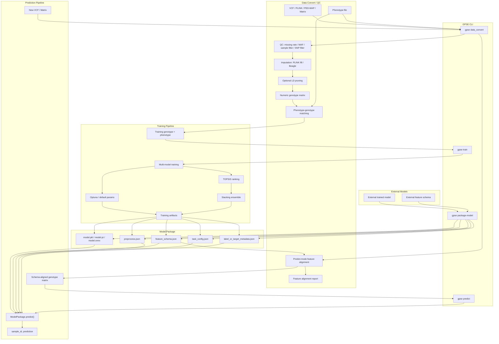

# GPSE 重构计划 v2

> 合并自 `todo_cc.md` + `docs/gpse核心逻辑梳理.md` + Claude 分析
> 生成日期: 2026-06-03
> 基于 commit: `30aaafb` (main 分支最新)

---

## 一、当前代码现状

### 1.1 已完成的重构（近期 commits）

| Commit | 内容 | 状态 |
|--------|------|------|
| `737abae` | 拆分 `GenomicPredictorV2` 为 8 个 `_*.py` 子模块 | ✅ |
| `df15dbb` | 重组包结构，统一日志到单文件 | ✅ |
| `2bcac02` | 整合 utilities，合并 config，固定依赖版本 | ✅ |
| `4948a3e` | 统一绝对导入，填充 `__init__.py` 导出 | ✅ |
| `abb3e76` | 线程控制（环境变量 + threadpool_limits） | ✅ |
| `121c4bf` | lazy imports 避免加载重依赖 | ✅ |
| `30aaafb` | CLI 彩蛋修复 | ✅ |

**结论：前置模块化已干净，现在是执行 YAML 外置化的最佳时机。**

### 1.2 当前目录结构

```
gpse/
├── cli.py                          # CLI 入口 → GenomicPredictorV2
├── config/
│   ├── constants.py                # ModelConfig, ClassificationModelConfig, ModelConstants
│   ├── default.yaml                # 软件元信息
│   └── software.yaml               # 外部工具依赖
├── core/
│   ├── prediction_v2.py            # GenomicPredictorV2 主编排类（方法绑定模式）
│   ├── _pipeline.py                # run_all_models() 顶层循环
│   ├── _repeat_training.py         # 多重复训练，ProcessPoolExecutor 并行
│   ├── _fold_training.py           # 单 fold 训练: 缩放 → fit → predict → metrics
│   ├── _optimization.py            # Optuna 超参数优化（CV 内循环）
│   ├── _ensemble.py                # Fold 集成预测
│   ├── _data_io.py                 # 数据加载/标准化/反标准化
│   ├── _model_tools.py             # 模型创建/默认参数路由（reg vs clf）
│   ├── _cv_manager.py              # CV fold 文件生成与加载
│   ├── _topsis_config.py           # TOPSIS 配置 + 代表性模型保存
│   └── genomic_classification.py   # GenomicClassifier（标签编码，分类指标）
├── models/
│   ├── model_optimizers.py         # Backward-compatible shim → RegressionModelOptimizer
│   ├── regression_model_optimizer.py  # RegressionModelOptimizer — 14 reg 模型 (681行)
│   └── classification_models.py    # ClassificationModelOptimizer — 6 clf 模型 (394行)
├── utils/
│   ├── stacking.py                 # StackingEnsemble — 元学习器集成 ★
│   ├── topsis.py                   # TOPSISEvaluator — 多准则排名 ★
│   ├── genomic_utils.py            # 通用工具
│   ├── genomic_data_pipeline.py    # VCF/PLINK 预处理
│   └── log_utils.py / logo.py / version.py / configuration.py / print_utils.py
└── tools/
    └── analyze_phenotypes.py
```

### 1.3 模型清单（实际代码统计）

**`RegressionModelOptimizer`** (`regression_model_optimizer.py`, 681行):

| 类型 | 注册到 configs | param 函数 | create_model 分支 | 默认参数 |
|------|:-:|:-:|:-:|:-:|
| **回归 14 个** | ✅ | ✅ | ✅ | ✅ |
| elasticnet_reg, gbdt_reg, svr_reg, mlp_reg, knn_reg | ✅ | ✅ | ✅ | ✅ |
| rf_reg, xgboost_reg, adaboost_reg, lightgbm_reg | ✅ | ✅ | ✅ | ✅ |
| catboost_reg, kernelridge_reg, histgradientboost_reg | ✅ | ✅ | ✅ | ✅ |
| sgd_reg, lasso_reg | ✅ | ✅ | ✅ | ✅ |
| **分类** | — | — | — | — |
| ~~15 个 clf 函数~~ | **已清理** | **已清理** | **已清理** | **已清理** |

**`ClassificationModelOptimizer`** (`classification_models.py`, 394行):

| 类型 | 注册到 configs | param 函数 | create_model 分支 | 默认参数 |
|------|:-:|:-:|:-:|:-:|
| **分类 6 个** | ✅ | ✅ | ✅ | ✅ |
| rf_clf, xgboost_clf, lightgbm_clf | ✅ | ✅ | ✅ | ✅ |
| catboost_clf, svm_clf, mlp_clf | ✅ | ✅ | ✅ | ✅ |

---

## 二、发现的问题

### ✅ ~~P0: 分类模型代码严重重复~~ **【已完成 by codex】**

**状态**：`model_optimizers.py` 中所有 clf 死代码（15 个 `_clf_params` 函数 + clf 分支）已清理。文件变为向后兼容的 shim，实际逻辑移至 `regression_model_optimizer.py`。

| 模型 | ~~`ModelOptimizer`~~ `RegressionModelOptimizer` | `ClassificationModelOptimizer` | 状态 |
|------|:-:|:-:|:-:|
| rf_clf | ❌ 已移除 | ✅ | **清理完成** |
| xgboost_clf | ❌ 已移除 | ✅ | **清理完成** |
| lightgbm_clf | ❌ 已移除 | ✅ | **清理完成** |
| catboost_clf | ❌ 已移除 | ✅ | **清理完成** |
| svm_clf / svc_clf | ❌ 已移除 | ✅ | **清理完成** |
| mlp_clf | ❌ 已移除 | ✅ | **清理完成** |

- 15 个 `_clf_params` 死函数已删除
- `create_model()` / `get_default_params()` 中的 clf elif 分支已删除
- 职责边界已清晰：`regression_model_optimizer.py` = 纯回归，`classification_models.py` = 纯分类

### 🟡 P1: `create_model()` 的 if/elif 链不可扩展

当前每加一个模型需要改 **4 处代码**：
1. `_init_model_configs()` — 注册
2. `_xxx_params(trial)` — Optuna 搜索空间
3. `create_model()` — if/elif 实例化分支
4. `get_default_params()` — if/elif 默认参数

### 🟡 P2: Stacking 模型加载路径脆弱

`load_and_select_models()` 搜索 6 级路径 + 遍历 repeat_1~50：
```
1. {model_name}_{suffix}/representative_model/model.pkl
2. {model_name}_{suffix}/model.pkl
3. {model_name}/representative_model/model.pkl
4. {model_name}/model.pkl
5. {model_name}_{suffix}/repeat_{1~50}/model.pkl
6. {model_name}/repeat_{1~50}/model.pkl
```

**问题**：容易找不到模型、路径约定脆弱、与 pipeline 耦合深。

### 🟡 P3: `test/` 目录为空 — 无回归测试

没有任何测试文件，重构后无法自动化验证正确性。

### 🟡 P4: Optuna 搜索空间的动态约束

部分搜索空间有自适应逻辑，不能简单用 YAML 表达：
- **深树约束**: max_depth 越大 → n_estimators 上限越低
- **XGBoost booster 条件分支**: gbtree/dart 才有树参数
- **MLP 动态层数**: n_layers 决定 hidden_layer_sizes 维度
- **LightGBM 二分类/多分类**: n_classes 影响 objective

### 🟡 P5: 线程参数名差异

不同库使用不同参数名：
| 库 | 参数名 |
|----|--------|
| sklearn | `n_jobs` |
| XGBoost | `n_jobs` + `nthread` |
| LightGBM | `n_jobs` |
| CatBoost | `thread_count` |
| SGD | 无（不支持并行） |

### 🟡 P6: CLI 职责需要拆分为 `data_convert` / `train` / `predict`

**状态**：当前先不处理，等训练流程彻底稳定后再设计和实现。

当前 `gpse/cli.py` 是单入口平铺参数，实际混合了三类职责：

1. **数据转换/预处理**
   - VCF / PLINK / PED / MAP → genotype matrix
   - 表型文件转换、样本 ID 匹配、列名清理、简单质控
   - 现有主要逻辑在 `gpse/utils/genomic_data_pipeline.py`
   - 后续需要合并 `scripts/qc.py` 中的 QC / LD pruning / imputation / numeric recode 逻辑

2. **模型训练**
   - 使用 genotype + phenotype 训练多模型
   - Optuna 调参 / 默认参数训练
   - TOPSIS 排名
   - Stacking 集成
   - 现有主要逻辑在 `GenomicPredictorV2.run_all_models()`

3. **模型预测**
   - 使用已经构建好的模型，对新的 VCF / genotype matrix 进行表型预测
   - 当前 CLI **没有 predict-only 模式**
   - 当前只保存 `(model, scaler)`，缺少足够的 feature metadata

建议未来 CLI 结构：

```bash
gpse data_convert ...
gpse train ...
gpse predict ...
```

#### P6.0: `data_convert` 需要合并 `genomic_data_pipeline.py` 与 `scripts/qc.py`

当前存在两套相关逻辑：

- `gpse/utils/genomic_data_pipeline.py`
  - VCF → PLINK
  - PLINK/PED/MAP → genotype matrix
  - 表型 TXT/CSV 转换
  - 基因型/表型样本 ID 匹配
  - 列名特殊字符清理
  - 表型标准化

- `scripts/qc.py`
  - 输入格式识别与转换：VCF / PED/MAP / BED/BIM/FAM → PLINK BED
  - PLINK 样本过滤：`--keep` / `--remove`
  - PLINK SNP 过滤：`--extract` / `--exclude`
  - SNP missing rate 过滤：`--geno`
  - sample missing rate 过滤：`--mind`
  - MAF 过滤：`--maf`
  - 缺失值处理：PLINK `--fill-missing-a2`
  - 可选 Beagle 插补
  - LD pruning：`--indep-pairwise`
  - compound genotype → numeric additive coding (`0/1/2`)

后续应统一为：

```bash
gpse data_convert ...
```

`data_convert` 至少需要支持两种模式：

1. **train 模式**
   - 输入：VCF/PLINK/PED/MAP + phenotype
   - 输出：
     - 训练用 genotype matrix
     - 训练用 phenotype CSV
     - QC report
     - feature schema 初稿
   - 用于后续 `gpse train`

2. **predict 模式**
   - 输入：新 VCF/PLINK/PED/MAP 或已有 genotype matrix + 已训练模型的 `feature_schema.json`
   - 输出：
     - 已按模型 schema 对齐的 genotype matrix
     - feature 对齐报告
     - 缺失 feature / 额外 feature / allele mismatch 报告
   - 用于后续 `gpse predict`

predict 模式下必须注意：

- 不能重新自由选择 SNP 集合
- 不能重新做会改变 feature 空间的 LD pruning
- 应按模型中的 `feature_schema.json` 提取、排序和校验 feature
- 缺失 feature 按指定策略处理：`strict` / `impute_mean` / `impute_mode` / `missing_code`
- 额外 feature 默认丢弃并记录
- 如果能获得 REF/ALT 信息，需要检查 allele 方向；方向不一致时必须报错或执行显式翻转
- 输出矩阵必须与训练模型的 feature 数量、顺序、编码语义一致

#### P6.1: 已保存模型缺少 feature schema

当前模型保存点：

- fold 模型：`repeat_N/fold_M_model.pkl`，内容为 `(model, scaler)`
- representative 模型：`representative_model/model.pkl`，内容为 `(model, scaler)`

问题：模型文件没有记录训练时特征的完整描述。后续使用新数据预测时，即使模型能正常加载，也无法确认新数据是否和训练数据处在同一个 feature 空间。

至少需要保存：

- 原始 SNP ID 列表
- 清理后的 SNP/feature 名称
- feature 顺序
- feature 数量
- VCF / PLINK 编码规则
- REF / ALT 或等位基因方向信息
- 缺失值编码和缺失值处理策略
- 训练时 `StandardScaler` 对应的 feature schema
- 回归任务的 phenotype scaler 信息（如果启用标准化）
- 分类任务的 label encoder 信息
- 训练任务类型、模型名、GPSE 版本、训练时间、参数

建议新增文件：

```text
representative_model/
├── model.pkl
├── model_info.json
└── feature_schema.json
```

#### P6.2: predict 阶段必须做 feature 对齐

“相同 feature”不能只理解为列数相同。对 VCF 数据来说，必须同时满足：

- SNP ID 一致
- SNP 顺序一致
- REF / ALT 或等位基因编码方向一致
- genotype 编码规则一致（例如 0/1/2/3）
- 缺失值处理一致
- 列名清理规则一致

predict 流程应当：

1. 将新 VCF 转换为 genotype matrix
2. 读取训练时保存的 `feature_schema.json`
3. 按训练 schema 对新 matrix 进行列对齐
4. 额外 feature：丢弃或记录 warning
5. 缺失 feature：按策略处理
6. 使用训练时保存的 scaler transform
7. 加载模型预测
8. 输出 `sample_id, prediction`

#### P6.3: 真实数据中的缺失 feature 需要明确策略

新数据中可能缺少训练模型需要的 SNP。当前没有处理策略。

可选策略：

| 策略 | 行为 | 适用场景 |
|------|------|----------|
| `strict` | 缺任何训练 feature 就报错 | 默认推荐，保证预测可靠 |
| `impute_mean` | 用训练集 feature 均值填充 | 回归/连续编码，需保存训练均值 |
| `impute_mode` | 用训练集 feature 众数填充 | SNP 离散编码 |
| `missing_code` | 用固定缺失编码填充（如 3） | 需要训练时也使用同样编码 |

建议默认使用 `strict`，只有用户明确指定时才允许 imputation。

#### P6.4: predict-only 子命令建议参数

未来可以考虑：

```bash
gpse predict \
  --model_file results/rf_reg/representative_model/model.pkl \
  --feature_schema results/rf_reg/representative_model/feature_schema.json \
  --vcf_file new_samples.vcf \
  --preprocess_prefix predict/new_samples \
  --output predictions.csv \
  --missing_feature_strategy strict
```

或直接对已经转换好的矩阵预测：

```bash
gpse predict \
  --model_file results/rf_reg/representative_model/model.pkl \
  --feature_schema results/rf_reg/representative_model/feature_schema.json \
  --matrix_file new_samples_genotype.csv \
  --output predictions.csv
```

#### P6.5: ModelPackage / PredictorPackage 统一对象

后续可以抽象一个统一的 `ModelPackage` / `PredictorPackage` 对象，把“模型本体”和“输入输出契约”封装在一起。

核心目标不是把所有模型变成同一种模型，而是让所有模型都遵守同一个预测接口：

```python
package = ModelPackage.load("model_package/")
pred = package.predict(genotype_matrix)
```

内部模型可以是：

- GPSE 自己训练出的 sklearn / XGBoost / LightGBM / CatBoost 模型
- 外部用户训练好的 sklearn 模型
- PyTorch / TensorFlow 深度学习模型
- ONNX 模型
- 外部命令行模型（通过 wrapper 适配）

建议模型包结构：

```text
model_package/
├── model.pkl / model.pt / model.onnx / model.json
├── feature_schema.json
├── preprocess.json
├── task_config.json
└── label_or_target_metadata.json
```

建议对象职责：

```python
class ModelPackage:
    def load(path): ...
    def validate_features(X): ...
    def align_features(X): ...
    def preprocess(X): ...
    def predict(X): ...
    def postprocess(y_pred): ...
```

再抽象 backend 层：

```python
class BaseModelBackend:
    def load(model_path): ...
    def predict(X): ...
    def predict_proba(X): ...
```

不同模型对应不同 backend：

```text
SklearnBackend
XGBoostBackend
LightGBMBackend
CatBoostBackend
TorchBackend
TensorFlowBackend
OnnxBackend
ExternalCommandBackend
```

这样外部用户训练好的模型也可以转换成 GPSE package：

```bash
gpse package-model \
  --model_file external_model.pkl \
  --backend sklearn \
  --feature_schema feature_schema.json \
  --preprocess preprocess.json \
  --task_config task_config.json \
  --output my_model_package/
```

之后预测统一为：

```bash
gpse predict \
  --model_package my_model_package/ \
  --vcf_file new_samples.vcf \
  --output predictions.csv
```

关键输入契约仍然必须统一：

- feature 名称、顺序、数量
- SNP / allele 编码方向
- 缺失 feature 处理策略
- genotype 缺失值编码
- scaler / imputer / 标准化流程
- 输出类型：回归值、分类 label、分类概率
- 回归值是否需要 inverse transform

#### P6.6: 当前风险总结

- 当前训练得到的模型可以被 `joblib.load()` 加载并预测
- 但没有 schema 校验时，预测新数据存在静默错误风险
- 最危险情况：新数据列数刚好一致，但 SNP 顺序或等位基因方向不同，程序不会报错，预测结果却可能完全错误
- 因此在实现 `predict` 前，必须先补齐 feature schema 保存与对齐机制

#### P6.7: 目标架构 Mermaid 可视化



---

## 三、端到端训练流程（当前实现）

```
CLI (cli.py)
  │
  ├── 1. [可选] 数据预处理 (GenomicDataProcessor)
  │      VCF → PLINK → 矩阵 → 表型匹配 → 清洗
  │
  ├── 2. GenomicPredictorV2.__init__()
  │      ├── 回归 → RegressionModelOptimizer
  │      └── 分类 → GenomicClassifier (内含 ClassificationModelOptimizer)
  │
  └── 3. run_all_models()                              [_pipeline.py]
         │
         ├── load_data()                               [_data_io.py]
         ├── prepare_cv_folds()                        [_cv_manager.py]
         │
         ├── For each model:
         │    └── run_model_multiple_repeats()         [_repeat_training.py]
         │         ├── 可选: ProcessPoolExecutor 并行
         │         └── For each repeat:
         │              ├── optimize_model_parameters() [_optimization.py]
         │              │    └── Optuna TPE + MedianPruner + 早停
         │              ├── create_model(best_params)   [_model_tools.py]
         │              ├── For each fold:
         │              │    └── _train_single_fold()   [_fold_training.py]
         │              │         ├── StandardScaler.fit_transform
         │              │         ├── model.fit (threadpool_limits)
         │              │         ├── predict + metrics
         │              │         └── 保存 (model, scaler) pickle
         │              └── _compute_ensemble_predictions() [_ensemble.py]
         │
         ├── create_comparison_table() → model_comparison.csv
         │
         ├── [可选] TOPSIS 排名                         [topsis.py]
         │    └── 按 Test Pearson/Accuracy 排序, 选 Top-N
         │
         └── [可选] StackingEnsemble                    [stacking.py]
              └── 用 Top-N 模型训练元学习器 (Ridge/LogisticRegression)
```

---

## 四、核心模块详解

### 4.1 ★ Stacking 集成 — `gpse/utils/stacking.py`

**核心类**: `StackingEnsemble`

**初始化参数**:
- `base_models_dir`: 基础模型存储目录
- `top_n_models`: 选 Top-N 个基础模型 (默认5)
- `meta_model_type`: 元模型类型 (目前仅 `'ridge'`)
- `cv_folds`: 生成元特征的 CV 折数 (默认5)
- `task_type`: 回归 / 分类

**`fit()` 流程**:
```
fit(X_train, y_train, X_test, y_test, model_names)
  ├── Step 1: load_and_select_models(model_names)
  │    ├── 读 model_comparison.csv
  │    ├── 按指标排序选 Top-N
  │    └── 加载 .pkl（搜索 6 级路径 + repeat_1~50）
  │
  ├── Step 2: create_meta_features(X_train, y_train, X_test)
  │    ├── 训练集: KFold CV → clone(model) → fit → predict → 填入 meta_train
  │    ├── 测试集: model.fit(X_train 全量) → predict(X_test) → 填入 meta_test
  │    └── 特殊处理: (model, scaler) 元组 → 先 transform 再 predict
  │
  ├── Step 3: fit_meta_model(meta_train, y_train)
  │    ├── 回归: Pipeline([StandardScaler, Ridge(alpha=1.0)])
  │    └── 分类: Pipeline([StandardScaler, LogisticRegression(C=1.0, multi_class='ovr')])
  │
  ├── Step 4: 保存 stacking_ensemble_model.pkl
  └── Step 5: 评估 (train/test metrics, model_importances)
```

**存在的问题**:
1. 模型加载路径过于脆弱（6 级搜索 + 遍历 50 个 repeat）
2. 元特征生成中对 X_test 使用 `model.fit(X_train)` 原地训练，修改了基础模型状态
3. 元模型选择太少（只有 Ridge / LogisticRegression）
4. 没有交叉验证评估元模型
5. `clone()` 要求 sklearn-compatible，自定义模型需适配

### 4.2 ★ TOPSIS 排名 — `gpse/utils/topsis.py`

**核心类**: `TOPSISEvaluator`

**算法步骤**:
```
evaluate(input_file, output_file, criteria, criteria_types, ...)
  ├── Step 1: 读 model_comparison.csv
  ├── Step 2: 过滤无效行（全0或NaN）
  ├── Step 3: 计算权重
  │    ├── 熵权法: E = -k * Σ(P·logP), w = (1-E) / Σ(1-E)
  │    └── 手动权重: 默认 "0.8,0.2"（精度80%, 稳定性20%）
  ├── Step 4: min 型指标正向化
  │    ├── reciprocal: 1/(x+ε)       ← 默认
  │    ├── neglog: -log(x+ε)         ← pipeline 使用
  │    └── minmax_inv: (max-x)/(max-min)
  ├── Step 5: TOPSIS 计算
  │    ├── 向量归一化 → 加权 → 理想解/负理想解 → 距离 → Score
  │    └── Score = D- / (D+ + D-)
  └── Step 6: 输出（完整版 + 精简版 CSV）
```

**默认配置**（`_topsis_config.py`）:
- 回归: `["Test Pearson", "Test Pearson (std)"]`, types `["max", "min"]`, weights `"0.8,0.2"`
- 分类: `["Test Accuracy", "Test Accuracy (std)"]`, types `["max", "min"]`, weights `"0.8,0.2"`

**存在的问题**:
1. 评价指标固定为 2 个（主指标 + 标准差），未纳入训练时间、模型复杂度
2. 权重硬编码 0.8:0.2
3. 与 pipeline 耦合：`call_topsis_evaluator()` 在 `genomic_utils.py` 中包装

### 4.3 方法绑定模式

```python
class GenomicPredictorV2:
    load_data = load_data                        # from _data_io
    create_model = create_model                  # from _model_tools
    optimize_model_parameters = optimize_model_parameters  # from _optimization
    _train_single_fold = _train_single_fold      # from _fold_training
    run_model_multiple_repeats = run_model_multiple_repeats  # from _repeat_training
    run_all_models = run_all_models              # from _pipeline
    # ... 共 ~15 个绑定方法
```

---

## 五、重构计划: 模型参数 YAML 外置化

### 5.1 目标

将每个模型的以下信息外置到 YAML：
- 模型类路径（如 `sklearn.ensemble.RandomForestRegressor`）
- Optuna 搜索空间（参数名、类型、范围、约束）
- 默认参数
- 线程参数映射（`n_jobs` / `nthread` / `thread_count`）
- 需要过滤的辅助参数

### 5.2 YAML 结构设计

```yaml
# gpse/config/models/rf_reg.yaml
model:
  name: rf_reg
  class: sklearn.ensemble.RandomForestRegressor
  task_type: regression
  thread_param: n_jobs

default_params:
  n_estimators: 100
  max_depth: null
  min_samples_split: 2
  min_samples_leaf: 1
  bootstrap: true

search_space:
  max_depth:
    type: int
    low: 2
    high: 32
  n_estimators:
    type: int
    low: 10
    high: 2000
    constraints:
      - when: {max_depth: {gte: 25}}
        then: {high: 500}
      - when: {max_depth: {gte: 15}}
        then: {high: 1000}
  min_samples_split:
    type: int
    low: 2
    high: 20
  min_samples_leaf:
    type: int
    low: 1
    high: 20
  bootstrap:
    type: categorical
    choices: [true, false]

filter_params: []
```

```yaml
# gpse/config/models/xgboost_reg.yaml
model:
  name: xgboost_reg
  class: xgboost.XGBRegressor
  task_type: regression
  thread_param: n_jobs
  thread_param_alias: nthread

default_params:
  n_estimators: 100
  max_depth: 3
  learning_rate: 0.1
  booster: gbtree
  verbosity: 0

search_space:
  booster:
    type: categorical
    choices: [gbtree, gblinear, dart]
  lambda:
    type: float
    low: 1.0e-8
    high: 10.0
    log: true
  alpha:
    type: float
    low: 1.0e-8
    high: 10.0
    log: true
  max_depth:
    type: int
    low: 1
    high: 14
    condition: "booster in [gbtree, dart]"
  n_estimators:
    type: int
    low: 20
    high: 400
    condition: "booster in [gbtree, dart]"
  # ...

filter_params: []
```

```yaml
# gpse/config/models/mlp_reg.yaml — 特殊: 动态层数用 Python hook
model:
  name: mlp_reg
  class: sklearn.neural_network.MLPRegressor
  task_type: regression
  custom_param_func: gpse.models.custom_params.mlp_reg_suggest  # Python hook

default_params:
  hidden_layer_sizes: [128, 64]
  activation: relu
  solver: adam
  alpha: 0.0001
  learning_rate: adaptive

filter_params:
  - n_layers
  - "n_units_l*"
```

### 5.3 约束表达式设计（安全方案）

**❌ 不要用 `eval()`**（有注入风险）

**✅ 方案 A: 简单 DSL**
```yaml
constraints:
  - when: {max_depth: {gte: 25}}
    then: {n_estimators: {high: 500}}
  - when: {max_depth: {gte: 15}}
    then: {n_estimators: {high: 1000}}
```
对应 Python 解析器:
```python
def check_condition(when: dict, current_params: dict) -> bool:
    for param, rule in when.items():
        val = current_params.get(param)
        if val is None:
            return False
        for op, threshold in rule.items():
            if op == 'gte' and not (val >= threshold): return False
            if op == 'lte' and not (val <= threshold): return False
            if op == 'in' and val not in threshold: return False
            if op == 'eq' and val != threshold: return False
    return True
```

**✅ 方案 B: Python hook（仅用于复杂模型）**
```yaml
# 只有 MLP, XGBoost 等复杂模型需要
model:
  custom_param_func: gpse.models.custom_params.xgboost_reg_suggest
```

**推荐**: 简单约束用 DSL（方案 A），复杂逻辑用 hook（方案 B）。

### 5.4 核心实现: ModelRegistry

```python
# gpse/models/model_registry.py — 新文件

class ModelRegistry:
    """从 YAML 文件加载模型配置, 替代硬编码的 RegressionModelOptimizer + ClassificationModelOptimizer"""
    
    def __init__(self, config_dirs: list[str], random_state: int, 
                 n_threads: int, n_classes: int = None):
        self.config_dirs = [Path(d) for d in config_dirs]
        self.random_state = random_state
        self.n_threads = n_threads
        self.n_classes = n_classes
        self._models = {}
        self._load_all_configs()
    
    def _load_all_configs(self):
        """扫描所有 config_dirs 下的 .yaml 文件, 后加载的覆盖先加载的"""
        for config_dir in self.config_dirs:
            for yaml_file in config_dir.glob("*.yaml"):
                config = yaml.safe_load(yaml_file.read_text())
                name = config['model']['name']
                self._models[name] = config
    
    def get_available_models(self, task_type: str = None) -> list:
        if task_type:
            return [n for n, c in self._models.items() 
                    if c['model']['task_type'] == task_type]
        return list(self._models.keys())
    
    def create_model(self, model_name: str, params: dict):
        """动态导入模型类并实例化"""
        config = self._models[model_name]
        cls = self._import_class(config['model']['class'])
        
        params = params.copy()
        # 注入线程参数
        thread_param = config['model'].get('thread_param')
        if thread_param:
            params[thread_param] = self.n_threads
        thread_alias = config['model'].get('thread_param_alias')
        if thread_alias:
            params[thread_alias] = self.n_threads
        
        return cls(**params)
    
    def suggest_params(self, model_name: str, trial) -> dict:
        """根据 YAML 定义的搜索空间建议参数"""
        config = self._models[model_name]
        # 如果有 custom_param_func, 直接调用 Python hook
        custom = config['model'].get('custom_param_func')
        if custom:
            return self._call_custom_param_func(custom, trial)
        # 否则从 YAML 解析
        return self._suggest_from_yaml(trial, config['search_space'])
    
    def get_default_params(self, model_name: str) -> dict:
        return self._models[model_name].get('default_params', {})
    
    def filter_params(self, model_name: str, params: dict) -> dict:
        """过滤辅助参数"""
        config = self._models[model_name]
        filter_list = config.get('filter_params', [])
        result = {k: v for k, v in params.items() if not k.startswith('_')}
        for rule in filter_list:
            if '*' in rule:  # 通配符
                pattern = rule.replace('*', '')
                result = {k: v for k, v in result.items() if not k.startswith(pattern)}
            else:
                result.pop(rule, None)
        return result
    
    @staticmethod
    def _import_class(class_path: str):
        module_path, class_name = class_path.rsplit('.', 1)
        module = importlib.import_module(module_path)
        return getattr(module, class_name)
```

---

## 六、重构计划: 模型调用通用化

### 6.1 目标

将模型创建从 if/elif 链改为**注册表模式**，支持：
- 内置模型（YAML 配置）
- 用户自定义模型（用户提供 YAML + 可选 Python hook）
- 第三方模型（通过 importlib 动态加载）

### 6.2 动态约束搜索空间解析器

```python
# gpse/models/search_space.py — 新文件

def check_condition(when: dict, current_params: dict) -> bool:
    """安全地评估约束条件 (不用 eval)"""
    for param, rule in when.items():
        val = current_params.get(param)
        if val is None:
            return False
        for op, threshold in rule.items():
            if op == 'gte' and not (val >= threshold): return False
            if op == 'lte' and not (val <= threshold): return False
            if op == 'gt'  and not (val >  threshold): return False
            if op == 'lt'  and not (val <  threshold): return False
            if op == 'eq'  and val != threshold:        return False
            if op == 'in'  and val not in threshold:     return False
    return True


def suggest_from_yaml(trial, search_space: dict, current_params: dict) -> dict:
    """根据 YAML 规格建议参数"""
    params = {}
    for param_name, spec in search_space.items():
        # 检查 condition 是否满足
        condition = spec.get('condition')
        if condition:
            # condition 格式: "booster in [gbtree, dart]"
            # 解析为 check_condition 格式
            if not _eval_simple_condition(condition, params):
                continue
        
        param_type = spec['type']
        
        if param_type == 'int':
            high = spec['high']
            # 处理动态约束
            for c in spec.get('constraints', []):
                if check_condition(c['when'], params):
                    high = c['then'].get('high', high)
                    break
            params[param_name] = trial.suggest_int(
                param_name, spec['low'], high,
                log=spec.get('log', False),
                step=spec.get('step', 1)
            )
        elif param_type == 'float':
            params[param_name] = trial.suggest_float(
                param_name, spec['low'], spec['high'],
                log=spec.get('log', False)
            )
        elif param_type == 'categorical':
            params[param_name] = trial.suggest_categorical(
                param_name, spec['choices']
            )
    
    return params
```

---

## 七、分阶段执行计划

### ~~Phase 0: 清理（预计 30min）~~ ✅ **已完成 by codex**

- [x] 删除 `ModelOptimizer` 中所有 `_xxx_clf_params` 函数（15个，约 280 行）
- [x] 删除 `ModelOptimizer.create_model()` 中的 clf elif 分支
- [x] 删除 `ModelOptimizer.get_default_params()` 中的 clf elif 分支
- [x] 新建 `regression_model_optimizer.py`，`ModelOptimizer` 改为 `RegressionModelOptimizer` 别名
- [x] `GenomicClassifier` 支持通过参数注入 `ClassificationModelOptimizer`
- [x] `GenomicPredictorV2` 消除 `ClassificationModelOptimizer` 重复创建
- [x] 统一 `random_seed` / `random_state` 参数命名
- [x] 验证删除后回归/分类任务初始化正常

### Phase 1: 基础架构（预计 2-3h）

- [ ] 创建 `gpse/config/models/` 目录
- [ ] 创建 `gpse/models/model_registry.py` — ModelRegistry 类
- [ ] 创建 `gpse/models/search_space.py` — YAML 搜索空间解析器
- [ ] 编写第一个 YAML: `rf_reg.yaml`，端到端验证
  - 跑旧版 baseline: `gpse --models rf_reg --task regression ...`
  - 用新版 ModelRegistry 跑同一模型
  - 对比 Optuna 搜索空间 + 训练结果一致性

### Phase 2: 批量迁移（预计 3-4h）

- [ ] 迁移全部 14 个回归模型到 YAML
- [ ] 迁移全部 6 个分类模型到 YAML
- [ ] 特殊处理:
  - MLP 动态层数 → `custom_param_func` hook
  - XGBoost booster 条件分支 → DSL condition
  - LightGBM 二分类/多分类 → YAML 中 n_classes 参数
  - NGBoost 基学习器 → `custom_param_func` hook
- [ ] 每迁移一个模型，对比 baseline 结果

### Phase 3: 整合清理（预计 2h）

- [ ] 更新 `_model_tools.py` 路由 → 通过 ModelRegistry
- [ ] 更新 `prediction_v2.py` 初始化 → 创建 ModelRegistry
- [ ] 更新 `_optimization.py` → suggest_params 调用 Registry
- [ ] 合并 `RegressionModelOptimizer` + `ClassificationModelOptimizer` → 统一为 ModelRegistry
- [ ] 删除旧的 if/elif 链
- [ ] 添加 CLI 参数 `--model_config_dir`（支持用户自定义模型目录）
- [ ] 更新 `cli.py` 中 `--models` 的 help 文本动态获取

### Phase 4: Stacking & TOPSIS 改进（预计 2-3h）

- [ ] **Stacking: 修复模型加载** — 改为从 pipeline 直接传递模型实例
- [ ] **Stacking: 修复元特征生成** — 不对基础模型原地 fit
- [ ] Stacking: 支持更多元模型（ElasticNet, GBDT 等）
- [ ] TOPSIS: 权重配置外置到 YAML
- [ ] TOPSIS: 支持更多评价指标维度（训练时间、模型复杂度）

### Phase 5: 测试 & 文档（预计 1-2h）

- [ ] 为 ModelRegistry 编写单元测试
- [ ] 为 search_space.py 编写单元测试（含约束条件测试）
- [ ] 端到端测试: 全模型跑一遍对比 baseline
- [ ] 更新 README（新增自定义模型说明）

---

## 八、修改文件清单

| 文件 | 操作 | 阶段 |
|------|------|------|
| `gpse/config/models/*.yaml` | **新建** 20 个 YAML（14 reg + 6 clf） | Phase 2 |
| `gpse/models/model_registry.py` | **新建** ModelRegistry 类 | Phase 1 |
| `gpse/models/search_space.py` | **新建** YAML 搜索空间解析器 | Phase 1 |
| `gpse/models/custom_params.py` | **新建** MLP/NGBoost 等自定义 hook | Phase 2 |
| `gpse/models/regression_model_optimizer.py` | **已新建** — 回归模型优化器（原 `model_optimizers.py` 拆分） | codex |
| `gpse/models/model_optimizers.py` | **Phase 0 完成**: 已变为 shim; **Phase 3**: 替换为 ModelRegistry 委托 | 0, 3 |
| `gpse/models/classification_models.py` | **Phase 3**: 替换为 ModelRegistry 委托 | 3 |
| `gpse/core/_model_tools.py` | 路由改为通过 ModelRegistry | Phase 3 |
| `gpse/core/prediction_v2.py` | 初始化时创建 ModelRegistry | Phase 3 |
| `gpse/core/_optimization.py` | suggest_params 调用改为 Registry | Phase 3 |
| `gpse/cli.py` | 添加 `--model_config_dir`; help 文本动态获取 | Phase 3 |
| `gpse/utils/stacking.py` | 修复模型加载路径; 修复元特征 fit | Phase 4 |
| `gpse/utils/topsis.py` | 权重/指标配置外置 | Phase 4 |
| `gpse/core/_topsis_config.py` | 适配新配置 | Phase 4 |
| `gpse/config/constants.py` | 可能需要扩展 ModelConfig | Phase 1 |
| `scripts/qc.py` | 合并 QC / imputation / LD pruning / recode 逻辑到正式 data_convert 流程 | P6 后续 |
| `gpse/utils/genomic_data_pipeline.py` | 升级为 data_convert 核心实现，区分 train-mode 与 predict-mode | P6 后续 |
| `gpse/model_package/` 或 `gpse/core/model_package.py` | 新建 ModelPackage / PredictorPackage 抽象 | P6 后续 |
| `gpse/cli.py` | 拆分为 `data_convert` / `train` / `predict` / 可选 `package-model` 子命令 | P6 后续 |

---

## 九、关键代码位置索引

| 功能 | 文件 | 行号/方法 |
|------|------|----------|
| 回归模型配置注册 | `models/regression_model_optimizer.py` | `_init_model_configs()` L41-117 |
| 回归搜索空间 | `models/regression_model_optimizer.py` | `_xxx_reg_params()` L132-425 |
| ~~分类死代码~~ | ~~`models/model_optimizers.py`~~ | **已清理** |
| 参数过滤 | `models/regression_model_optimizer.py` | `filter_model_params()` L427-463 |
| 回归模型创建 | `models/regression_model_optimizer.py` | `create_model()` L465-556 |
| 回归默认参数 | `models/regression_model_optimizer.py` | `get_default_params()` L558-676 |
| 分类配置注册 | `models/classification_models.py` | `_init_classification_model_configs()` L39-67 |
| 分类搜索空间 | `models/classification_models.py` | `_xxx_clf_params()` L80-237 |
| 分类模型创建 | `models/classification_models.py` | `create_classification_model()` L259-300 |
| 分类默认参数 | `models/classification_models.py` | `get_classification_default_params()` L302-390 |
| 模型路由 | `core/_model_tools.py` | `create_model()`, `get_default_params()` |
| Optuna 优化 | `core/_optimization.py` | `optimize_model_parameters()` L25-203 |
| Stacking 集成 | `utils/stacking.py` | `StackingEnsemble` class |
| TOPSIS 排名 | `utils/topsis.py` | `TOPSISEvaluator.evaluate()` L78-166 |
| Pipeline 编排 | `core/_pipeline.py` | `run_all_models()` L22-212 |
| 常量配置 | `config/constants.py` | `ModelConstants` singleton |
| 线程控制 | `cli.py` L15-28; `_repeat_training.py` | 环境变量设置 |

---

## 十、风险与注意事项

1. **⚠️ 无回归测试**: `test/` 为空，重构前**必须先保存 baseline 结果**
   ```bash
   gpse --data your_data.csv --task regression --models all --n_repeats 3
   cp results/model_comparison.csv results/baseline_comparison.csv
   ```

2. **⚠️ YAML 参数空间翻译错误**: Optuna 搜索空间范围不一致会导致模型性能下降但不报错
   - **预防**: 每个模型迁移后对比 Optuna study 的搜索空间日志

3. **⚠️ eval() 注入风险**: 约束表达式不要用 `eval()`
   - **预防**: 使用 DSL（方案 A）或 Python hook（方案 B）

4. **⚠️ 线程参数差异**: `n_jobs` / `nthread` / `thread_count` 名称不统一
   - **预防**: YAML 中显式声明 `thread_param` + `thread_param_alias`

5. **⚠️ 分类特殊逻辑**: LightGBM 根据 `n_classes` 设置 `objective`，XGBoost 需要 `num_class`
   - **预防**: 在 YAML 中增加 `runtime_params` 字段，由 pipeline 注入

6. **⚠️ Stacking pickle 兼容性**: 模型类路径变化后旧 pickle 无法加载
   - **预防**: 重构完成后重新训练，或保留旧类路径作为 alias

7. **⚠️ 向后兼容**: `model_optimizers.py` 已保留为 shim，`ModelOptimizer` 是 `RegressionModelOptimizer` 的别名
   - **状态**: codex 已完成 shim，`from gpse.models.model_optimizers import ModelOptimizer` 仍可工作
   - **Phase 3**: 统一为 ModelRegistry 后再移除 shim

---

## 十一、耗时对比

| 阶段 | 纯人工 | 人机协作（推荐） |
|------|--------|---------------|
| Phase 0: 清理死代码 | 1h | **30min** |
| Phase 1: 基础架构 | 5-6h | **2-3h** |
| Phase 2: 批量迁移 | 8-10h | **3-4h** |
| Phase 3: 整合清理 | 3-4h | **2h** |
| Phase 4: Stacking & TOPSIS | 3-4h | **2-3h** |
| Phase 5: 测试 & 文档 | 3-4h | **1-2h** |
| **合计** | **23-30h（4-5天）** | **10-14h（2天）** |

人机协作分工：
- AI → 生成 YAML、写 ModelRegistry、删除死代码、修改路由
- 人 → 跑 baseline、验证端到端、对比结果、提供实际数据

---

*文档生成时间: 2026-06-03*
*基于代码版本: main@30aaafb*
